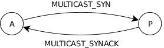

<!-- Adapted from /docs/html/multicast-->
# Multicast Transport

Starting with the OpenDDS 2.1 release, a new IP multicast transport is
available which replaces the SimpleMcast and ReliableMulticast transports. The
source for the multicast transport is available under the general OpenDDS
license and may be found under: `$DDS_ROOT/dds/DCPS/transport/multicast/`.

What follows is a detailed description of the design, configuration, known
issues, and potential enhancements for the multicast transport:

Unlike other transports, a single DataLink is maintained for each TransportImpl
instance. Multicast reservations are also formed between participants rather
than individual publications and subscriptions via a transport-specific session
layer. This allows any number of associations belonging to the same pair of
participants to re-use an existing MulticastSession, thereby reducing the
amount of resources needed in multicast intensive environments. Another
departure is unified support for best-effort and reliable delivery based on
transport configuration. Delivery-specific behavior is abstracted by each
concrete MulticastSession implementation, which allows for the same set of
transport strategies to be used regardless of delivery mode.

Two delivery modes are supported: best-effort and reliable.  Best-effort
delivery imposes the least amount of overhead as data is exchanged between
peers, however it does not provide any guarantee of delivery. Data may be lost
due to unresponsive or unreachable peers or received in duplicate (see:
OpenDDS::DCPS::BestEffortSession).  Reliable delivery provides for guaranteed
delivery of data to associated peers with no duplication at the cost of
additional processing and bandwidth (see: OpenDDS::DCPS::ReliableSession).
When a new reservation is made, a remote and local peer identifier is assigned
based on the participant ID of the associated entities. These values are used
to uniquely identify each side of a given MulticastSession within the multicast
group. The Extensible Transport Framework (ETF) will always designate the
publishing side of the association as being active. Multicast datagrams will
always assign the local peer ID to the source field of the transport header
(see: OpenDDS::DCPS::TransportHeader).

The multicast transport may be configured and attached similarly to other transport implementations:

```
OpenDDS::DCPS::TransportImpl_rch transport_impl =
  TheTransportFactory->create_transport_impl(OpenDDS::DCPS::DEFAULT_MULTICAST_ID,
                                             OpenDDS::DCPS::AUTO_CONFIG);

OpenDDS::DCPS::AttachStatus status = transport_impl->attach(...);
if (status != OpenDDS::DCPS::ATTACH_OK) {
  exit(EXIT_FAILURE);
}
```

MPC base projects are also provided for linking against the `OpenDDS_Multicast` library:
```
project : dcps_multicast {
}
```

and:
```
project : dcpsexe_with_multicast {
}
```

## Transport Class Diagram


## Reliability

Reliable delivery is achieved through two primary mechanisms:
- 2-way peer handshaking (SYN/SYN+ACK)
- Negative acknowledgment of missing data (NAK/NAK+ACK)

For the purpose of examining the interactions between reliable peers, it helps
to narrow the view of the multicast group to two specific peers: active and
passive. The active peer is the publishing side of the MulticastSession. The
passive peer will be the remote peer associated with the session when it was
created. It is important to remember that control data will be exchanged among
all peers within the multicast group, however disinterested peers will discard
payloads which are not addressed to them directly.

DCPS control samples were chosen in lieu of more traditional PDUs for the
exchange of control data between peers; this allowed the transport to leverage
existing functionality at the cost of a slightly increased payload size.

### SYN/SYN+ACK



The active peer initiates a handshake by sending a MULTICAST_SYN control sample
to the passive peer at periodic intervals bounded by a timeout to ensure
delivery. An exponential backoff is observed based on the number of retries.

Upon receiving the MULTICAST_SYN control sample, the passive peer records the
current transport sequence value for the active peer and responds with a
MULTICAST_SYNACK control sample. This sequence number establishes a value from
which reception gaps may be identified in the future.

If the active peer receives a MULTICAST_SYNACK control sample, it will then
notify the ETF that the association is complete, which will in turn trigger a
communication status change in the DCPS layer. In the event a MULTICAST_SYNACK
control sample is not received, an error will be logged.

### NAK/NAK+ACK


As each datagram is delivered to the ReliableSession, the transport sequence
value is scored against a special container which identifies reception gaps
(see: OpenDDS::DCPS::DisjointSequence). Periodically, a watchdog executes and
will age off any outstanding repair requests which have not been fulfilled by
resetting the sequence low-water mark and logging an error. Once outstanding
requests have been purged, the watchdog will then check for reception gaps. In
the event a new (or existing) reception gap is identified, the ReliableSession
records the current interval and the high-water mark for the transport
sequence. It will then issue MULTICAST_NAK control samples to active peers from
which it is missing data. Passive peers perform NAK suppression based on all
repair requests destined for the same active peer. If previous requests have
been sent, a passive peer will temporarily elide previously requested ranges
for the current interval. This interval is randomized to prevent potential
collisions among similarly associated peers.

If the active peer receives a MULTICAST_NAK control sample it will examine its
send buffer for the missing datagram. If the datagram is no longer available,
it sends a MULTICAST_NAKACK control sample to the entire multicast group to
suppress further repair requests. If the datagram is still available, it
resends the missing data to the entire multicast group.

If the passive peer receives a MULTICAST_NAKACK control sample, it will behave
just as if the repair request has aged off, suppressing further repair requests
and logging an error.

## Configuration

As with other transports, dynamic configuration is provided by the ACE Service
Configurator Framework. A svc.conf file should be created which contains the
following:
```
dynamic OpenDDS_DCPS_Multicast_Service Service_Object * OpenDDS_Multicast:_make_MulticastLoader()
```

The transport may then be loaded at runtime by passing the following arguments:
```
-ORBSvcConf svc.conf
```

Alternately,
the transport may be statically loaded by including the
dds/DCPS/transport/multicast/Multicast.h header (implies static linking):

```C++
#ifdef ACE_AS_STATIC_LIBS
# include <dds/DCPS/transport/multicast/Multicast.h>
#endif
```

A number of additional transport configuration options are available:
```
# Enables IPv6 default group address selection.
# The default value is: 0 (disabled).
default_to_ipv6=0

# The offset used to determine default port numbers; this value
# will be added to the transport ID for the actual port number.
# The default value is: 49400.
port_offset=49400

# The multicast group to join to send/receive data.
# The default value is:
#   224.0.0.128:<port> (IPv4), or
#    [FF01::80]:<port> (IPv6)
group_address=224.0.0.128:49401

# Enables reliable communication. This option will eventually
# be deprecated.
# The default value is: 1 (enabled).
reliable=1

# The exponential base used during handshake retries; smaller
# values yield shorter delays between attempts (reliable only).
# The default value is: 2.0.
syn_backoff=2.0

# The minimum number of milliseconds to wait between handshake
# attempts during association (reliable only).
# The default value is: 250.
syn_interval=250

# The maximum number of milliseconds to wait before giving up
# on a handshake response during association (reliable only).
# The default value is: 30000 (30 seconds).
syn_timeout=30000

# The number of datagrams to retain in order to service repair
# requests (reliable only).
# The default value is: 32.
nak_depth=32

# The minimum number of milliseconds to wait between repair
# requests (reliable only).
# The default value is: 500.
nak_interval=500

# The maximum number of milliseconds to wait before giving up
# on a repair response (reliable only).
# The default value is: 30000 (30 seconds).
nak_timeout=30000

# Set the time-to-live value.
# The default value isL 1 (local subnet)
ttl=1
```

## Known Issues

- The current implementation supports at most one DDS domain per multicast
group.

- A given participant may only have a single multicast TransportImpl attached
per multicast group; if you wish to send and receive samples on the same
multicast group in the same process, independent DomainParticipants must be
used.

- TRANSPORT_PRIORITY is not directly supported. This is partially due to
routing restrictions placed on default group addresses as the selection
heuristic assigns from the link-local range. Setting the TOS would provide
little to no benefit for non-default group addresses at the cost of additional
resources and complexity managing n-ary associations by priority key.

- Reliability must be configured via the reliable transport configuration
option.  The ETF currently multiplexes best-effort and reliable samples across
the same DataLink which effectively disables autonegotiation of reliability
between peers at the transport level.

- The current implementation provides no rate limiting or flow control; it is
possible to overrun the receive buffer which can lead to unrecoverable data
loss even if reliability is enabled. Users should either implement their own
rate limiting for excessive rates, increase the nak_depth configuration option,
and/or increase the OS receive buffer size if needed. nak_depth should not
exceed 16383 (214-1) due to limits imposed by OpenDDS::DCPS::SequenceNumber
comparisons (see: $DDS_ROOT/dds/DCPS/Definitions.h).

- The current implementation relies on LIVELINESS to periodically send
application-level heartbeat messages to aid in detecting reception gaps. If
AUTOMATIC_LIVELINESS_QOS (the default) is not used, peers may not detect these
gaps in a timely manner leading to unrecoverable data loss.

- The current implementation relies on the transport reactor being derived from
ACE_Select_Reactor; this ensures a single thread may be active when
sending/receiving data. If the transport reactor implementation is changed,
additional locks must be introduced to protect critical sections.

## Future Tasks

- NAK requests currently contain individual ranges; performance testing should
be done to determine if collapsing ranges into a single sample would yield
better performance for the entire multicast group in a lossy network.

- An FEC mechanism should be introduced to reduce repair requests and to
provide an additional source from which to detect reception gaps.

- MULTICAST_SYNACK responses should be predicated on association status to
prevent potential denial of service attacks (not currently supported by the
ETF).
