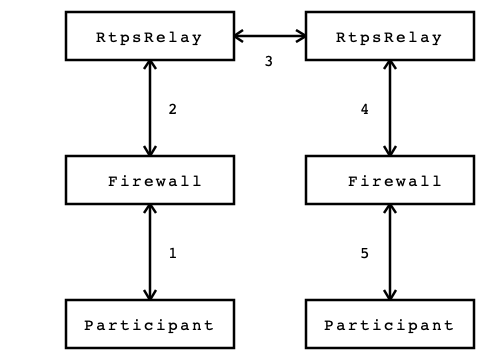

.. _internet_enabled_rtps--internet-enabled-rtps:

#####################
Internet-Enabled RTPS
#####################

..
    Sect<15>

.. _internet_enabled_rtps--overview:

********
Overview
********

..
    Sect<15.1>

Like any specification, standard, or system, RTPS was designed with certain assumptions.
Two of these assumptions severely limit the ability to use RTPS in modern network environments.
First, RTPS, or more specifically, SPDP uses multicast for discovery.
Multicast is not supported on the public Internet which precludes the use of RTPS for Internet of Things (IoT) applications and Industrial Internet of Things (IIoT) applications.
Second, SPDP and SEDP advertise locators (IP and port pairs) for endpoints (DDS readers and writer).
If the participant is behind a firewall that performs network address translation, then the locators advertised by the participant are useless to participants on the public side of the firewall.

This chapter describes different tools and techniques for getting around these limitations.
First, we introduce the *RtpsRelay* as a service for forwarding RTPS messages according to application-defined groups.
The RtpsRelay can be used to connect participants that are deployed in environments that don't support multicast and whose packets are subject to NAT.
Second, we introduce Interactive Connection Establishment (ICE) for RTPS.
Adding ICE to RTPS is an optimization that allows participants that are behind firewalls that perform NAT to exchange messages directly.
ICE requires a back channel for distributing discovery information and is typically used with the RtpsRelay.

.. _internet_enabled_rtps--the-rtpsrelay:

*************
The RtpsRelay
*************

..
    Sect<15.2>

The RtpsRelay is designed to allow participants to exchange RTPS datagrams when separated by a firewall that performs network address translation (NAT) and/or a network that does not support multicast like the public Internet.
The RtpsRelay supports both IPv4 and IPv6.
A participant that uses an RtpsRelay Instance is a *client* of that instance.
Each RtpsRelay instance contains two participants:  the *Application Participant* and the *Relay Participant*.
The Application Participant runs in the domain of the application.
The RtpsRelay reads the built-in topics to discover Participants, DataReaders, and DataWriters.
It then shares this information with other RtpsRelay instances using the Relay Participant.
Each RtpsRelay instance maintains a map of associated readers and writers.
When a client sends an RTPS datagram to its RtpsRelay instance, the RtpsRelay instance uses the association table to forward the datagram to other clients and other RtpsRelay instances so that they can deliver it to their clients.
Clients send RTPS datagrams via unicast which is generally supported and compatible with NAT.
The RtpsRelay can be used in lieu of or in addition to conventional RTPS discovery.

The preceding diagram illustrates how the RtpsRelay can be used to connect participants that are behind firewalls that may be performing NAT.
First, a Participant sends an RTPS datagram to its associated RtpsRelay (1).
This datagram is intercepted by the firewall, the source address and port are replaced by the external IP address and port of the firewall, and then the datagram is sent to the RtpsRelay (2).
The relationship between the source address and external IP address and port selected by the firewall is called a NAT binding.
The RtpsRelay instance forwards the datagram to other RtpsRelay instances (3).
The RtpsRelays then forward the datagram to all of the destination participants (4).
Firewalls on the path to the participants intercept the packet and replace the destination address (which is the external IP and port of the firewall) with the address of the Participant according to a previously created NAT binding (5).

The RTPS implementation in OpenDDS uses a port for SPDP, a port for SEDP, and a port for conventional RTPS messages.
The relay mirrors this idea and exposes three ports to handle each type of traffic.

To keep NAT bindings alive, clients send STUN binding requests and indications periodically to the RtspRelay ports.
Participants using ICE may use these ports as a STUN server for determining a server reflexive address.
The timing parameters for the periodic messages are controlled via the ICE configuration variables for server reflexive addresses.

.. _internet_enabled_rtps--using-the-rtpsrelay:

Using the RtpsRelay
===================

..
    Sect<15.2.1>

Support for the RtpsRelay is activated via configuration.
See :ref:`Table 7-5 RTPS Discovery Configuration Options <run_time_configuration--reftable12>` and :ref:`Table 7-17 RTPS_UDP Configuration Options <run_time_configuration--reftable24>`.
As an example:

.. code-block:: ini

    [common]
    DCPSGlobalTransportConfig=$file

    [domain/4]
    DiscoveryConfig=rtps

    [rtps_discovery/rtps]
    SpdpRtpsRelayAddress=1.2.3.4:4444
    SedpRtpsRelayAddress=1.2.3.4:4445
    UseRtpsRelay=1

    [transport/the_rtps_transport]
    transport_type=rtps_udp
    DataRtpsRelayAddress=1.2.3.4:4446
    UseRtpsRelay=1

Each participant should use a single RtpsRelay instance due to the way NAT bindings work.
Most firewalls will only forward packets received from the destination address that was originally used to create the NAT binding.
That is, if participant A is interacting with relay A and participant B is interacting with relay B, then a message from A to B must go from A to relay A, to relay B, and finally to B.  Relay A cannot send directly to B since that packet will not be accepted by the firewall.

.. _internet_enabled_rtps--usage:

Usage
=====

..
    Sect<15.2.2>

The RtpsRelay itself is an OpenDDS application.
The source code is located in ``tools/rtpsrelay``.
Security must be enabled to build the RtpsRelay.
See section :ref:`dds_security--building-opendds-with-security-enabled`.
Each RtpsRelay process has a set of ports for exchanging RTPS messages with the participants called the "vertical" ports and a set of ports for exchanging RTPS messages with other relays called the “horizontal” ports.

The RtpsRelay contains an embedded webserver called the meta discovery server.
The webserver has the following endpoints:

* ``/config``

  ``Responds with configured content and content type.``
  ``See -MetaDiscovery options below.``
  ``Potential client participants can download the necessary configuration from this endpoint.``

* /``healthcheck``

  Responds with HTTP 200 (OK) or 503 (Service Unavailable) if thread monitoring is enabled and the RtpsRelay is not admitting new client participants.
  Load balancers can use this endpoint to route new client participants to an available RtpsRelay instance.

The command-line options for the RtpsRelay:

* ``-Id STRING``

  ``The Id option is mandatory and is a unique id associated with all topics published by the relay.``

* ``-HorizontalAddress ADDRESS``

  Determines the base network address used for receiving RTPS message from other relays.
  By default, the relay listens on the first IP network and uses port 11444 for SPDP messages, 11445 for SEDP messages, and 11446 for data messages.

* ``-VerticalAddress ADDRESS``

  Determines the base network address used for receiving RTPS messages from the participants.
  By default, the relay listens on 0.0.0.0:4444 for SPDP messages, 0.0.0.0:4445 for SEDP messages, and 0.0.0.0.4446 for data messages.

* ``-RelayDomain DOMAIN``

  Sets the DDS domain used by the Relay Participant.
  The default is 0.

* ``-ApplicationDomain DOMAIN``

  Sets the DDS domain used by the Application Participant.
  The default is 1.

* ``-UserData STRING``

  ``Set the contents of the Application Participant’s UserData QoS policy to the provided string.``

* ``-BufferSize INTEGER``

  ``Send of send and receive buffers in bytes``

* ``-Lifespan SECONDS``

  RtpsRelay will only forward a datagram to a client if it has received a datagram from the client in this amount of time.
  Otherwise, participant is marked as not alive.
  The default is 60 seconds.

* ``-InactivePeriodSECONDS``

  RtpsRelay will mark participant as not active if does not receive a datagram from the client in this amount of time.
  The default is 60 seconds.

* ``-AllowEmptyPartitions 0|1``

  ``Allow client participants with no partitions.``
  ``Defaults to 1 (true).``

* ``-IdentityCA PATH``

  ``-PermissionsCA PATH``

  ``-IdentityCertificate PATH``

  ``-IdentityKey PATH``

  ``-Governance PATH``

  ``-Permissions PATH``

  Provide paths to the DDS Security documents.
  Requires a security-enabled build.

* ``-RestartDetection 0|1``

  ``Setting RestartDetction to 1 causes the relay to track clients by the first 6 bytes of their RTPS GUID and source IP address and clean up older sessions with the same key.``
  ``The default is 0 (false).``

* ``-LogWarnings0|1``

  ``-LogDiscovery0|1``

  ``-LogActivity0|1``

  Enable/disable logging of the various event types.

* ``-LogRelayStatisticsSECONDS``

  ``-LogHandlerStatistics SECONDS``

  ``-LogParticipantStatistics SECONDS``

  Write statistics for the various event types to the log at the given interval, defaults to 0 (disabled).

* ``-PublishRelayStatisticsSECONDS``

  ``-PublishHandlerStatistics SECONDS``

  ``-PublishParticipantStatistics SECONDS``

  Configure the relay to publish usage statistics on DDS topics at the given interval, defaults to 0 (disabled).

* ``-LogThreadStatus 0|1``

  Log the status of the threads in the RtpsRelay, defaults to 0 (disabled).

* ``-ThreadStatusSafetyFactor INTEGER``

  Restart if thread monitoring is enabled and a thread has not checked in for this many reporting intervals, default 3.

* ``-UtilizationLimit DECIMAL``

  If thread monitoring is enabled, the RtpsRelay will not accept to new client participants if the CPU utilization of any thread is above this limit, default .95.

* ``-PublishRelayStatusSECONDS``

  ``-PublishRelayStatusLivelinessSECONDS``

  Setting PublishRelayStatus to a positive integer causes the relay to publish its status at that interval.
  Setting PublishRelayStatusLiveliness to a positive integer causes the relay to set the liveliness QoS on the relay status topic.

* ``-MetaDiscoveryAddress``

  Listening address for the meta discovery server, default 0.0.0.0:8080.

* ``-MetaDiscoveryContentType``

  The HTTP content type to report for the meta discovery config endpoint, default application/json.

* ``-MetaDiscoveryContentPathPATH``

  ``-MetaDiscoveryContentCONTENT``

  The content returned by the meta discovery config endpoint, default {}.
  If a path is specified, the content of the file will be used.

.. _internet_enabled_rtps--deployment-considerations:

Deployment Considerations
=========================

..
    Sect<15.2.3>

Running an RtpsRelay relay cluster with RTPS in the cloud leads to a bootstrapping problem since multicast is not supported in the cloud.
One option is to not use RTPS for discovery.
Another option is to run a single well-known relay that allows the other relays to discover each other.
A third option is to use a program translates multicast to unicast.

RTPS uses UDP which typically cannot be load balanced effectively due to the way NAT bindings work.
Consequently, each RtpsRelay server must have a public IP address.
Load balancing can be achieved by having the participants choose a relay according to a load balancing policy.
To illustrate, each relay could also run an HTTP server which does nothing but serve the public IP address of the relay.
These simple web servers would be exposed via a centralized load balancer.
A participant, then, could access the HTTP load balancer to select a relay.

.. _internet_enabled_rtps--interactive-connectivity-establishment-ice-for-rtps:

*****************************************************
Interactive Connectivity Establishment (ICE) for RTPS
*****************************************************

..
    Sect<15.3>

Interactive Connectivity Establishment (ICE) is protocol for establishing connectivity between a pair of hosts that are separated by at least one firewall that performs network address translation.
ICE can be thought of as an optimization for situations that require an RtpsRelay.
The success of ICE depends on the firewall(s) that separate the hosts.

The ICE protocol has three steps.
First, a host determines its public IP address by sending a STUN binding request to a public STUN server.
The STUN server sends a binding success response that contains the source address of the request.
If the host has a public IP address, then the address returned by STUN will match the IP address of the host.
Otherwise, the address will be the public address of the outermost firewall.
Second, the hosts generate and exchange candidates (which includes the public IP address determined in the first step) using a side channel.
A candidate is an IP and port that responds to STUN messages and sends datagrams.
Third, the hosts send STUN binding requests to the candidates in an attempt to generate the necessary NAT bindings and establish connectivity.

For OpenDDS, ICE can be used to potentially establish connectivity between SPDP endpoints, SEDP endpoints, and ordinary RTPS endpoints.
SPDP is used as the side channel for SEDP and SEDP is used as the side channel for the ordinary RTPS endpoints.
To this, we added two parameters to the RTPS protocol for sending general ICE information and ICE candidates and added the ability to execute the ICE protocol and process STUN messages to the RTPS transports.

ICE is defined in `IETF RFC 8445 <https://www.rfc-editor.org/info/rfc8445>`__.
ICE utilizes the STUN protocol that is defined in `IETF RFC 5389 <https://www.rfc-editor.org/info/rfc5389>`__.
The ICE implementation in OpenDDS does not use TURN servers.

ICE is enabled through configuration.
The minimum configuration involves setting the ``UseIce`` flag and providing addresses for the STUN servers.
See :ref:`Table 7-5 RTPS Discovery Configuration Options <run_time_configuration--reftable12>` and :ref:`Table 7-17 RTPS_UDP Configuration Options <run_time_configuration--reftable24>` for details.

.. code-block:: ini

    [common]
    DCPSGlobalTransportConfig=$file
    DCPSDefaultDiscovery=DEFAULT_RTPS

    [transport/the_rtps_transport]
    transport_type=rtps_udp
    DataRtpsRelayAddress=5.6.7.8:4446
    UseIce=1
    DataStunServerAddress=1.2.3.4:3478

    [domain/42]
    DiscoveryConfig=DiscoveryConfig1
    [rtps_discovery/DiscoveryConfig1]
    SpdpRtpsRelayAddress=5.6.7.8:4444
    SedpRtpsRelayAddress=5.6.7.8:4445
    UseIce=1
    SedpStunServerAddress=1.2.3.4:3478

.. _internet_enabled_rtps--security-considerations:

***********************
Security Considerations
***********************

..
    Sect<15.4>

The purpose of this section is to inform users about potential security issues when using OpenDDS.
Users of OpenDDS are encouraged to perform threat modeling, security reviews, assessments, testing, etc.
to ensure that their applications meet their security objectives.

.. _internet_enabled_rtps--use-dds-security:

Use DDS Security
================

..
    Sect<15.4.1>

Most applications have common objectives with respect to data security:

* Authentication - The identity of every process that participates in the DDS domain can be established.

* Authorization - Only authorized writers of a topic may generate samples for a topic and only authorized readers may consume samples for a topic.

* Integrity - The content of a sample cannot be altered without detection.

* Privacy - The content of a sample cannot be read by an unauthorized third party.

If an application is subject to any of these security objectives, then it should use the DDS Security features described in Chapter :ref:`dds_security--dds-security`.
Using a non-secure discovery mechanism or a non-secure transport leaves the application exposed to data security breaches.

.. _internet_enabled_rtps--understand-the-weaknesses-of-secure-rtps-discovery:

Understand the Weaknesses of (Secure) RTPS Discovery
====================================================

..
    Sect<15.4.2>

Secure RTPS Discovery has a behavior that can be exploited to launch a denial of service attack (see https://us-cert.cisa.gov/ics/advisories/icsa-21-315-02).
Basically, an attacker can send a fake SPDP message to a secure participant which will cause it to begin authentication with a non-existent participant.
The authentication messages are repeated resulting in amplification.
An attacker could manipulate a group of secure participants to launch a denial of service attack against a specific host or group of hosts.
RTPS (without security) has the same vulnerability except that messages come from the other builtin endpoints.
For this reason, consider the mitigation features below before making an OpenDDS participant publicly accessible.

The weakness in RTPS Discovery can be mitigated but currently does not have a solution.
OpenDDS includes the following features for mitigation:

* Compare the source IP of the SPDP message to the locators.
  For most applications, the locators advertised by SPDP should match the source IP of the SPDP message.

  * See CheckSourceIp in :ref:`Table 7-5 RTPS Discovery Configuration Options <run_time_configuration--reftable12>`

* Use the participant lease time from secure discovery and bound it otherwise.
  By default, OpenDDS will attempt authentication for the participant lease duration specified in the SPDP message.
  However, this data can’t be trusted so a smaller maximum lease time can be specified to force authentication or discovery to terminate before the lease time.

  * See MaxAuthTime in :ref:`Table 7-5 RTPS Discovery Configuration Options <run_time_configuration--reftable12>`

* Limit the number of outstanding secure discoveries.
  The number of discovered but not-yet-authenticated participants is capped when using secure discovery.

  * See MaxParticipantsInAuthentication in :ref:`Table 7-5 RTPS Discovery Configuration Options <run_time_configuration--reftable12>`

.. _internet_enabled_rtps--run-participants-in-a-secure-network:

Run Participants in a Secure Network
====================================

..
    Sect<15.4.3>

One approach to a secure application without DDS Security is to secure it at the network layer instead of the application layer.
A physically secure network satisfies this by construction.
Another approach is to use a virtual private network (VPN) or a secure overlay.
These approaches have a simple security model when compared to DDS Security and are not interoperable.

