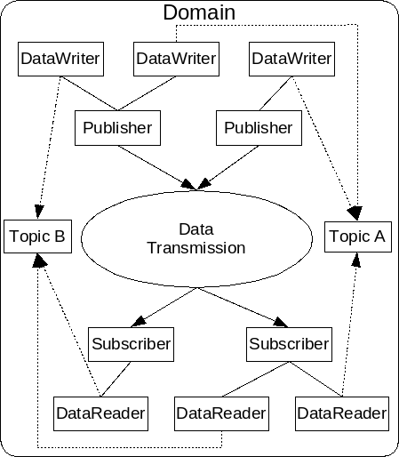

############
Introduction
############

OpenDDS is an open source implementation of the OMG Data Distribution Service
(DDS) for Real-Time Systems Specification v1.4 (OMG Document formal/2015-04-10)
and the Real-time Publish-Subscribe Wire Protocol DDS Interoperability Wire
Protocol Specification (DDSI-RTPS) v2.2 (OMG Document formal/2014-09-01).
OpenDDS also implements the DDS Security Sepcification v1.1 (OMG Document
formal/2018-04-01). OpenDDS is sponsored by Object Computing, Inc. (OCI) and is
available at http://www.opendds.org/. This developer’s guide is based on the
version |release| release of OpenDDS.

DDS defines a service for efficiently distributing application data between
participants in a distributed application. This service is not specific to
CORBA. The specification provides a Platform Independent Model (PIM) as well as
a Platform Specific Model (PSM) that maps the PIM onto a CORBA IDL
implementation. 

For additional details about DDS, developers should refer to the DDS
specification (OMG Document formal/2015-04-10) as it contains in-depth coverage
of all the service’s features. 

OpenDDS is the open-source C++ implementation of OMG’s DDS specification
developed and commercially supported by Object Computing, Inc. (OCI). It is
available for download from http://www.opendds.org/downloads.html and is
compatible with the latest patch level of OCI TAO version 2.2a, and the latest
DOC Group release.

*************
DCPS Overview
*************

In this section we introduce the main concepts and entities of the DCPS layer
and discuss how they interact and work together.

Basic Concepts
==============

:numref:`dcps` shows an overview of the DDS DCPS layer. The following
subsections define the concepts shown in this diagram.

.. _dcps:

  DCPS Conceptual Overview

.. attention::

  TODO: The rest of the introduction section.
