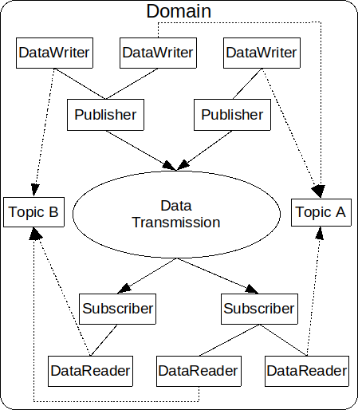

.. include:: <isonum.txt>

..
    Sect<1>

.. _introduction--dcps-overview:

###################
Introduction to DDS
###################

..
    Sect<1.1>

The Data Distribution Service (DDS |reg|) is a specification for distributed systems based on the publish-subscribe paradigm published by the Object Management Group (OMG |reg|).
DDS applications efficiently share data across the network using strongly-typed and asynchronous cache updates based on topics and QoS policies.
:omgspec:`dds:2.2.1.2` contains a detailed overview of DDS.
Data-Centric Publish-Subscribe (DCPS) is the application model defined by the DDS specification.
This section describes the main concepts and entities of the DCPS API and discuss how they interact and work together.

.. _introduction--basic-concepts:

**************
Basic Concepts
**************

..
    Sect<1.1.1>

This is an overview of the DDS DCPS API:

  DCPS Conceptual Overview

The following subsections define the concepts shown in the diagram.

.. _introduction--domain:

Domain
======

..
    Sect<1.1.1.1>

The *domain* is the fundamental partitioning unit within DCPS.
Each of the other entities belongs to a domain and can only interact with other entities in that same domain.
Application code is free to interact with multiple domains but must do so via separate entities that belong to the different domains.
Domains are identified by an integer identifier.
There is no entity in the DCPS API that represents the domain.

Entity
======

An *entity* is an object in a domain that has a QoS policy, status, and can be used with listeners and waitsets.
"Entity" is an interface that is implemented by the other concepts in a DCPS domain.
The QoS policy for each derived entity is specialized for that entity.

.. _introduction--domainparticipant:

Domain Participant
==================

..
    Sect<1.1.1.2>

A *domain participant* or just *participant* is the entry-point for an application to interact within a particular domain.
The domain participant is a factory for many of the objects involved in writing or reading data.

.. _introduction--topic:

Topic
=====

..
    Sect<1.1.1.3>

The *topic* is the fundamental means of interaction between publishing and subscribing applications.
Each topic has a unique name within the domain that connects publishers to subscribers.
Multiple processes can publish on a topic and multiple processes can subscribe to a topic which allows for many-to-many communication.
A publishing process specifies the topic when publishing samples and a subscribing process requests samples via the topic.

Samples, Instances, and Types
=============================

In DCPS terminology, an application publishes individual data *samples* for different *instances* on a topic.
Each topic has a specific type that describes the samples.
Each topic data type can specify zero or more fields that make up its *key*.
Each instance is associated with a unique value for the key.
A publishing process publishes multiple data samples on the same instance by using the same key value for each sample.
Conceptually, a topic data type without a key has a single instance.

A type can be defined at compile-time (static type) or at run-time (dynamic type).
An application can use both static types and dynamic types.
Static types are defined using OMG Interface Description Language (:term:`IDL`).
See :ref:`getting_started--defining-data-types-with-idl` for more information and examples.
Dynamic types can be created or acquired via API.
(OpenDDS current does not support the creation of dynamic types.)

The type associated with a topic is relative to a participant.
That is, two different participants may have different definitions for the same topic type.
A feature called :ref:`xtypes` allows participants with different topic types to still exchange samples.
If XTypes is not used, then the types must match exactly.

.. _introduction--datawriter:

DataWriter
==========

..
    Sect<1.1.1.4>

A *data writer* is used by the publishing application code to introduce samples for distribution.
Each data writer is bound to a particular topic.
The application uses the data writer's type-specific interface to publish samples on that topic.
The data writer is responsible for marshaling the data and passing it to the publisher for transmission.

:ref:`Dynamic data writers <xtypes--creating-and-using-a-dynamicdatawriter-or-dynamicdatareader>` can be used when code generated from IDL is not available or desired.
Dynamic data writers are also type-safe, but type checking happens at runtime.

.. _introduction--publisher:

Publisher
=========

..
    Sect<1.1.1.5>

A *publisher* is responsible for taking the published data and disseminating it to all relevant subscribers in the domain.
The exact mechanism employed is left to the service implementation.
A participant can have multiple publishers and each publisher can have multiple data writers which may be on different topics.
A publisher can group a sequence of writes that span multiple data writers so that it appears as a coherent change to subscribers.

.. _introduction--subscriber:

Subscriber
==========

..
    Sect<1.1.1.6>

A *subscriber* receives the data from the publisher and passes it to any relevant data readers that belong to it.
A participant can have multiple subscribers and each subscriber can have multiple data readers which may be on different topics.

.. _introduction--datareader:

DataReader
==========

..
    Sect<1.1.1.7>

A *data reader* takes data from the subscriber, demarshals it into the appropriate type for that topic, and delivers the sample to the application.
Each data reader is bound to a particular topic.
The application uses the data reader's type-specific interfaces to receive the samples.

:ref:`Dynamic data readers <xtypes--creating-and-using-a-dynamicdatawriter-or-dynamicdatareader>` can be used when code generated from IDL is not available or desired.
Dynamic data readers are also type-safe, but type checking happens at runtime.

.. _dds-introduction--discovery:

************************************
Discovery, Matching, and Association
************************************

*Discovery* is the process whereby a participant learns about the publications and subscriptions offered by other participants.
The :ref:`spec-dds` leaves the details of discovery to the implementation.

After discovering a remote publication and subscription, a participant compares the remote entity with its local entities to determine if they are compatible.
This process is called *matching*.
A data writer and data reader match if they are on the same topic, they have compatible types, and they have compatible QoS policies.

If a local entity matches a remote entity, then the implementation is configured to allow data to flow from the data writer to the data reader.
This is called *association*.

.. seealso::

  :ref:`discovery`
    The discovery impementations availables in OpenDDS.

.. _introduction--quality-of-service-policies:

***************************
Quality of Service Policies
***************************

..
    Sect<1.1.3>

The DDS specification defines a number of Quality of Service (QoS) policies that are used by applications to specify their QoS requirements to the service.
Participants specify what behavior they require from the service and the service decides how to achieve these behaviors.
These policies can be applied to the various DCPS entities (topic, data writer, data reader, publisher, subscriber, domain participant) although not all policies are valid for all types of entities.

Subscribers and publishers are matched using a request-versus-offered (RxO) model.
Subscribers *request* a set of policies that are minimally required.
Publishers *offer* a set of QoS policies to potential subscribers.
The DDS implementation then attempts to match the requested policies with the offered policies; if these policies are compatible then the association is formed.

.. seealso::

  :ref:`qos`
    The QoS policies available in OpenDDS and how to use them.

********************
Conceptual Data Flow
********************

The application on the publishing side initiates the flow of data by writing a sample to the DataWriter which then passes it to its associated Publisher.
The Publisher sends the sample to associated Subscribers.
Each Subscriber gives the received sample to its DataReaders that are associated with the sending DataWriter.
The flow ends when the application on the subscribing side retrieves the data from the DataReader.

Quality of Service (QoS) Policies control the flow of the data through the system.
The QoS policies of the Publisher, DataWriter, and Topic control the data on the sending side.
The QoS policies of the Subscriber, DataReader, and Topic control the data on the receiving side.

.. _introduction--built-in-topics:

**********************
Built-in Topics (BITs)
**********************

..
    Sect<1.1.2>

The DDS specification defines a number of topics that are built-in to the DDS implementation.
Subscribing to these *built-in topics* gives application developers access to the state of the domain being used including which topics are registered, which data readers and data writers have been discovered and their status, and the QoS settings of the various entities.
While subscribed, the application receives samples indicating changes in the entities within the domain.

.. seealso::

  :ref:`bit`
    The built-in topics available in OpenDDS and how to use them.

.. _introduction--listeners:

*********
Listeners
*********

..
    Sect<1.1.4>

The DCPS API defines a callback interface for each entity that allows an application to listen for certain state changes or events pertaining to that entity.
For example, a Data Reader Listener is notified when there are data values available for reading.

.. seealso::

  :ref:`conditions_and_listeners--listeners`
    The listeners available in OpenDDS and how to use them.

.. _introduction--conditions:

**********
Conditions
**********

..
    Sect<1.1.5>

*Conditions* and *Wait Sets* can also be used to detect events of interest in DDS Entities and are an alternative to listeners.
The general pattern is the application creates a specific kind of ``Condition`` object, such as a ``StatusCondition``, and attaches it to a ``WaitSet``.

* The application waits on the ``WaitSet`` until one or more conditions become true.

* The application calls operations on the corresponding entity objects to extract the necessary information.

* The ``DataReader`` interface also has operations that take a ``ReadCondition`` argument.

* ``QueryCondition`` objects are provided as part of the implementation of the :ref:`content_subscription_profile`.
  The ``QueryCondition`` interface extends the ``ReadCondition`` interface.

.. seealso::

  :ref:`conditions_and_listeners--conditions`
    The conditions available in OpenDDS and how to use them.
