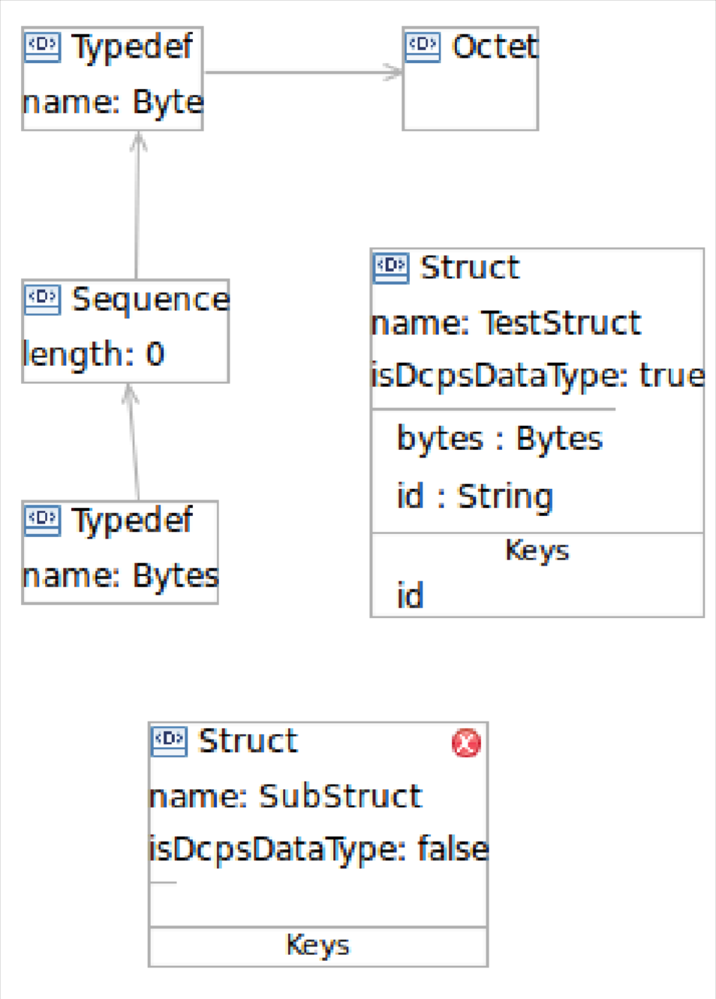
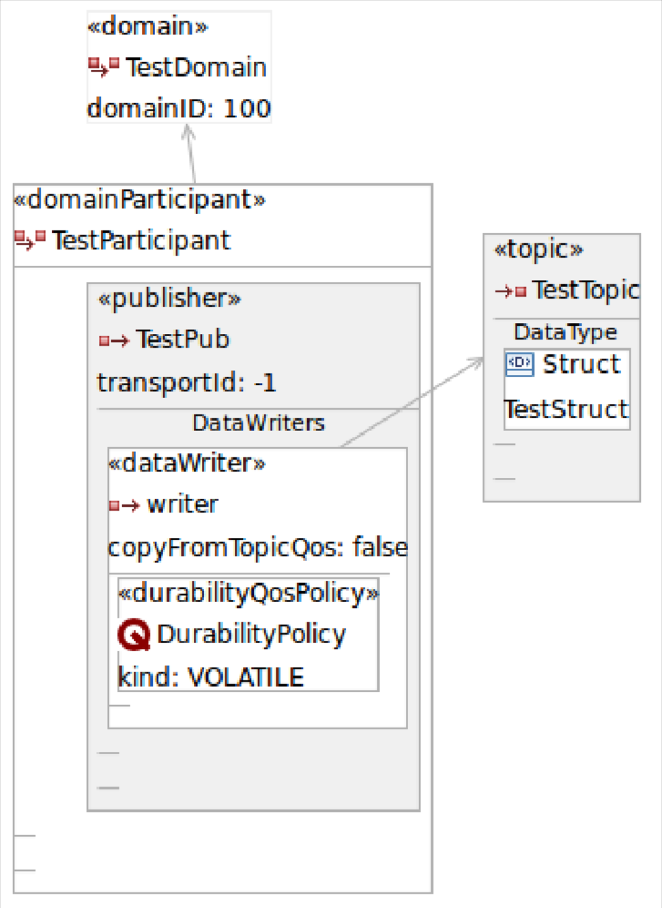
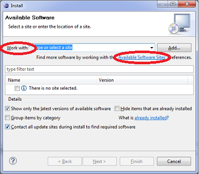

.. _modeling_sdk--modeling-sdk:

############
Modeling SDK
############

..
    Sect<11>

The OpenDDS Modeling SDK is a modeling tool that can be used by the application developer to define the required middleware components and data structures as a UML model and then generate the code to implement the model using OpenDDS.
The generated code can then be compiled and linked with the application to provide seamless middleware support to the application.

.. _modeling_sdk--overview:

********
Overview
********

..
    Sect<11.1>

.. _modeling_sdk--model-capture:

Model Capture
=============

..
    Sect<11.1.1>

UML models defining DCPS elements and policies along with data definitions are captured using the graphical model capture editors included in the Eclipse plug-ins.
The elements of the UML models follow the structure of the DDS UML Platform Independent Model (PIM) defined in the DDS specification (OMG: ``formal/2015-04-10``).

Opening a new OpenDDS model within the plug-ins begins with a top level main diagram.
This diagram includes any package structures to be included in the model along with the local QoS policy definitions, data definitions, and DCPS elements of the model.
Zero or more of the policy or data definition elements can be included.
Zero or one DCPS elements definition can be included in any given model.

.. _modeling_sdk--reffigure5:

**Figure  Graphical modeling of the data definitions**

Creating separate models for QoS policies only, data definitions only, or DCPS elements only is supported.
References to other models allows externally defined models to be included in a model.
This allows sharing of data definitions and QoS policies among different DCPS models as well as including externally defined data in a new set of data definitions.

.. _modeling_sdk--reffigure6:

**Figure  Graphical modeling of the DCPS entities**

.. _modeling_sdk--code-generation:

Code Generation
===============

..
    Sect<11.1.2>

Once models have been captured, source code can be generated from them.
This source code can then be compiled into link libraries providing the middleware elements defined in the model to applications that link the library.
Code generation is done using a separate forms based editor.

Specifics of code generation are unique to the individual generation forms and are kept separate from the models for which generation is being performed.
Code generation is performed on a single model at a time and includes the ability to tailor the generated code as well as specifying search paths to be used for locating resources at build time.

It is possible to generate model variations (distinct customizations of the same model) that can then be created within the same application or different applications.
It is also possible to specify locations to search for header files and link libraries at build time.

See section :ref:`modeling_sdk--generated-code`, “Generated Code” for details.

.. _modeling_sdk--programming:

Programming
===========

..
    Sect<11.1.3>

In order to use the middleware defined by models, applications need to link in the generated code.
This is done through header files and link libraries.
Support for building applications using the MPC portable build tool is included in the generated files for a model.

See section :ref:`modeling_sdk--developing-applications`, “Developing Applications” for details.

.. _modeling_sdk--installation-and-getting-started:

********************************
Installation and Getting Started
********************************

..
    Sect<11.2>

Unlike the OpenDDS Middleware which is compiled from source code by the developer, the compiled Modeling SDK is available for download via an Eclipse Update Site.

.. _modeling_sdk--prerequisites:

Prerequisites
=============

..
    Sect<11.2.1>

* Java Runtime Environment (JRE)

* Eclipse IDE

.. _modeling_sdk--installation:

Installation
============

..
    Sect<11.2.2>

#. From Eclipse, open the Help menu and select Install New Software.

.. _modeling_sdk--reffigure7:

**Figure  Eclipse Software Installation Dialog**

* Click the hyperlink for Available Software Sites.

* The standard ``eclipse.org`` sites (Eclipse Project Updates and Galileo) should be enabled.
  If they are disabled, enable them now.

* Add a new Site entry named OpenDDS with URL http://www.opendds.org/modeling/eclipse_44

* Click OK to close the Preferences dialog and return to the Install dialog.

* In the “Work with” combo box, select the new entry for OpenDDS.

* Select the “OpenDDS Modeling SDK” and click Next.

* Review the “Install Details” list and click Next.
  Review the license, select Accept (if you do accept it), and click Finish.

* Eclipse will download the OpenDDS plug-ins and various plug-ins from ``eclipse.org`` that they depend on.
  There will be a security warning because the OpenDDS plug-ins are not signed.
  There also may be a prompt to accept a certificate from ``eclipse.org``.

* Eclipse will prompt the user to restart in order to use the newly installed software.

.. _modeling_sdk--getting-started:

Getting Started
===============

..
    Sect<11.2.3>

The OpenDDS Modeling SDK contains an Eclipse Perspective.
Open it by going to the Window menu and selecting Open Perspective -> Other -> OpenDDS Modeling.

To get started using the OpenDDS Modeling SDK, see the help content installed in Eclipse.
Start by going to the Help menu and selecting Help Contents.
There is a top-level item for “``OpenDDS Modeling SDK Guide``” that contains all of the OpenDDS-specific content describing the modeling and code generation activities.

.. _modeling_sdk--developing-applications:

***********************
Developing Applications
***********************

..
    Sect<11.3>

In order to build an application using the OpenDDS Modeling SDK, one must understand a few key concepts.
The concepts concern:

#. The support library

#. Generated model code

#. Application code

.. _modeling_sdk--modeling-support-library:

Modeling Support Library
========================

..
    Sect<11.3.1>

The OpenDDS Modeling SDK includes a support library, found at :ghfile:`tools/modeling/codegen/model`.
This support library, when combined with the code generated by the Modeling SDK, greatly reduces the amount of code needed to build an OpenDDS application.

The support library is a C++ library which is used by an OpenDDS Modeling SDK application.
Two classes in the support library that most developers will need are the Application and Service classes.

.. _modeling_sdk--the-application-class:

The Application Class
---------------------

..
    Sect<11.3.1.1>

The ``OpenDDS::Model::Application`` class takes care of initialization and finalization of the OpenDDS library.
It is required for any application using OpenDDS to instantiate a single instance of the ``Application`` class, and further that the ``Application`` object not be destroyed while communicating using OpenDDS.

The ``Application`` class initializes the factory used to create OpenDDS participants.
This factory requires the user-provided command line arguments.
In order to provide them, the ``Application`` object must be provided the same command line arguments.

.. _modeling_sdk--the-service-class:

The Service Class
-----------------

..
    Sect<11.3.1.2>

The ``OpenDDS::Model::Service`` class is responsible for the creation of OpenDDS entities described in an OpenDDS Modeling SDK model.
Since the model can be generic, describing a much broader domain than an individual application uses, the Service class uses lazy instantiation to create OpenDDS entities.

In order to properly instantiate these entities, it must know:

* The relationships among the entities

* The transport configuration used by entities

.. _modeling_sdk--generated-code:

Generated Code
==============

..
    Sect<11.3.2>

The OpenDDS Modeling SDK generates model-specific code for use by an OpenDDS Modeling SDK application.
Starting with a .codegen file (which refers to an ``.opendds`` model file), the files described in :ref:`Table 11-1 <modeling_sdk--reftable35>`.
The process of generating code is documented in the Eclipse help.

.. _modeling_sdk--reftable35:

**Table  Generated Files**

+---------------------------+-------------------------------------------------------------------------------------------+
| File Name                 | Description                                                                               |
+===========================+===========================================================================================+
| ``<ModelName>.idl``       | Data types from the model’s ``DataLib``                                                   |
+---------------------------+-------------------------------------------------------------------------------------------+
| ``<ModelName>_T.h``       | C++ class from the model’s ``DcpsLib``                                                    |
+---------------------------+-------------------------------------------------------------------------------------------+
| ``<ModelName>_T.cpp``     | C++ implementation of the model’s ``DcpsLib``                                             |
+---------------------------+-------------------------------------------------------------------------------------------+
| ``<ModelName>.mpc``       | MPC project file for the generated C++ library                                            |
+---------------------------+-------------------------------------------------------------------------------------------+
| ``<ModelName>.mpb``       | MPC base project for use by the application                                               |
+---------------------------+-------------------------------------------------------------------------------------------+
| ``<ModelName>_paths.mpb`` | MPC base project with paths, see section :ref:`modeling_sdk--dependencies-between-models` |
+---------------------------+-------------------------------------------------------------------------------------------+
| ``<ModelName>Traits.h``   | Transport configuration from the .codegen file                                            |
+---------------------------+-------------------------------------------------------------------------------------------+
| ``<ModelName>Traits.cpp`` | Transport configuration from the .codegen file                                            |
+---------------------------+-------------------------------------------------------------------------------------------+

.. _modeling_sdk--the-dcps-model-class:

The DCPS Model Class
--------------------

..
    Sect<11.3.2.1>

The DCPS library models relationships between DDS entities, including ``Topics``, ``DomainParticipants``, ``Publishers``, ``Subscribers``, ``DataWriters`` and ``DataReaders``, and their corresponding Domains.

For each DCPS library in your model, the OpenDDS Modeling SDK generates a class named after the DCPS library.
This DCPS model class is named after the DCPS library, and is found in the ``<ModelName>_T.h`` file in the code generation target directory.

The model class contains an inner class, named Elements, defining enumerated identifiers for each DCPS entity modeled in the library and each type referenced by the library's Topics.
This Elements class contains enumeration definitions for each of:

* DomainParticipants

* Types

* Topics

* Content Filtered Topics

* Multi Topics

* Publishers

* Subscribers

* Data Writers

* Data Readers

In addition, the DCPS model class captures the relationships between these entities.
These relationships are used by the Service class when instantiating DCPS entities.

.. _modeling_sdk--the-traits-class:

The Traits Class
----------------

..
    Sect<11.3.2.2>

Entities in a DCPS model reference their transport configuration by name.
The Model Customization tab of the Codegen file editor is used to define the transport configuration for each name.

There can be more than one set of configurations defined for a specific code generation file.
These sets of configurations are grouped into instances, each identified by a name.
Multiple instances may be defined, representing different deployment scenarios for models using the application.

For each of these instances, a ``Traits`` class is generated.
The traits class provides the transport configuration modeled in the Codegen editor for a specific transport configuration name.

.. _modeling_sdk--the-service-typedef:

The Service Typedef
-------------------

..
    Sect<11.3.2.3>

The Service is a template which needs two parameters: (1) the entity model, in the DCPS model ``Elements`` class, (2) transport configuration, in a ``Traits`` class.
The OpenDDS Modeling SDK generates one typedef for each combination of DCPS library and transport configuration model instance.
The typedef is named ``<InstanceName><DCPSLibraryName>Type``.

.. _modeling_sdk--data-library-generated-code:

Data Library Generated Code
---------------------------

..
    Sect<11.3.2.4>

From the data library, IDL is generated, which is processed by the IDL compilers.
The IDL compilers generate type support code, which is used to serialize and deserialize data types.

.. _modeling_sdk--qos-policy-library-generated-code:

QoS Policy Library Generated Code
---------------------------------

..
    Sect<11.3.2.5>

There are no specific compilation units generated from the QoS policy library.
Instead, the DCPS library stores the QoS policies of the entities it models.
This QoS policy is later queried by the Service class, which sets the QoS policy upon entity creation.

.. _modeling_sdk--application-code-requirements:

Application Code Requirements
=============================

..
    Sect<11.3.3>

.. _modeling_sdk--required-headers:

Required headers
----------------

..
    Sect<11.3.3.1>

The application will need to include the ``Traits`` header, in addition to the ``Tcp.h`` header (for static linking).
These will include everything required to build a publishing application.
Here is the ``#include`` section of an example publishing application, ``MinimalPublisher.cpp``.

.. code-block:: cpp

    #ifdef ACE_AS_STATIC_LIBS
    #include <dds/DCPS/transport/tcp/Tcp.h>
    #endif

    #include "model/MinimalTraits.h"

.. _modeling_sdk--exception-handling:

Exception Handling
------------------

..
    Sect<11.3.3.2>

It is recommended that Modeling SDK applications catch both ``CORBA::Exception`` objects and ``std::exception`` objects.

.. code-block:: cpp

    int ACE_TMAIN(int argc, ACE_TCHAR* argv[])
    {
      try {
        // Create and use OpenDDS Modeling SDK (see sections below)
      } catch (const CORBA::Exception& e) {
        // Handle exception and return non-zero
      } catch (const OpenDDS::DCPS::Transport::Exception& te) {
        // Handle exception and return non-zero
      } catch (const std::exception& ex) {
        // Handle exception and return non-zero
      }
      return 0;
    }

.. _modeling_sdk--instantiation:

Instantiation
-------------

..
    Sect<11.3.3.3>

As stated above, an OpenDDS Modeling SDK application must create an ``OpenDDS::Model::Application`` object for the duration of its lifetime.
This ``Application`` object, in turn, is passed to the constructor of the Service object specified by one of the typedef declarations in the traits headers.

The service is then used to create OpenDDS entities.
The specific entity to create is specified using one of the enumerated identifiers specified in the ``Elements`` class.
The Service provides this interface for entity creation:

.. code-block:: cpp

    DDS::DomainParticipant_var participant(Elements::Participants::Values part);
    DDS::TopicDescription_var topic(Elements::Participants::Values part,
                                    Elements::Topics::Values topic);
    DDS::Publisher_var publisher(Elements::Publishers::Values publisher);
    DDS::Subscriber_var subscriber(Elements::Subscribers::Values subscriber);
    DDS::DataWriter_var writer(Elements::DataWriters::Values writer);
    DDS::DataReader_var reader(Elements::DataReaders::Values reader);

It is important to note that the service also creates any required intermediate entities, such as ``DomainParticipants``, ``Publishers``, ``Subscribers``, and ``Topics``, when necessary.

.. _modeling_sdk--publisher-code:

Publisher Code
--------------

..
    Sect<11.3.3.4>

Using the ``writer()`` method shown above, ``MinimalPublisher.cpp`` continues:

.. code-block:: cpp

    int ACE_TMAIN(int argc, ACE_TCHAR* argv[])
    {
      try {
        OpenDDS::Model::Application application(argc, argv);
        MinimalLib::DefaultMinimalType model(application, argc, argv);

        using OpenDDS::Model::MinimalLib::Elements;
        DDS::DataWriter_var writer = model.writer(Elements::DataWriters::writer);

What remains is to narrow the ``DataWriter`` to a type-specific data writer, and send samples.

.. code-block:: cpp

        data1::MessageDataWriter_var msg_writer =
            data1::MessageDataWriter::_narrow(writer);
        data1::Message message;
        // Populate message and send
        message.text = "Worst. Movie. Ever.";
        DDS::ReturnCode_t error = msg_writer->write(message, DDS::HANDLE_NIL);
        if (error != DDS::RETCODE_OK) {
          // Handle error
        }

In total our publishing application, ``MinimalPublisher.cpp``, looks like this:

.. code-block:: cpp

    #ifdef ACE_AS_STATIC_LIBS
    #include <dds/DCPS/transport/tcp/Tcp.h>
    #endif

    #include "model/MinimalTraits.h"

    int ACE_TMAIN(int argc, ACE_TCHAR* argv[])
    {
      try {
        OpenDDS::Model::Application application(argc, argv);
        MinimalLib::DefaultMinimalType model(application, argc, argv);

        using OpenDDS::Model::MinimalLib::Elements;
        DDS::DataWriter_var writer = model.writer(Elements::DataWriters::writer);

        data1::MessageDataWriter_var msg_writer =
            data1::MessageDataWriter::_narrow(writer);
        data1::Message message;
        // Populate message and send
        message.text = "Worst. Movie. Ever.";
        DDS::ReturnCode_t error = msg_writer->write(message, DDS::HANDLE_NIL);
        if (error != DDS::RETCODE_OK) {
          // Handle error
        }
      } catch (const CORBA::Exception& e) {
        // Handle exception and return non-zero
      } catch (const std::exception& ex) {
        // Handle exception and return non-zero
      }
      return 0;
    }

Note this minimal example ignores logging and synchronization, which are issues that are not specific to the OpenDDS Modeling SDK.

.. _modeling_sdk--subscriber-code:

Subscriber Code
---------------

..
    Sect<11.3.3.5>

The subscriber code is much like the publisher.
For simplicity, OpenDDS Modeling SDK subscribers may want to take advantage of a base class for Reader Listeners, called ``OpenDDS::Modeling::NullReaderListener``.
The ``NullReaderListener`` implements the entire ``DataReaderListener`` interface and logs every callback.

Subscribers can create a listener by deriving a class from ``NullReaderListener`` and overriding the interfaces of interest, for example on_data_available.

.. code-block:: cpp

    #ifdef ACE_AS_STATIC_LIBS
    #include <dds/DCPS/transport/tcp/Tcp.h>
    #endif

    #include "model/MinimalTraits.h"
    #include <model/NullReaderListener.h>

    class ReaderListener : public OpenDDS::Model::NullReaderListener {
    public:
      virtual void on_data_available(DDS::DataReader_ptr reader)
                            ACE_THROW_SPEC((CORBA::SystemException)) {
        data1::MessageDataReader_var reader_i =
          data1::MessageDataReader::_narrow(reader);

        if (!reader_i) {
          // Handle error
          ACE_OS::exit(-1);
        }

        data1::Message msg;
        DDS::SampleInfo info;

        // Read until no more messages
        while (true) {
          DDS::ReturnCode_t error = reader_i->take_next_sample(msg, info);
          if (error == DDS::RETCODE_OK) {
            if (info.valid_data) {
              std::cout << "Message: " << msg.text.in() << std::endl;
            }
          } else {
            if (error != DDS::RETCODE_NO_DATA) {
              // Handle error
            }
            break;
          }
        }
      }
    };

In the main function, create a data reader from the service object:

.. code-block:: cpp

        DDS::DataReader_var reader = model.reader(Elements::DataReaders::reader);

Naturally, the ``DataReaderListener`` must be associated with the data reader in order to get its callbacks.

.. code-block:: cpp

        DDS::DataReaderListener_var listener(new ReaderListener);
        reader->set_listener(listener, OpenDDS::DCPS::DEFAULT_STATUS_MASK);

The remaining subscriber code has the same requirements of any OpenDDS Modeling SDK application, in that it must initialize the OpenDDS library through an ``OpenDDS::Modeling::Application`` object, and create a Service object with the proper DCPS model Elements class and traits class.

An example subscribing application, ``MinimalSubscriber.cpp``, follows.

.. code-block:: cpp

    #ifdef ACE_AS_STATIC_LIBS
    #include <dds/DCPS/transport/tcp/Tcp.h>
    #endif

    #include "model/MinimalTraits.h"
    #include <model/NullReaderListener.h>

    class ReaderListener : public OpenDDS::Model::NullReaderListener {
    public:
      virtual void on_data_available(DDS::DataReader_ptr reader)
                            ACE_THROW_SPEC((CORBA::SystemException)) {
        data1::MessageDataReader_var reader_i =
          data1::MessageDataReader::_narrow(reader);

        if (!reader_i) {
          // Handle error
          ACE_OS::exit(-1);
        }

        data1::Message msg;
        DDS::SampleInfo info;

        // Read until no more messages
        while (true) {
          DDS::ReturnCode_t error = reader_i->take_next_sample(msg, info);
          if (error == DDS::RETCODE_OK) {
            if (info.valid_data) {
              std::cout << "Message: " << msg.text.in() << std::endl;
            }
          } else {
            if (error != DDS::RETCODE_NO_DATA) {
              // Handle error
            }
            break;
          }
        }
      }
    };

    int ACE_TMAIN(int argc, ACE_TCHAR* argv[])
    {
      try {
        OpenDDS::Model::Application application(argc, argv);
        MinimalLib::DefaultMinimalType model(application, argc, argv);

        using OpenDDS::Model::MinimalLib::Elements;

        DDS::DataReader_var reader = model.reader(Elements::DataReaders::reader);

        DDS::DataReaderListener_var listener(new ReaderListener);
        reader->set_listener(listener, OpenDDS::DCPS::DEFAULT_STATUS_MASK);

        // Call on_data_available in case there are samples which are waiting
        listener->on_data_available(reader);

        // At this point the application can wait for an exteral “stop” indication
        // such as blocking until the user terminates the program with Ctrl-C.

      } catch (const CORBA::Exception& e) {
        e._tao_print_exception("Exception caught in main():");
        return -1;
      } catch (const std::exception& ex) {
        // Handle error
        return -1;
      }
      return 0;
    }

.. _modeling_sdk--mpc-projects:

MPC Projects
------------

..
    Sect<11.3.3.6>

In order to make use of the OpenDDS Modeling SDK support library, OpenDDS Modeling SDK MPC projects should inherit from the dds_model project base.
This is in addition to the dcpsexe base from which non-Modeling SDK projects inherit.

.. code-block:: mpc

    project(*Publisher) : dcpsexe, dds_model {
      // project configuration
    }

The generated model library will generate an MPC project file and base project file in the target directory, and take care of building the model shared library.
OpenDDS modeling applications must both (1) include the generated model library in their build and (2) ensure their projects are built after the generated model libraries.

.. code-block:: mpc

    project(*Publisher) : dcpsexe, dds_model {
      // project configuration
      libs  += Minimal
      after += Minimal
    }

Both of these can be accomplished by inheriting from the model library's project base, named after the model library.

.. code-block:: mpc

    project(*Publisher) : dcpsexe, dds_model, Minimal {
      // project configuration
    }

Note that the ``Minimal.mpb`` file must now be found by MPC during project file creation.
This can be accomplished through the -include command line option.

Using either form, the MPC file must tell the build system where to look for the generated model library.

.. code-block:: mpc

    project(*Publisher) : dcpsexe, dds_model, Minimal {
      // project configuration
      libpaths += model
    }

This setting based upon what was provided to the Target Folder setting in the Codegen file editor.

Finally, like any other MPC project, its source files must be included:

::

      Source_Files {
        MinimalPublisher.cpp
      }

The final MPC project looks like this for the publisher:

.. code-block:: mpc

    project(*Publisher) : dcpsexe, dds_model, Minimal {
      exename   = publisher
      libpaths += model

      Source_Files {
        MinimalPublisher.cpp
      }
    }

And similar for the subscriber:

.. code-block:: mpc

    project(*Subscriber) : dcpsexe, dds_model, Minimal {
      exename   = subscriber
      libpaths += model

      Source_Files {
        MinimalSubscriber.cpp
      }
    }

.. _modeling_sdk--dependencies-between-models:

Dependencies Between Models
---------------------------

..
    Sect<11.3.3.7>

One final consideration — the generated model library could itself depend on other generated model libraries.
For example, there could be an external data type library which is generated to a different directory.

This possibility could cause a great deal of maintenance of project files, as models change their dependencies over time.
To help overcome this burden, the generated model library records the paths to all of its externally referenced model libraries in a separate MPB file named ``<ModelName>_paths.mpb``.
Inheriting from this paths base project will inherit the needed settings to include the dependent model as well.

Our full MPC file looks like this:

.. code-block:: mpc

    project(*Publisher) : dcpsexe, dds_model, Minimal, Minimal_paths {
      exename   = publisher
      libpaths += model

      Source_Files {
        MinimalPublisher.cpp
      }
    }

    project(*Subscriber) : dcpsexe, dds_model, Minimal, Minimal_paths {
      exename   = subscriber
      libpaths += model

      Source_Files {
        MinimalSubscriber.cpp
      }
    }

