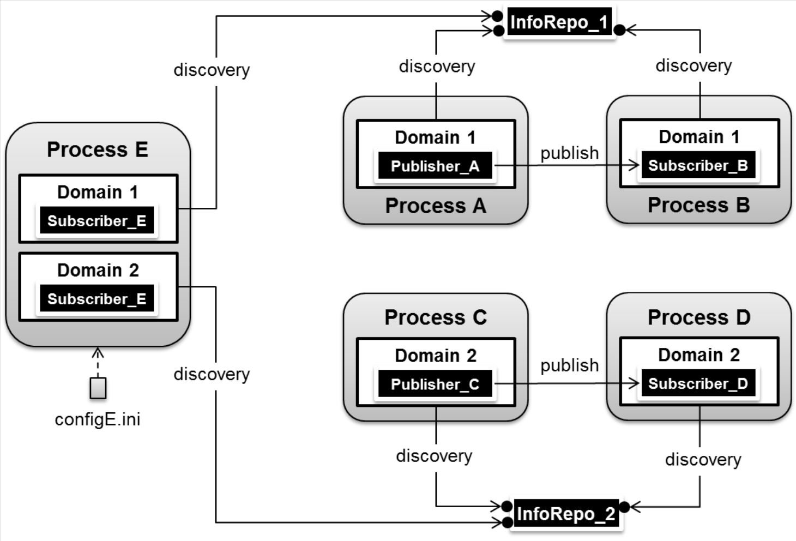

.. default-domain:: cfg

.. _run_time_configuration:
.. _config:

######################
Run-time Configuration
######################

..
    Sect<7>

.. _run_time_configuration--configuration-approach:

OpenDDS configuration is concerned with three main areas:

#. **Common Configuration Properties** -- configure the behavior of DCPS entities at a global level.
   This allows separately deployed processes in a computing environment to share common settings for the specified behavior (e.g. all readers and writers should use RTPS discovery).
   See :ref:`config-common` for details.

#. **Discovery Configuration Properties** -- configure the behavior of the :ref:`discovery mechanism(s) <discovery>`.
   OpenDDS supports multiple approaches for discovering and associating writers and readers as detailed in :ref:`config-disc`.

#. **Transport Configuration Properties** -- configure the :ref:`transport framework <transports>` which abstracts the transport layer from the DCPS layer of OpenDDS.
   Each pluggable transport can be configured separately.
   See :ref:`config-transport` for details.

.. _config-store-keys:

**********************
Configuration Approach
**********************

..
    Sect<7.1>

Most of OpenDDS is configured through a key-value store.
Keys are strings that are converted to a canonical form before being stored by 1) converting camel case to snake case, 2) capitalizing all alphabetic characters, 3) replacing all non-alphanumeric characters with underscores, and 4) stripping leading, trailing, and duplicate underscores.
For example, the key ``!SectionInstance__PROPERTY`` is canonicalized into ``SECTION_INSTANCE_PROPERTY`` before being stored.
Values are stored as strings and converted to other types as necessary.
The documentation for each key contains its canonical name.

A key has the following parts:

#. **section** -- The section describes the area of functionality that is being configured.

#. **instance** -- (optional) The instance names a particular collection of configuration values.
   Configuration keys that do not have an instance imply a singleton or global.

#. **property** -- The property names a variable relative to the section and instance.

Sections, instances, and properties can contain underscores meaning that underscores are not used as delimiters to separate the section, instance, and property.
This ambiguity is resolved by the following rules:

* Sections are known by OpenDDS.
  For example, OpenDDS will look for :ref:`RTPS Discovery <rtps-disc-config>` instances under keys prefixed by ``RTPS_DISCOVERY``.

* Instances must be introduced by a special key-value pair where the value is prefixed by ``@``.
  For example, ``RTPS_DISCOVERY_MY_DISCOVERY=@MY_DISCOVERY`` introduces an instance named ``MY_DISCOVERY`` under the ``RTPS_DISCOVERY`` section.

Suppose the configuration store contains the following key-pairs: ``RTPS_DISCOVERY_MY_DISCOVERY=@MY_DISCOVERY`` and ``RTPS_DISCOVERY_MY_DISCOVERY_RESEND_PERIOD=5``.
In this case, the ``MY_DISCOVERY`` instance of ``RTPS_DISCOVERY`` will have a ``RESEND_PERIOD`` with a value of ``5`` (seconds).

:ref:`This table <run_time_configuration--sections>` shows a list of the available configuration section types as they relate to the area of OpenDDS that they configure.

.. _run_time_configuration--sections:

.. list-table:: Configuration Sections
   :header-rows: 1

   * - **Focus Area**

     - **Section Title**

   * - :ref:`Global Settings <config-common>`

     - :sec:`common`

   * - :ref:`config-disc`

     - :sec:`domain`

   * - :ref:`inforepo-disc-config`

     - :sec:`repository`

   * - :ref:`rtps-disc-config`

     - :sec:`rtps_discovery`

   * - :ref:`static-disc-config`

     - :sec:`endpoint`

       :sec:`topic`

       :sec:`datawriterqos`

       :sec:`datareaderqos`

       :sec:`publisherqos`

       :sec:`subscriberqos`

   * - :ref:`config-transport`

     - :sec:`config`

       :sec:`transport`

   * - Other

     - :sec:`ice`

The configuration store can be populated in a number of ways:

* :ref:`Environment variables <config-environment-variables>`

* :ref:`Command-line arguments <config-command-line-arguments>`

* :ref:`Configuration file(s) <dcpsconfigfile>`

* :ref:`Specific and generic APIs <config-api>`

By default and for backwards compatibility, the different configuration mechanisms are processed in the following order:

#. Environment variables

#. Command-line arguments (will overwrite configuration from environment variables)

#. Configuration file (will not overwrite configuration from environment variables or command-line arguments)

#. APIs called by the user (will overwrite existing configuration)

However, multiple configuration files can be processed by setting ``DCPS_SINGLE_CONFIG_FILE=0``.
This can be done with an environment variable ``OPENDDS_DCPS_SINGLE_CONFIG_FILE=0`` or a command-line argument ``-DCPSSingleConfigFile 0``.
This causes the different configuration mechanisms to be processed in the following order:

#. Environment variables

#. Command-line arguments and configuration files are processed sequentially and overwrite existing configuration

#. APIs called by the user (which also overwrite existing configuration)

Users can store configuration data for their applications in the configuration store.
Users taking advantage of this capability should use the section names of ``APP`` and ``USER`` which are reserved for this purpose.

.. _config-environment-variables:

Configuration with Environment Variables
========================================

OpenDDS reads environment variables that begin with ``OPENDDS_`` to populate the configuration store.
An environment variable ``OPENDDS_KEY=VALUE`` causes ``KEY=VALUE`` to be saved in the configuration store.
``KEY`` is canonicalized before being stored.

To set the ``ResendPeriod`` on an ``rtps_discovery`` instance named ``MyDiscovery`` to 5 seconds using environment variables, one would set the following:

* ``OPENDDS_RTPS_DISCOVERY_MY_DISCOVERY=@MY_DISCOVERY``
* ``OPENDDS_RTPS_DISCOVERY_MY_DISCOVERY_RESEND_PERIOD=5``

.. _config-command-line-arguments:

Configuration with Command-line Arguments
=========================================

This section describes the command-line arguments that are relevant to OpenDDS and how they are processed.
Command-line arguments are passed to the service participant singleton when initializing the domain participant factory.
This is accomplished by using the ``TheParticipantFactoryWithArgs`` macro:

.. code-block:: cpp

    #include <dds/DCPS/Service_Participant.h>

    int main(int argc, char* argv[])
    {
      DDS::DomainParticipantFactory_var dpf =
        TheParticipantFactoryWithArgs(argc, argv);
      // ...
    }

Command-line arguments are parsed in two phases.
The following arguments are parse in the first phase:

#. :prop:`ORBLogFile`

#. :prop:`ORBVerboseLogging`

#. ``-DCPSSingleConfigFile 0|1`` - Enables/disables the legacy behavior of a single configuration file that is processed after environment variables and command-line arguments and does not overwrite existing configuration (default 1).
   When disabled, arguments processed in the second phase are processed as they are encountered and overwrite existing configuration.

The following arguments are processed in the second phase:

#. ``-DCPSConfigFile <path>`` - Causes configuration to be read from the file indicated by ``<path>``.
   It is processed immediately if ``-DCPSSingleConfigFile 0`` and deferred to the end of argument processing, otherwise.

#. ``-OpenDDSKEY VALUE`` - Causes ``KEY=VALUE`` to be saved in the configuration store.
   The key ``KEY`` is canonicalized before being stored.
   To set the :prop:`[rtps_discovery]ResendPeriod` on an :sec:`rtps_discovery` instance named ``MyDiscovery`` to 5 seconds using environment variables, one could use the following arguments:

   * ``-OpenDDS_rtps_discovery_MyDiscovery @MY_DISCOVERY``
   * ``-OpenDDS_rtps_discovery_MyDiscovery_ResendPeriod 5``

#. ``-DCPSx VALUE`` - Causes ``COMMON_DCPS_x=VALUE`` to be saved in the configuration store.
   The key ``COMMON_DCPS_x`` is canonicalized before being stored.

#. ``-FederationX VALUE`` - Causes ``COMMON_FEDERATION_X=VALUE`` to be saved in the configuration store.
   The key ``COMMON_FEDERATION_X`` is canonicalized before being stored.

.. _dcpsconfigfile:

Configuration with a File
=========================

The ``-DCPSConfigFile <path>`` argument described above causes OpenDDS to read configuration from a human-readable ini-style text file.
For example:

.. tab:: Linux, macOS, BSDs, etc.

  .. code-block:: bash

    ./publisher -DCPSConfigFile pub.ini

.. tab:: Windows

  .. code-block:: batch

    publisher -DCPSConfigFile pub.ini

For each of the section types with the exception of :sec:`common` and ``[ice]``, the syntax of a section header takes the form of ``[<section_type>/<instance_name>]``.
For example, a ``[repository]`` section type would always be used in a configuration file like so: ``[repository/repo_1]`` where ``repository`` is the section type and ``repo_1`` is an instance name of a repository configuration.

Using instances to configure discovery and transports is explained further in :ref:`config-disc` and :ref:`config-transport` respectively.

..
  Keep the "word joiner" U+FEFF in the next sentence, otherwise the line is broken up and it comes out strange in the output.

To set a default configuration file to load, use ``TheServiceParticipant->default_configuration_file(ACE_TCHAR* path)``, like in the following example:

.. code-block:: cpp

    #include <dds/DCPS/Service_Participant.h>

    int main(int argc, char* argv[])
    {
      TheServiceParticipant->default_configuration_file(ACE_TEXT("pub.ini"));

      DDS::DomainParticipantFactory_var dpf =
        TheParticipantFactoryWithArgs(argc, argv);
      // ...
    }

``pub.ini`` would be used unless ``-DCPSConfigFile`` is passed to override the default configuration file.

.. _OPENDDS_CONFIG_DIR:

If there is a directory with multiple configuration files, then :envvar:`OPENDDS_CONFIG_DIR` can be used to make ``-DCPSConfigFile`` relative to that directory.
For example, the following commands would have the same effect:

.. code-block:: bash

  ./publisher -DCPSConfigFile /pretend/this/is/a/long/path/a.ini
  ./subscriber -DCPSConfigFile /pretend/this/is/a/long/path/b.ini

  export OPENDDS_CONFIG_DIR=/pretend/this/is/a/long/path
  ./publisher -DCPSConfigFile a.ini
  ./subscriber -DCPSConfigFile b.ini

.. _config-api:

Configuration with API
======================

ConfigStore API
---------------

The configuration store API allows any configuration value to be set and retrieved.
The interface for the ConfigStore is intentionally generic to facilitate multiple language bindings without specific support for every configuration property.
See :ghfile:`dds/DdsDcpsInfrastructure.idl` and :ghfile:`dds/DCPS/ConfigStoreImpl.h` for more details.

.. tab:: C++

  .. code-block:: cpp

     #include <dds/DCPS/Service_Participant.h>

     int main(int argc, char* argv[])
     {
       // ...
       TheServiceParticipant->config_store()->set_string(
          "RTPS_DISCOVERY_MY_DISCOVERY", "@MY_DISCOVERY");
       TheServiceParticipant->config_store()->set_string(
          "RTPS_DISCOVERY_MY_DISCOVERY_RESEND_PERIOD", "5");
       // ...
     }

.. tab:: Java

  .. code-block:: java

     import OpenDDS.DCPS.TheServiceParticipant;
     import OpenDDS.DCPS.ConfigStore;
     // ...
     ConfigStore cs = TheServiceParticipant.config_store();
     cs.set_string("RTPS_DISCOVERY_MY_DISCOVERY", "@MY_DISCOVERY");
     cs.set_string("RTPS_DISCOVERY_MY_DISCOVERY_RESEND_PERIOD", "5");
     // ...

Specific APIs
-------------

Various classes provide methods that allow an application to configure OpenDDS.

* See ``Service_Participant`` in :ghfile:`dds/DCPS/Service_Participant.h`

* See ``InfoRepoDiscovery`` in :ghfile:`dds/DCPS/InfoRepoDiscovery/InfoRepoDiscovery.h`

* See ``RtpsDiscoveryConfig`` in :ghfile:`dds/DCPS/RTPS/RtpsDiscoveryConfig.h`

* See ``TransportRegistry`` in :ghfile:`dds/DCPS/transport/framework/TransportRegistry.h`

* See ``RtpsUdpInst`` in :ghfile:`dds/DCPS/transport/rtps_udp/RtpsUdpInst.h`

* See ``TcpInst`` in :ghfile:`dds/DCPS/transport/tcp/TcpInst.h`

* See ``ShmemInst`` in :ghfile:`dds/DCPS/transport/shmem/ShmemInst.h`

.. _config-common:
.. _run_time_configuration--common-configuration-options:

*******************************
Common Configuration Properties
*******************************

..
    Sect<7.2>

The :sec:`common` section of an OpenDDS configuration file contains options such as the debugging output level, the location of the ``DCPSInfoRepo`` process, and memory preallocation settings.
A sample ``[common]`` section follows:

.. code-block:: ini

    [common]
    DCPSDebugLevel=0
    DCPSInfoRepo=localhost:12345
    DCPSLivelinessFactor=80
    DCPSChunks=20
    DCPSChunksAssociationMultiplier=10
    DCPSBitLookupDurationMsec=2000
    DCPSPendingTimeout=30

It is not necessary to specify every option.

Option values in the ``[common]`` section with names that begin with ``DCPS`` or ``ORB`` [#orbprefix]_ can be overridden by a command-line argument.
The command-line argument has the same name as the configuration option with a ``-`` prepended to it.
For example:

.. code-block:: bash

  subscriber -DCPSInfoRepo localhost:12345

.. sec:: common

  .. prop:: DCPSBidirGIOP=<boolean>
    :default: ``1`` (enabled)

    .. note:: This property is only applicable when using :ref:`inforepo-disc`.

    Use TAO's BiDirectional GIOP feature for interaction with the :ref:`inforepo`.
    With BiDir enabled, fewer sockets are needed since the same socket can be used for both client and server roles.

  .. prop:: DCPSBit=<boolean>
    :default: ``1`` (enabled)

    Controls if :ref:`bit` are enabled.

  .. prop:: DCPSBitLookupDurationMsec=<msec>
    :default: ``2000`` (2 seconds)

    The maximum duration in milliseconds that the framework will wait for latent :ref:`bit` information when retrieving BIT data given an instance handle.
    The participant code may get an instance handle for a remote entity before the framework receives and processes the related BIT information.
    The framework waits for up to the given amount of time before it fails the operation.

  .. prop:: DCPSBitTransportIPAddress=<addr>
    :default: ``INADDR_ANY``

    .. note:: This property is only applicable when using :ref:`inforepo-disc`.

    IP address identifying the local interface to be used by :ref:`tcp-transport` for the :ref:`bit`.

  .. prop:: DCPSBitTransportPort=<port>
    :default: ``0``

    .. note:: This property is only applicable when using :ref:`inforepo-disc`.

    Port used by the :ref:`tcp-transport` for :ref:`bit`.
    If the default of ``0`` is used, the operating system will choose a port to use.

  .. prop:: DCPSChunkAssociationMultiplier=<n>
    :default: ``10``

    Multiplier for the :prop:`DCPSChunks` or the ``max_samples`` value in :ref:`qos-resource-limits` to determine the total number of shallow copy chunks that are preallocated.
    Set this to a value greater than the number of connections so the preallocated chunk handles do not run out.
    A sample written to multiple data readers will not be copied multiple times but there is a shallow copy handle to that sample used to manage the delivery to each data reader.
    The size of the handle is small so there is not great need to set this value close to the number of connections.

  .. prop:: DCPSChunks=<n>
    :default: ``20``

    Configurable number of chunks that a data writer's and reader's cached allocators will preallocate when the :ref:`qos-resource-limits` value is infinite.
    When all of the preallocated chunks are in use, OpenDDS allocates from the heap.
    This feature of allocating from the heap when the preallocated memory is exhausted provides flexibility but performance will decrease when the preallocated memory is exhausted.

  .. prop:: DCPSDebugLevel=<n>
    :default: ``0`` (disabled)

    Integer value that controls the amount of :ref:`debug information the DCPS layer logs <run_time_configuration--dcps-layer-debug-logging>`.
    Valid values are ``0`` through ``10``.

  .. prop:: DCPSDefaultAddress=<addr>
    :default: ``0.0.0.0``

    Default value for the host portion of ``local_address`` in transport instances and some other host address values:

    - :prop:`[transport@tcp]local_address`
    - :prop:`[transport@udp]local_address`
    - :prop:`[transport@multicast]local_address`
    - :prop:`[transport@rtps_udp]local_address`
    - :prop:`[transport@rtps_udp]ipv6_local_address`
    - :prop:`[transport@rtps_udp]multicast_interface`
    - :prop:`[rtps_discovery]SedpLocalAddress`
    - :prop:`[rtps_discovery]SpdpLocalAddress`
    - :prop:`[rtps_discovery]MulticastInterface`

  .. prop:: DCPSDefaultDiscovery=DEFAULT_REPO|DEFAULT_RTPS|DEFAULT_STATIC|<name>
    :default: :val:`DEFAULT_REPO`

    Specifies a discovery configuration to use for any domain not explicitly configured.

    .. val:: DEFAULT_REPO

      Uses a default :ref:`inforepo-disc` configuration.

    .. val:: DEFAULT_RTPS

      Uses a default :ref:`rtps-disc` configuration.

    .. val:: DEFAULT_STATIC

      Uses a default :ref:`static-disc` configuration.

    .. val:: <name>

        Name of a user-defined discovery configuration.
        This can either be a :sec:`repository` or :sec:`rtps_discovery` section

    See :ref:`config-disc` for details about configuring discovery.

  .. prop:: DCPSGlobalTransportConfig=<name>|$file
    :default: The default configuration is used as described in :ref:`run_time_configuration--overview`.

    The :ref:`transport configuration <config-transport>` that should be used as the global default one.

    .. val:: <name>

      Name of a user-defined :sec:`config` sections.

    .. val:: $file

      ``$file`` uses a transport configuration that includes all transport instances defined in the configuration file.

  .. prop:: DCPSInfoRepo=<objref>
    :default: ``file://repo.ior``

    Object reference for locating the :ref:`inforepo` in :ref:`inforepo-disc`.
    This value is passed to ``CORBA::ORB::string_to_object()`` and can be any Object URL type understandable by :term:`TAO` (file, IOR, corbaloc, corbaname).
    A simplified endpoint description of the form ``<host>:<port>`` is also accepted, which is equivalent to ``corbaloc::<host>:<port>/DCPSInfoRepo``.

  .. prop:: DCPSLivelinessFactor=<n>
    :default: ``80``

    Percent of the :ref:`qos-liveliness` lease duration after which a liveliness message is sent.
    A value of ``80`` implies a 20% cushion of latency from the last detected heartbeat message.

  .. prop:: DCPSLogLevel=none|error|warning|notice|info|debug
    :default: :val:`warning`

    General logging control.

    .. val:: none

      See :ref:`none log level <log-none>`

    .. val:: error

      See :ref:`error log level <log-error>`

    .. val:: warning

      See :ref:`warning log level <log-warning>`

    .. val:: notice

      See :ref:`notice log level <log-notice>`

    .. val:: info

      See :ref:`info log level <log-info>`

    .. val:: debug

      See :ref:`debug log level <log-debug>`

    See :ref:`run_time_configuration--logging` for details.

  .. prop:: DCPSMonitor=<boolean>
    :default: ``0``

    Use the Monitor library to publish data on monitoring topics (see :ghfile:`dds/monitor/README`).

  .. prop:: DCPSPendingTimeout=<sec>
    :default: ``0``

    The maximum duration in seconds a data writer will block to allow unsent samples to drain on deletion.
    The default, ``0``, blocks indefinitely.

  .. prop:: DCPSPersistentDataDir=<path>
    :default: ``OpenDDS-durable-data-dir``

    The path to a directory on where durable data will be stored for :ref:`PERSISTENT_DURABILITY_QOS <PERSISTENT_DURABILITY_QOS>`.
    If the directory does not exist it will be created automatically.

  .. prop:: DCPSPublisherContentFilter=<boolean>
    :default: ``1``

    Controls the filter expression evaluation policy for :ref:`content filtered topics <content_subscription_profile--content-filtered-topic>`.
    When the value is ``1`` the publisher may drop any samples, before handing them off to the transport when these samples would have been ignored by all subscribers.

  .. prop:: DCPSSecurity=<boolean>
    :default: ``0``

    This setting is only available when OpenDDS is compiled with :ref:`dds_security`.
    If set to ``1``, enable DDS Security framework and built-in plugins.
    Each Domain Participant using security must be created with the correct :ref:`property QoS <dds_security--dds-security-configuration-via-propertyqospolicy>`.

    See :ref:`dds_security` for more information.

  .. prop:: DCPSSecurityDebug=<cat>[,<cat>]...
    :default: ``0`` (No security logging)

    This setting is only available when OpenDDS is compiled with :ref:`dds_security` enabled.
    This controls the :ref:`security debug logging <run_time_configuration--security-debug-logging>` granularity by category.

  .. prop:: DCPSSecurityDebugLevel=<n>
    :default: ``0`` (No security logging)

    This setting is only available when OpenDDS is compiled with :ref:`dds_security` enabled.
    This controls the :ref:`security debug logging <run_time_configuration--security-debug-logging>` granularity by debug level.

  .. prop:: DCPSSecurityFakeEncryption=<boolean>
    :default: ``0`` (Real encryption when that's setup)

    This setting is only available when OpenDDS is compiled with :ref:`dds_security` enabled.
    This option, when set to ``1``, disables all encryption by making encryption and decryption no-ops.
    OpenDDS still generates keys and performs other security bookkeeping, so this option is useful for debugging the security infrastructure by making it possible to manually inspect all messages.

  .. prop:: DCPSThreadStatusInterval=<sec>
    :default: ``0`` (disabled)

    Enable :ref:`internal thread status reporting <built_in_topics--openddsinternalthread-topic>` using the specified reporting interval, in seconds.

  .. prop:: DCPSTransportDebugLevel=<n>
    :default: ``0`` (disabled)

    Integer value that controls the amount of :ref:`debug information the transport layer logs <run_time_configuration--transport-layer-debug-logging>`.
    Valid values are ``0`` through ``5``.

  .. prop:: DCPSTypeObjectEncoding=Normal|WriteOldFormat|ReadOldFormat
    :default: :val:`Normal`

    From when :term:`XTypes` was first implemented in OpenDDS from 3.16.0 until 3.18.0, there was a bug in the encoding and decoding of ``TypeObject`` and related data types for :ref:`representing user types <xtypes--representing-types-with-typeobject-and-dynamictype>`.
    This was fixed in 3.18.0, but if an application needs to be compatible with an application built with 3.16 or 3.17, then it can use this option to do that and migrate to the correct encoding without taking everything down all at once.

    .. val:: WriteOldFormat

      This setting makes OpenDDS use the incorrect encoding.
      To start to migrate an existing set of OpenDDS applications, this should be the setting of applications using OpenDDS 3.18 or later.

    .. val:: ReadOldFormat

      This setting allows OpenDDS to read the incorrect encoding, but it will always write the correct one.
      Once all application using OpenDDS 3.16 or 3.17 have been upgraded to OpenDDS 3.18 or later, ``WriteOldFormat`` can be set to communicate with ``ReadOldFormat`` and ``Normal``.

    .. val:: Normal

      The default, correct encoding is used.
      Once all applications are using both OpenDDS 3.18 or later and ``ReadOldFormat``, then ``Normal`` can be used.

  .. prop:: ORBLogFile=<path>
    :default: Output to standard error stream on most platforms

    Change :ref:`log <run_time_configuration--logging>` message destination to the file specified, which is opened in appending mode. [#orbprefix]_

  .. prop:: ORBVerboseLogging=0|1|2
    :default: ``0``

    Add a prefix to each :ref:`log <run_time_configuration--logging>` message, using a format defined by the :term:`ACE` library: [#orbprefix]_

    .. val:: 0

      No prefix

    .. val:: 1

      Verbose "lite", adds timestamp and priority

    .. val:: 2

      Verbose, in addition to "lite" has host name, PID, program name

  .. prop:: pool_size=<n_bytes>
    :default: ``41943040`` bytes (40 MiB)

    Size of :ref:`safety_profile` memory pool, in bytes.

  .. prop:: pool_granularity=<n_bytes>
    :default: ``8``

    Granularity of :ref:`safety_profile` memory pool in bytes.
    Must be multiple of 8.

  .. prop:: Scheduler=SCHED_RR|SCHED_FIFO|SCHED_OTHER
    :default: :val:`SCHED_OTHER`

    Selects the scheduler to use for transport sending threads.
    Setting the scheduler to a value other than the default requires privileges on most systems.

    .. val:: SCHED_RR

      Round robin scheduling algorithm

    .. val:: SCHED_FIFO

      Allows each thread to run until it either blocks or completes before switching to a different thread

    .. val:: SCHED_OTHER

      The default scheduler on most systems

    .. seealso::

      :manpage:`sched(7)`

      :ref:`qos-transport-priority`

  .. prop:: scheduler_slice=<usec>
    :default: ``0``

    Some operating systems require a time slice value to be set when selecting a :prop:`Scheduler` other than the default.
    For those systems, this option can be used to set a value in microseconds.

.. _config-disc:
.. _run_time_configuration--discovery-configuration:

***********************
Discovery Configuration
***********************

..
    Sect<7.3>

In DDS implementations, participants are instantiated in application processes and must discover one another in order to communicate.
A DDS implementation uses the feature of domains to give context to the data being exchanged between DDS participants in the same domain.
When DDS applications are written, participants are assigned to a domain and need to ensure their configuration allows each participant to discover the other participants in the same domain.

OpenDDS offers a centralized discovery mechanism, a peer-to-peer discovery mechanism, and a static discovery mechanism.
The centralized mechanism uses a separate service running a ``DCPSInfoRepo`` process.
The RTPS peer-to-peer mechanism uses the DDSI-RTPS discovery protocol standard to achieve non-centralized discovery.
The static discovery mechanism uses the configuration file to determine which writers and readers should be associated and uses the underlying transport to determine which writers and readers exist.
A number of configuration options exist to meet the deployment needs of DDS applications.
Except for static discovery, each mechanism uses default values if no configuration is supplied either via the command line or configuration file.

The following sections show how to configure the advanced discovery capabilities.
For example, some deployments may need to use multiple ``DCPSInfoRepo`` services or DDSI-RTPS discovery to satisfy interoperability requirements.

.. _config-domain:
.. _run_time_configuration--domain-configuration:

Domain Configuration
====================

..
    Sect<7.3.1>

An OpenDDS configuration file uses the ``[domain]`` section type to configure one or more discovery domains with each domain pointing to a discovery configuration in the same file or a default discovery configuration.
OpenDDS applications can use a centralized discovery approach using the ``DCPSInfoRepo`` service or a peer-to-peer discovery approach using the RTPS discovery protocol standard or a combination of the two in the same deployment.
A single domain can refer to only one type of discovery section.

See :ref:`inforepo-disc-config` for configuring InfoRepo Discovery, :ref:`rtps-disc-config` for configuring RTPS Discovery, and :ref:`static-disc-config` for configuring Static Discovery.

Ultimately a domain is assigned an integer value and a configuration file can support this in two ways.
The first is to simply make the instance value the integer value assigned to the domain as shown here:

.. code-block:: ini

    [domain/1]
    DiscoveryConfig=DiscoveryConfig1
    (more properties...)

Our example configures a single domain identified by the ``domain`` keyword and followed by an instance value of ``/1``.
The instance value after the slash in this case is the integer value assigned to the domain.
An alternative syntax for this same content is to use a more recognizable (friendly) name instead of a number for the domain name and then add the :prop:`[domain]DomainId` property to the section to give the integer value.
Here is an example:

.. code-block:: ini

    [domain/books]
    DomainId=1
    DiscoveryConfig=DiscoveryConfig1

The domain is given a friendly name of books.
The :prop:`[domain]DomainId` property assigns the integer value of ``1`` needed by a DDS application reading the configuration.
Multiple domain instances can be identified in a single configuration file in this format.

Once one or more domain instances are established, the discovery properties must be identified for that domain.
The :prop:`[domain]DiscoveryConfig` property must either point to another section that holds the discovery configuration or specify one of the internal default values for discovery.
The instance name in our example is ``DiscoveryConfig1``.
This instance name must be associated with a section type of either :sec:`repository` or :sec:`rtps_discovery`.

Here is an extension of our example:

.. code-block:: ini

    [domain/1]
    DiscoveryConfig=DiscoveryConfig1

    [repository/DiscoveryConfig1]
    RepositoryIor=host1.mydomain.com:12345

In this case our domain points to a ``[repository]`` section which is used for an OpenDDS ``DCPSInfoRepo`` service.
See :ref:`inforepo-disc-config` for more details.

There are going to be occasions when specific domains are not identified in the configuration file.
For example, if an OpenDDS application assigns a domain ID of 3 to its participants and the above example does not supply a configuration for domain id of 3 then the following can be used:

.. code-block:: ini

    [common]
    DCPSInfoRepo=host3.mydomain.com:12345
    DCPSDefaultDiscovery=DEFAULT_REPO

    [domain/1]
    DiscoveryConfig=DiscoveryConfig1

    [repository/DiscoveryConfig1]
    RepositoryIor=host1.mydomain.com:12345

The :prop:`DCPSDefaultDiscovery` and :prop:`DCPSInfoRepo` properties tell the application that every participant that doesn't have a domain id found in the configuration file to use the :ref:`inforepo` at ``host3.mydomain.com:12345``.

As shown in :ref:`config-common` the ``DCPSDefaultDiscovery`` property has three other values that can be used.
The ``DEFAULT_RTPS`` constant value informs participants that don't have a domain configuration to use RTPS discovery to find other participants.
Similarly, the ``DEFAULT_STATIC`` constant value informs the participants that don't have a domain configuration to use static discovery to find other participants.

The final option for the ``DCPSDefaultDiscovery`` property is to tell an application to use one of the defined discovery configurations to be the default configuration for any participant domain that isn't called out in the file.
Here is an example:

.. code-block:: ini

    [common]
    DCPSDefaultDiscovery=DiscoveryConfig2

    [domain/1]
    DiscoveryConfig=DiscoveryConfig1

    [repository/DiscoveryConfig1]
    RepositoryIor=host1.mydomain.com:12345

    [domain/2]
    DiscoveryConfig=DiscoveryConfig2

    [repository/DiscoveryConfig2]
    RepositoryIor=host2.mydomain.com:12345

By adding the ``DCPSDefaultDiscovery`` property to the ``[common]`` section, any participant that hasn't been assigned to a domain id of ``1`` or ``2`` will use the configuration of ``DiscoveryConfig2``.
For more explanation of a similar configuration for RTPS discovery see :ref:`run_time_configuration--configuring-for-ddsi-rtps-discovery`.

.. sec:: domain/<id>

  .. prop:: DomainId=<n>
    :required:

    An integer value representing a domain being associated with a repository.

  .. prop:: DomainRepoKey=<k>

    Key value of the mapped repository

    .. deprecated:: Provided for backward compatibility.

  .. prop:: DiscoveryConfig=<name>
    :default: :prop:`[common]DCPSDefaultDiscovery`

    Sets the discovery configuration for this domain.
    It uses the same values as :prop:`[common]DCPSDefaultDiscovery`.

  .. prop:: DefaultTransportConfig=<name>

    A user-defined string that refers to the instance name of a ``[config]`` section.
    See :ref:`config-transport`.

.. _inforepo-disc-config:
.. _run_time_configuration--configuring-applications-for-dcpsinforepo:

Configuring for InfoRepo Discovery
==================================

..
    Sect<7.3.2>

This section describes the configuration properties for the :ref:`inforepo-disc`.
Assume for example that the :ref:`inforepo` is started on a host and port of ``myhost.mydomain.com:12345``.
Applications can make their OpenDDS participants aware of how to find this service through command line options or by reading a configuration file.

In :ref:`getting_started--running-the-example` the executables were given a command line parameter to find the ``DCPSInfoRepo`` service like so:

.. code-block:: bash

    publisher -DCPSInfoRepo file://repo.ior

This assumes that the ``DCPSInfoRepo`` has been started with the following syntax:

.. tab:: Linux, macOS, BSDs, etc.

  .. code-block:: bash

    $DDS_ROOT/bin/DCPSInfoRepo -o repo.ior

.. tab:: Windows

  .. code-block:: batch

    %DDS_ROOT%\bin\DCPSInfoRepo -o repo.ior

The ``DCPSInfoRepo`` service generates its location object information in this file and participants need to read this file to ultimately connect.
The use of file based IORs to find a discovery service, however, is not practical in most production environments, so applications instead can use a command line option like the following to simply point to the host and port where the ``DCPSInfoRepo`` is running.

.. code-block:: bash

    publisher -DCPSInfoRepo myhost.mydomain.com:12345

The above assumes that the ``DCPSInfoRepo`` has been started on a host (``myhost.mydomain.com``) as follows:

.. tab:: Linux, macOS, BSDs, etc.

  .. code-block:: bash

    $DDS_ROOT/bin/DCPSInfoRepo -ORBListenEndpoints iiop://:12345

.. tab:: Windows

  .. code-block:: batch

    %DDS_ROOT%\bin\DCPSInfoRepo -ORBListenEndpoints iiop://:12345

If an application needs to use a configuration file for other settings, it would become more convenient to place discovery content in the file and reduce command line complexity and clutter.
The use of a configuration file also introduces the opportunity for multiple application processes to share common OpenDDS configuration.
The above example can easily be moved to the ``[common]`` section of a configuration file (assume a file of ``pub.ini``):

.. code-block:: ini

    [common]
    DCPSInfoRepo=myhost.mydomain.com:12345

The command line to start our executable would now change to the following:

.. code-block:: bash

    publisher -DCSPConfigFile pub.ini

A configuration file can specify domains with discovery configuration assigned to those domains.
In this case the :prop:`[repository]RepositoryIor` property is used to take the same information that would be supplied on a command line to point to a running ``DCPSInfoRepo`` service.
Two domains are configured here:

.. code-block:: ini

    [domain/1]
    DiscoveryConfig=DiscoveryConfig1

    [repository/DiscoveryConfig1]
    RepositoryIor=myhost.mydomain.com:12345

    [domain/2]
    DiscoveryConfig=DiscoveryConfig2

    [repository/DiscoveryConfig2]
    RepositoryIor=host2.mydomain.com:12345

The :prop:`[domain]DiscoveryConfig` property under ``[domain/1]`` instructs all participants in domain ``1`` to use the configuration defined in an instance called ``DiscoveryConfig1``.
In the above, this is mapped to a ``[repository]`` section that gives the ``RepositoryIor`` value of ``myhost.mydomain.com:12345``.

Finally, when configuring a ``DCPSInfoRepo`` the ``DiscoveryConfig`` property under a domain instance entry can also contain the value of ``DEFAULT_REPO`` which instructs a participant using this instance to use the definition of the property ``DCPSInfoRepo`` wherever it has been supplied.
Consider the following configuration file as an example:

.. code-block:: ini

    [common]
    DCPSInfoRepo=localhost:12345

    [domain/1]
    DiscoveryConfig=DiscoveryConfig1

    [repository/DiscoveryConfig1]
    RepositoryIor=myhost.mydomain.com:12345

    [domain/2]
    DiscoveryConfig=DEFAULT_REPO

In this case any participant in domain 2 would be instructed to refer to the discovery property of :prop:`DCPSInfoRepo`, which is defined in the ``[common]`` section of our example.
If the ``DCPSInfoRepo`` value is not supplied in the ``[common]`` section, it could alternatively be supplied as a parameter to the command line like so:

.. code-block:: bash

    publisher -DCPSInfoRepo localhost:12345 -DCPSConfigFile pub.ini

This sets the value of ``DCPSInfoRepo`` such that if participants reading the configuration file pub.ini encounters ``DEFAULT_REPO``, there is a value for it.
If ``DCPSInfoRepo`` is not defined in a configuration file or on the command line, then the OpenDDS default value for ``DCPSInfoRepo`` is ``file://repo.ior``.
As mentioned prior, this is not likely to be the most useful in production environments and should lead to setting the value of ``DCPSInfoRepo`` by one of the means described in this section.

.. _run_time_configuration--configuring-for-multiple-dcpsinforepo-instances:

Configuring for Multiple DCPSInfoRepo Instances
-----------------------------------------------

..
    Sect<7.3.2.1>

The DDS entities in a single OpenDDS process can be associated with multiple DCPS information repositories (``DCPSInfoRepo``).

The repository information and domain associations can be configured using a configuration file, or via application API.
Internal defaults, command line arguments, and configuration file options will work as-is for existing applications that do not want to use multiple ``DCPSInfoRepo`` associations.

The following is an example of a process that uses multiple ``DCPSInfoRepo`` repositories.

   Multiple DCPSInfoRepo Configuration

Processes ``A`` and ``B`` are typical application processes that have been configured to communicate with one another and discover one another in ``InfoRepo_1``.
This is a simple use of basic discovery.
However, an additional layer of context has been applied with the use of a specified domain (Domain ``1``).
DDS entities (data readers/data writers) are restricted to communicate to other entities within that same domain.
This provides a useful method of separating traffic when needed by an application.
Processes ``C`` and ``D`` are configured the same way, but operate in Domain ``2`` and use ``InfoRepo_2``.
The challenge comes when you have an application process that needs to use multiple domains and have separate discovery services.
This is Process ``E`` in our example.
It contains two subscribers, one subscribing to publications from ``InfoRepo_1`` and the other subscribing to publications in ``InfoRepo_2``.
What allows this configuration to work can be found in the ``configE.ini`` file.

We will now look at the configuration file (referred to as ``configE.ini``) to demonstrate how Process ``E`` can communicate to both domains and separate ``DCPSInfoRepo`` services.
For this example we will only show the discovery aspects of the configuration and not show transport content.

.. code-block:: ini
    :name: configE.ini

    [domain/1]
    DiscoveryConfig=DiscoveryConfig1

    [repository/DiscoveryConfig1]
    RepositoryIor=host1.mydomain.com:12345

    [domain/2]
    DiscoveryConfig=DiscoveryConfig2

    [repository/DiscoveryConfig2]
    RepositoryIor=host2.mydomain.com:12345

When Process ``E`` reads in the above configuration it finds the occurrence of multiple domain sections.
As described in :ref:`run_time_configuration--domain-configuration` each domain has an instance integer and a property of :prop:`[domain]DiscoveryConfig` defined.

For the first domain (``[domain/1]``), the ``DiscoveryConfig`` property is supplied with the user-defined name of ``DiscoveryConfig1`` value.
This property causes the OpenDDS implementation to find a section title of either ``repository`` or ``rtps_discovery`` and an instance name of ``DiscoveryConfig1``.
In our example, a ``[repository/DiscoveryConfig1]`` section title is found and this becomes the discovery configuration for domain instance ``[domain/1]`` (integer value 1).
The section found now tells us that the address of the ``DCPSInfoRepo`` that this domain should use can be found by using the ``RepositoryIor`` property value.
In particular it is ``host1.mydomain.com`` and port ``12345``.
The values of the ``RepositoryIor`` can be a full CORBA IOR or a simple ``host:port`` string.

A second domain section title ``[domain/2]`` is found in this configuration file along with it's corresponding repository section ``[repository/DiscoveryConfig2]`` that represents the configuration for the second domain of interest and the ``InfoRepo_2`` repository.
There may be any number of repository or domain sections within a single configuration file.

.. note:: Domains not explicitly configured are automatically associated with the default discovery configuration.

.. note:: Individual DCPSInfoRepos can be associated with multiple domains, however domains cannot be shared between multiple DCPSInfoRepos.

Here are the valid properties for a ``[repository]`` section:

.. sec:: repository/<inst_name>

  .. prop:: RepositoryIor=<ior>

    Repository IOR or host:port

  .. prop:: RepositoryKey=<key>

    Unique key value for the repository

    .. deprecated:: Provided for backward compatibility.

.. _rtps-disc-config:
.. _run_time_configuration--configuring-for-ddsi-rtps-discovery:

Configuring for RTPS Discovery
==============================

..
    Sect<7.3.3>

This section describes the configuration properties for the :ref:`rtps-disc`.
The RTPS specification gives the following simple description that forms the basis for the discovery approach used by OpenDDS and the two different protocols used to accomplish the discovery operations.
The excerpt from the :omgspec:`rtps:8.5.1` is as follows:

  The RTPS specification splits up the discovery protocol into two independent protocols:

  1. Participant Discovery Protocol

  2. Endpoint Discovery Protocol

  A Participant Discovery Protocol (PDP) specifies how Participants discover each other in the network.
  Once two Participants have discovered each other, they exchange information on the Endpoints they contain using an Endpoint Discovery Protocol (EDP).
  Apart from this causality relationship, both protocols can be considered independent.

The configuration options discussed in this section allow a user to specify property values to change the behavior of the *Simple Participant Discovery Protocol* (SPDP) and/or the *Simple Endpoint Discovery Protocol* (SEDP) default settings.

RTPS discovery can be configured for a single domain or for multiple domains as was done in :ref:`run_time_configuration--configuring-for-multiple-dcpsinforepo-instances`.

A simple configuration is achieved by specifying a property in the ``[common]`` section of our example configuration file.

.. code-block:: ini

    [common]
    DCPSDefaultDiscovery=DEFAULT_RTPS

All default values for RTPS discovery are adopted in this form.
A variant of this same basic configuration is to specify a section to hold more specific parameters of RTPS discovery.
The following example uses the ``[common]`` section to point to an instance of an ``[rtps_discovery]`` section followed by an instance name of ``TheRTPSConfig`` which is supplied by the user.

.. code-block:: ini

    [common]
    DCPSDefaultDiscovery=TheRTPSConfig

    [rtps_discovery/TheRTPSConfig]
    ResendPeriod=5

The instance ``[rtps_discovery/TheRTPSConfig]`` is now the location where properties that vary the default RTPS settings get specified.
In our example the :prop:`ResendPeriod=5 <[rtps_discovery]ResendPeriod>` entry sets the number of seconds between periodic announcements of available data readers / data writers and to detect the presence of other data readers / data writers on the network.
This would override the default of 30 seconds.

If your OpenDDS deployment uses multiple domains, the following configuration approach combines the use of the :sec:`domain` section title with :sec:`rtps_discovery` to allow a user to specify particular settings by domain.
It might look like this:

.. code-block:: ini

    [common]
    DCPSDebugLevel=0

    [domain/1]
    DiscoveryConfig=DiscoveryConfig1

    [rtps_discovery/DiscoveryConfig1]
    ResendPeriod=5

    [domain/2]
    DiscoveryConfig=DiscoveryConfig2

    [rtps_discovery/DiscoveryConfig2]
    ResendPeriod=5
    SedpMulticast=0

Some important implementation notes regarding RTPS discovery in OpenDDS are as follows:

#. Domain IDs should be between 0 and 231 (inclusive) due to the way UDP ports are assigned to domain IDs.
   In each OpenDDS process, up to 120 domain participants are supported in each domain.

#. The :ref:`multicast-transport` does not work with RTPS Discovery due to the way GUIDs are assigned (a warning will be issued if this is attempted).

The OMG RTPS specification details several properties that can be adjusted from their defaults that influence the behavior of RTPS discovery.
Those properties, along with options specific to OpenDDS's RTPS discovery implementation, are listed below.

.. sec:: rtps_discovery/<inst_name>

  .. prop:: ResendPeriod=<sec>
    :default: ``30``

    The number of seconds that a process waits between the announcement of participants (see :omgspec:`rtps:8.5.3`).

  .. prop:: MinResendDelay=<msec>
    :default: ``100``

    The minimum time in milliseconds between participant announcements.

  .. prop:: QuickResendRatio=<frac>
    :default: ``0.1``

    Tuning parameter that configures local SPDP resends as a fraction of the resend period.

  .. prop:: LeaseDuration=<sec>
    :default: ``300`` (5 minutes)

    Sent as part of the participant announcement.
    It tells the peer participants that if they don't hear from this participant for the specified duration, then this participant can be considered "not alive".

  .. prop:: LeaseExtension=<sec>
    :default: ``0``

    Extends the lease of discovered participants by the set amount of seconds.
    Useful on spotty connections to reduce load on the :ref:`RtpsRelay <rtpsrelay>`.

  .. prop:: PB=<port>
    :default: ``7400``

    This number sets the starting point for deriving port numbers used for Simple Endpoint Discovery Protocol (SEDP).
    This property is used in conjunction with :prop:`DG`, :prop:`PG`, :prop:`D0` (or :prop:`DX`), and :prop:`D1` to construct the necessary Endpoints for RTPS discovery communication.
    See :omgspec:`rtps:9.6.1.1` for how these Endpoints are constructed.

  .. prop:: DG=<n>
    :default: ``250``

    An integer value representing the Domain Gain.
    This is a multiplier that assists in formulating Multicast or Unicast ports for RTPS.

  .. prop:: PG=<n>
    :default: ``2``

    An integer that assists in configuring SPDP Unicast ports and serves as an offset multiplier.
    Participants are assigned addresses using the formula:

    .. math::

      \mathit{PB} + DG \times \mathit{domainId} + \mathit{d}1 + \mathit{PG} \times \mathit{participantId}

    See :omgspec:`rtps:9.6.1.1` for how these Endpoints are constructed.

  .. prop:: D0=<n>
    :default: The value of the ``OPENDDS_RTPS_DEFAULT_D0`` environment variable if set, else ``0``

    An integer value that assists in providing an offset for calculating an assignable port in SPDP Multicast configurations.
    The formula used is:

    .. math::

      \mathit{PB} + \mathit{DG} \times \mathit{domainId} + \mathit{d0}

    See :omgspec:`rtps:9.6.1.1` for how these Endpoints are constructed.

  .. prop:: D1=<n>
    :default: ``10``

    An integer value that assists in providing an offset for calculating an assignable port in SPDP Unicast configurations.
    The formula used is:

    .. math::

      \mathit{PB} + \mathit{DG} \times \mathit{domainId} + \mathit{d1} + \mathit{PG} \times \mathit{participantId}

    See :omgspec:`rtps:9.6.1.1` for how these Endpoints are constructed.

  .. prop:: DX=<n>
    :default: ``2``

    An integer value that assists in providing an offset for calculating a port in SEDP Multicast configurations.
    This is only valid when :prop:`SedpMulticast=1 <SedpMulticast>`.
    The formula used is:

    .. math::

      \mathit{PB} + \mathit{DG} \times \mathit{domainId} + \mathit{dx}

    This is an OpenDDS extension and not part of the OMG DDSI-RTPS specification.

  .. prop:: SpdpRequestRandomPort=<boolean>
    :default: ``0``

    Use a random port for SPDP.

  .. prop:: SedpMaxMessageSize=<n>
    :default: ``65466`` (maximum worst-case UDP payload size)

    Set the maximum SEDP message size.

    See :prop:`[transport@rtps_udp]max_message_size`.

  .. prop:: SedpMulticast=<boolean>
    :default: ``1``

    Determines whether Multicast is used for the SEDP traffic.
    When set to ``1``, Multicast is used.
    When set to ``0``, Unicast is used.

  .. prop:: SedpLocalAddress=<addr>:[<port>]
    :default: :prop:`[common]DCPSDefaultAddress`

    Configure the transport instance created and used by SEDP to bind to the specified local address and port.
    In order to leave the port unspecified, it can be omitted from the setting but the trailing ``:`` must be present.

  .. prop:: SpdpLocalAddress=<addr>[:<port>]
    :default: :prop:`[common]DCPSDefaultAddress`

    Address of a local interface, which will be used by SPDP to bind to that specific interface.

  .. prop:: SedpAdvertisedLocalAddress=<addr>:[<port>]

    Sets the address advertised by SEDP.
    Typically used when the participant is behind a firewall or NAT.
    In order to leave the port unspecified, it can be omitted from the setting but the trailing ``:`` must be present.

  .. prop:: SedpSendDelay=<msec>
    :default: ``10``

    Time in milliseconds for a built-in SEDP Writer to wait before sending data.

  .. prop:: SedpHeartbeatPeriod=<msec>
    :default: ``200``

    Time in milliseconds for a built-in SEDP Writer to announce the availability of data.

  .. prop:: SedpNakResponseDelay=<msec>
    :default: ``100``

    Time in milliseconds for a built-in SEDP Writer to delay the response to a negative acknowledgment.

  .. prop:: SpdpSendAddrs=<host>:<port>[,<host>:<port>]...

    A list (comma or whitespace separated) of ``<host>:<port>`` pairs used as destinations for SPDP content.
    This can be a combination of Unicast and Multicast addresses.

  .. prop:: MaxSpdpSequenceMsgResetChecks=<n>
    :default: ``3``

    Remove a discovered participant after this number of SPDP messages with earlier sequence numbers.

  .. prop:: PeriodicDirectedSpdp=<boolean>
    :default: ``0`` (disabled)

    A boolean value that determines whether directed SPDP messages are sent to all participants once every resend period.
    This setting should be enabled for participants that cannot use multicast to send SPDP announcements, e.g., an RtpsRelay.

  .. prop:: UndirectedSpdp=<boolean>
    :default: ``1`` (enabled)

    A boolean value that determines whether undirected SPDP messages are sent.
    This setting should be disabled for participants that cannot use multicast to send SPDP announcements, e.g., an RtpsRelay.

  .. prop:: InteropMulticastOverride=<group_address>

    A network address specifying the multicast group to be used for SPDP discovery.
    This overrides the interoperability group of the specification, ``239.255.0.1``
    It can be used, for example, to specify use of a routed group address to provide a larger discovery scope.

  .. prop:: TTL=n
    :default: ``1`` (all data is restricted to the local network)

    The value of the Time-To-Live (TTL) field of multicast datagrams sent as part of discovery.
    This value specifies the number of hops the datagram will traverse before being discarded by the network.

  .. prop:: MulticastInterface=<iface>
    :default: :prop:`[common]DCPSDefaultAddress`

    Specifies the network interface to be used by this discovery instance.
    This uses a platform-specific format that identifies the network interface, but can be address assigned to that interface on most platforms.

  .. prop:: GuidInterface=<iface>
    :default: The system / ACE library default is used

    Specifies the network interface to use when determining which local MAC address should appear in a GUID generated by this node.

  .. prop:: SpdpRtpsRelayAddress=<host>:<port>

    Specifies the address of the :ref:`RtpsRelay <rtpsrelay>` for SPDP messages.

  .. prop:: SpdpRtpsRelaySendPeriod=<sec>
    :default: ``30`` seconds

    Specifies the interval between SPDP announcements sent to the :ref:`RtpsRelay <rtpsrelay>`.

  .. prop:: SedpRtpsRelayAddress=host:port

    Specifies the address of the :ref:`RtpsRelay <rtpsrelay>` for SEDP messages.

  .. prop:: RtpsRelayOnly=<boolean>
    :default: ``0`` (disabled)

    Only send RTPS message to the :ref:`RtpsRelay <rtpsrelay>` (for debugging).

  .. prop:: UseRtpsRelay=<boolean>
    :default: ``0`` (disabled)

    Send messages to the :ref:`RtpsRelay <rtpsrelay>`.
    Messages will only be sent if :prop:`SpdpRtpsRelayAddress` and/or :prop:`SedpRtpsRelayAddress` are set.

  .. prop:: SpdpStunServerAddress=<host>:<port>

    Specifies the address of the STUN server to use for SPDP when using :ref:`ICE <ice>`.

  .. prop:: SedpStunServerAddress=<host>:<port>

    Specifies the address of the STUN server to use for SEDP when using :ref:`ICE <ice>`.

  .. prop:: UseIce=<boolean>
    :default: ``0`` (disabled)

    Enable or disable :ref:`ICE <ice>` for both SPDP and SEDP.

  .. prop:: MaxAuthTime=<sec>
    :default: ``300`` seconds (5 minutes)

    Set the maximum time for authentication with :ref:`dds_security`.

  .. prop:: AuthResendPeriod=<sec>
    :default: ``1`` second

    Resend authentication messages for :ref:`dds_security` after this amount of seconds.
    It is a floating point value, so fractions of a second can be specified.

  .. prop:: SecureParticipantUserData=<boolean>
    :default: ``0`` (disabled)

    If :ref:`dds_security` is enabled, the :ref:`Participant's USER_DATA QoS <quality_of_service--user-data>` is omitted from unsecured discovery messages.

  .. prop:: UseXTypes=no|minimal|complete
    :default: :val:`no`

    Enables discovery extensions from the XTypes specification.
    Participants exchange topic type information in endpoint announcements and extended type information using the Type Lookup Service.

    See :ref:`xtypes--representing-types-with-typeobject-and-dynamictype` for more information on ``CompleteTypeObject`` and its use in the dynamic binding.

    .. val:: no

      XTypes isn't taken into consideration during discovery.
      ``0`` can also be used for backwards compatibility.

    .. val:: minimal

      XTypes is used for discovery when possible and only the ``MinimalTypeObject`` is provided to remote participants if available.
      ``1`` can also be used for backwards compatibility.

    .. val:: complete

      XTypes is used for discovery when possible and only the ``CompleteTypeObject`` is provided to remote participants if available.
      This requires that :option:`opendds_idl -Gxtypes-complete` was used when compiling the IDL.
      ``2`` can also be used for backwards compatibility.

  .. prop:: TypeLookupServiceReplyTimeout=<msec>
    :default: ``5000`` milliseconds (5 seconds).

    If :prop:`UseXTypes` is enabled, then this sets the timeout for waiting for replies to remote Type Lookup Service requests.

  .. prop:: SedpResponsiveMode=<boolean>
    :default: ``0`` (disabled)

    Causes the built-in SEDP endpoints to send additional messages which may reduce latency.

  .. prop:: SedpPassiveConnectDuration=<msec>
    :default: ``60000`` milliseconds (1 minute)

    Sets the duration that a passive endpoint will wait for a connection.

  .. prop:: SendBufferSize=<bytes>
    :default: ``0`` (system default value is used, ``65466`` typical)

    Socket send buffer size for both SPDP and SEDP.

    See :prop:`[transport@rtps_udp]send_buffer_size`.

  .. prop:: RecvBufferSize=<bytes>
    :default: ``0`` (system default value is used, ``65466`` typical)

    Socket receive buffer size for both SPDP and SEDP.

    See :prop:`[transport@rtps_udp]rcv_buffer_size`.

  .. prop:: MaxParticipantsInAuthentication=<n>
    :default: ``0`` (no limit)

    This setting is only available when OpenDDS is compiled with :ref:`dds_security` enabled.
    Limits the number of peer participants that can be concurrently in the process of authenticating -- that is, not yet completed authentication.

  .. prop:: SedpReceivePreallocatedMessageBlocks=<n>
    :default: ``0`` (use :prop:`[transport]receive_preallocated_message_blocks`'s default)

    Configure the :prop:`[transport]receive_preallocated_message_blocks` attribute of SEDP's transport.

  .. prop:: SedpReceivePreallocatedDataBlocks=<n>
    :default: ``0`` (use :prop:`[transport]receive_preallocated_data_blocks`'s default)

    Configure the :prop:`[transport]receive_preallocated_data_blocks` attribute of SEDP's transport.

  .. prop:: CheckSourceIp=<boolean>
    :default: ``1`` (enabled)

    Incoming participant announcements (SPDP) are checked to verify that their source IP address matches one of:

    - An entry in the metatraffic locator list
    - The configured :ref:`RtpsRelay <rtpsrelay>` (if any)
    - An :ref:`ICE <ice>` AgentInfo parameter

    Announcements that don't match any of these are dropped if this check is enabled.

  .. prop:: SpdpUserTag=<i>
    :default: ``0`` (disabled)

    Add the OpenDDS-specific UserTag RTPS submessage to the start of SPDP messages.
    If ``<i>`` is 0 (the default), the submessage is not added.
    Otherwise this submessage's contents is the 4-byte unsigned integer ``<i>``.

.. _run_time_configuration--additional-ddsi-rtps-discovery-features:

Additional DDSI-RTPS Discovery Features
---------------------------------------

..
    Sect<7.3.3.1>

The DDSI_RTPS discovery implementation creates and manages a transport instance -- specifically an object of class ``RtpsUdpInst``.
In order for applications to access this object and enable advanced features (:ref:`Additional RTPS_UDP Features <run_time_configuration--additional-rtps-udp-features>`), the ``RtpsDiscovery`` class provides the method ``sedp_transport_inst(domainId, participant)``.

.. _static-disc-config:
.. _run_time_configuration--configuring-for-static-discovery:

Configuring for Static Discovery
================================

..
    Sect<7.3.4>

Static discovery may be used when a DDS domain has a fixed number of processes and data readers/writers that are all known *a priori*.
Data readers and writers are collectively known as *endpoints*.
Using only the configuration file, the static discovery mechanism must be able to determine a network address and the QoS settings for each endpoint.
The static discovery mechanism uses this information to determine all potential associations between readers and writers.
A domain participant learns about the existence of an endpoint through hints supplied by the underlying transport.

.. note:: Currently, static discovery can only be used for endpoints using the :ref:`rtps-udp-transport`.

Static discovery introduces the following configuration file sections:

- The :sec:`topic` section is used to introduce a topic.
- The :sec:`datawriterqos`, :sec:`datareaderqos`, :sec:`publisherqos`, and :sec:`subscriberqos` sections are used to describe a QoS of the associated type.
- The :sec:`endpoint` section describes a data reader or writer.

Data reader and writer objects must be identified by the user so that the static discovery mechanism can associate them with the correct :sec:`endpoint` section in the configuration file.
This is done by setting the :ref:`qos-user-data` of the ``DomainParticipantQos`` to an octet sequence of length 6.
The representation of this octet sequence occurs in the :prop:`[endpoint]participant` as a string with two hexadecimal digits per octet.
Similarly, the ``user_data`` of the ``DataReaderQos`` or ``DataWriterQos`` must be set to an octet sequence of length 3 corresponding to the ``entity`` value in the ``[endpoint/*]`` section.
For example, suppose the configuration file contains the following:

.. code-block:: ini

    [topic/MyTopic]
    type_name=TestMsg::TestMsg

    [endpoint/MyReader]
    type=reader
    topic=MyTopic
    config=MyConfig
    domain=34
    participant=0123456789ab
    entity=cdef01

    [config/MyConfig]
    transports=MyTransport

    [transport/MyTransport]
    transport_type=rtps_udp
    use_multicast=0
    local_address=1.2.3.4:30000

The corresponding code to configure the ``DomainParticipantQos`` is:

.. code-block:: cpp

    DDS::DomainParticipantQos dp_qos;
    domainParticipantFactory->get_default_participant_qos(dp_qos);
    dp_qos.user_data.value.length(6);
    dp_qos.user_data.value[0] = 0x01;
    dp_qos.user_data.value[1] = 0x23;
    dp_qos.user_data.value[2] = 0x45;
    dp_qos.user_data.value[3] = 0x67;
    dp_qos.user_data.value[4] = 0x89;
    dp_qos.user_data.value[5] = 0xab;

The code to configure the DataReaderQos is similar:

.. code-block:: cpp

    DDS::DataReaderQos qos;
    subscriber->get_default_datareader_qos(qos);
    qos.user_data.value.length(3);
    qos.user_data.value[0] = 0xcd;
    qos.user_data.value[1] = 0xef;
    qos.user_data.value[2] = 0x01;

The domain id, which is 34 in the example, should be passed to the call to ``create_participant``.

In the example, the endpoint configuration for ``MyReader`` references ``MyConfig`` which in turn references ``MyTransport``.
Transport configuration is described in :ref:`config-transport`.
The important detail for static discovery is that at least one of the transports contains a known network address (``1.2.3.4:30000``).
An error will be issued if an address cannot be determined for an endpoint.
The static discovery implementation also checks that the QoS of a data reader or data writer object matches the QoS specified in the configuration file.

.. sec:: topic/<inst_name>

  .. prop:: name=<name>
    :no-contents-entry:
    :default: The ``<inst_name>`` of the topic section

    Use this to override the name of the topic in the DDS API.

  .. prop:: type_name=<name>
    :no-contents-entry:
    :required:

    Identifier which uniquely defines the sample type.
    This is typically a CORBA interface repository type name.

.. sec:: datawriterqos/<inst_name>

  .. prop:: durability.kind=VOLATILE|TRANSIENT_LOCAL
    :no-contents-entry:

    See :ref:`quality_of_service--durability`.

  .. prop:: deadline.period.sec=<numeric>|DURATION_INFINITE_SEC
    :no-contents-entry:

    See :ref:`quality_of_service--deadline`.

  .. prop:: deadline.period.nanosec=<numeric>|DURATION_INFINITE_NANOSEC
    :no-contents-entry:

    See :ref:`quality_of_service--deadline`.

  .. prop:: latency_budget.duration.sec=<numeric>|DURATION_INFINITE_SEC
    :no-contents-entry:

    See :ref:`quality_of_service--latency-budget`.

  .. prop:: latency_budget.duration.nanosec=<numeric>|DURATION_INFINITE_NANOSEC
    :no-contents-entry:

    See :ref:`quality_of_service--latency-budget`.

  .. prop:: liveliness.kind=AUTOMATIC|MANUAL_BY_TOPIC|MANUAL_BY_PARTICIPANT
    :no-contents-entry:

    See :ref:`qos-liveliness`.

  .. prop:: liveliness.lease_duration.sec=<numeric>|DURATION_INFINITE_SEC
    :no-contents-entry:

    See :ref:`qos-liveliness`.

  .. prop:: liveliness.lease_duration.nanosec=<numeric>|DURATION_INFINITE_NANOSEC
    :no-contents-entry:

    See :ref:`qos-liveliness`.

  .. prop:: reliability.kind=BEST_EFFORT|RELIABILE
    :no-contents-entry:

    See :ref:`quality_of_service--reliability`.

  .. prop:: reliability.max_blocking_time.sec=<numeric>|DURATION_INFINITE_SEC
    :no-contents-entry:

    See :ref:`quality_of_service--reliability`.

  .. prop:: reliability.max_blocking_time.nanosec=<numeric>|DURATION_INFINITE_NANOSEC
    :no-contents-entry:

    See :ref:`quality_of_service--reliability`.

  .. prop:: destination_order.kind=BY_SOURCE_TIMESTAMP|BY_RECEPTION_TIMESTAMP
    :no-contents-entry:

    See :ref:`quality_of_service--destination-order`.

  .. prop:: history.kind=KEEP_LAST|KEEP_ALL
    :no-contents-entry:

    See :ref:`quality_of_service--history`.

  .. prop:: history.depth=<numeric>
    :no-contents-entry:

    See :ref:`quality_of_service--history`.

  .. prop:: resource_limits.max_samples=<numeric>
    :no-contents-entry:

    See :ref:`quality_of_service--resource-limits`.

  .. prop:: resource_limits.max_instances=<numeric>
    :no-contents-entry:

    See :ref:`quality_of_service--resource-limits`.

  .. prop:: resource_limits.max_samples_per_instance=<numeric>
    :no-contents-entry:

    See :ref:`quality_of_service--resource-limits`.

  .. prop:: transport_priority.value=<numeric>
    :no-contents-entry:

    See :ref:`quality_of_service--transport-priority`.

  .. prop:: lifespan.duration.sec=<numeric>|DURATION_INFINITE_SEC
    :no-contents-entry:

    See :ref:`quality_of_service--lifespan`.

  .. prop:: lifespan.duration.nanosec=<numeric>|DURATION_INFINITE_NANOSEC
    :no-contents-entry:

    See :ref:`quality_of_service--lifespan`.

  .. prop:: ownership.kind=SHARED|EXCLUSIVE
    :no-contents-entry:

    See :ref:`quality_of_service--ownership`.

  .. prop:: ownership_strength.value=<numeric>
    :no-contents-entry:

    See :ref:`quality_of_service--ownership-strength`.

.. sec:: datareaderqos/<inst_name>

  .. prop:: durability.kind=VOLATILE|TRANSIENT_LOCAL
    :no-contents-entry:

    See :ref:`quality_of_service--durability`.

  .. prop:: deadline.period.sec=<numeric>|DURATION_INFINITE_SEC
    :no-contents-entry:

    See :ref:`quality_of_service--deadline`.

  .. prop:: deadline.period.nanosec=<numeric>|DURATION_INFINITE_NANOSEC
    :no-contents-entry:

    See :ref:`quality_of_service--deadline`.

  .. prop:: latency_budget.duration.sec=<numeric>|DURATION_INFINITE_SEC
    :no-contents-entry:

    See :ref:`quality_of_service--latency-budget`.

  .. prop:: latency_budget.duration.nanosec=<numeric>|DURATION_INFINITE_NANOSEC
    :no-contents-entry:

    See :ref:`quality_of_service--latency-budget`.

  .. prop:: liveliness.kind=AUTOMATIC|MANUAL_BY_TOPIC|MANUAL_BY_PARTICIPANT
    :no-contents-entry:

    See :ref:`qos-liveliness`.

  .. prop:: liveliness.lease_duration.sec=<numeric>|DURATION_INFINITE_SEC
    :no-contents-entry:

    See :ref:`qos-liveliness`.

  .. prop:: liveliness.lease_duration.nanosec=<numeric>|DURATION_INFINITE_NANOSEC
    :no-contents-entry:

    See :ref:`qos-liveliness`.

  .. prop:: reliability.kind=BEST_EFFORT|RELIABILE
    :no-contents-entry:

    See :ref:`quality_of_service--reliability`.

  .. prop:: reliability.max_blocking_time.sec=<numeric>|DURATION_INFINITE_SEC
    :no-contents-entry:

    See :ref:`quality_of_service--reliability`.

  .. prop:: reliability.max_blocking_time.nanosec=<numeric>|DURATION_INFINITE_NANOSEC
    :no-contents-entry:

    See :ref:`quality_of_service--reliability`.

  .. prop:: destination_order.kind=BY_SOURCE_TIMESTAMP|BY_RECEPTION_TIMESTAMP
    :no-contents-entry:

    See :ref:`quality_of_service--destination-order`.

  .. prop:: history.kind=KEEP_LAST|KEEP_ALL
    :no-contents-entry:

    See :ref:`quality_of_service--history`.

  .. prop:: history.depth=<numeric>
    :no-contents-entry:

    See :ref:`quality_of_service--history`.

  .. prop:: resource_limits.max_samples=<numeric>
    :no-contents-entry:

    See :ref:`quality_of_service--resource-limits`.

  .. prop:: resource_limits.max_instances=<numeric>
    :no-contents-entry:

    See :ref:`quality_of_service--resource-limits`.

  .. prop:: resource_limits.max_samples_per_instance=<numeric>
    :no-contents-entry:

    See :ref:`quality_of_service--resource-limits`.

  .. prop:: time_based_filter.minimum_separation.sec=<numeric>|DURATION_INFINITE_SEC
    :no-contents-entry:

    See :ref:`quality_of_service--time-based-filter`.

  .. prop:: time_based_filter.minimum_separation.nanosec=<numeric>|DURATION_INFINITE_NANOSEC
    :no-contents-entry:

    See :ref:`quality_of_service--time-based-filter`.

  .. prop:: reader_data_lifecycle.autopurge_nowriter_samples_delay.sec=<numeric>|DURATION_INFINITE_SEC
    :no-contents-entry:

    See :ref:`quality_of_service--reader-data-lifecycle`.

  .. prop:: reader_data_lifecycle.autopurge_nowriter_samples_delay.nanosec=<numeric>|DURATION_INFINITE_NANOSEC
    :no-contents-entry:

    See :ref:`quality_of_service--reader-data-lifecycle`.

  .. prop:: reader_data_lifecycle.autopurge_dispose_samples_delay.sec=<numeric>|DURATION_INFINITE_SEC
    :no-contents-entry:

    See :ref:`quality_of_service--reader-data-lifecycle`.

  .. prop:: reader_data_lifecycle.autopurge_dispose_samples_delay.nanosec=<numeric>|DURATION_INFINITE_NANOSEC
    :no-contents-entry:

    See :ref:`quality_of_service--reader-data-lifecycle`.

.. sec:: publisherqos/<inst_name>

  .. prop:: presentation.access_scope=INSTANCE|TOPIC|GROUP
    :no-contents-entry:

    See :ref:`quality_of_service--presentation`.

  .. prop:: presentation.coherent_access=true|false
    :no-contents-entry:

    See :ref:`quality_of_service--presentation`.

  .. prop:: presentation.ordered_access=true|false
    :no-contents-entry:

    See :ref:`quality_of_service--presentation`.

  .. prop:: partition.name=<name>[,<name>]...
    :no-contents-entry:

    See :ref:`quality_of_service--partition`.

.. sec:: subscriberqos/<inst_name>

  .. prop:: presentation.access_scope=INSTANCE|TOPIC|GROUP
    :no-contents-entry:

    See :ref:`quality_of_service--presentation`.

  .. prop:: presentation.coherent_access=true|false
    :no-contents-entry:

    See :ref:`quality_of_service--presentation`.

  .. prop:: presentation.ordered_access=true|false
    :no-contents-entry:

    See :ref:`quality_of_service--presentation`.

  .. prop:: partition.name=<name>[,<name>]...
    :no-contents-entry:

    See :ref:`quality_of_service--partition`.

.. sec:: endpoint/<inst_name>

  .. prop:: domain=<numeric>
    :no-contents-entry:
    :required:

    Domain id for endpoint in range 0-231.
    Used to form GUID of endpoint.

  .. prop:: participant=<hexstring>
    :no-contents-entry:
    :required:

    String of 12 hexadecimal digits.
    Used to form GUID of endpoint.
    All endpoints with the same domain/participant combination should be in the same process.

  .. prop:: entity=<hexstring>
    :no-contents-entry:
    :required:

    String of 6 hexadecimal digits.
    Used to form GUID of endpoint.
    The combination of domain/participant/entity should be unique.

  .. prop:: type=reader|writer
    :no-contents-entry:
    :required:

    Determines if the entity is a data reader or data writer.

  .. prop:: topic=<inst_name>
    :no-contents-entry:
    :required:

    The :sec:`topic` to use.

  .. prop:: datawriterqos=<inst_name>
    :no-contents-entry:

    The :sec:`datawriterqos` to use.

  .. prop:: datareaderqos=<inst_name>
    :no-contents-entry:

    The :sec:`datareaderqos` to use.

  .. prop:: publisherqos=<inst_name>
    :no-contents-entry:

    The :sec:`publisherqos` to use.

  .. prop:: subscriberqos=<inst_name>
    :no-contents-entry:

    The :sec:`subscriberqos` to use.

  .. prop:: config=<inst_name>
    :no-contents-entry:

    The :sec:`config` to use.

.. _config-transport:
.. _run_time_configuration--transport-configuration:

***********************
Transport Configuration
***********************

..
    Sect<7.4>

Beginning with OpenDDS 3.0, a new transport configuration design has been implemented.
The basic goals of this design were to:

* Allow simple deployments to ignore transport configuration and deploy using intelligent defaults (with no transport code required in the publisher or subscriber).

* Enable flexible deployment of applications using only configuration files and command line options.

* Allow deployments that mix transports within individual data writers and writers.
  Publishers and subscribers negotiate the appropriate transport implementation to use based on the details of the transport configuration, QoS settings, and network reachability.

* Support a broader range of application deployments in complex networks.

* Support optimized transport development (such as collocated and shared memory transports - note that these are not currently implemented).

* Integrate support for the :ref:`qos-reliability` policy with the underlying transport.

* Whenever possible, avoid dependence on the ACE Service Configurator and its configuration files.

Unfortunately, implementing these new capabilities involved breaking of backward compatibility with OpenDDS transport configuration code and files from previous releases.
See :ghfile:`docs/OpenDDS_3.0_Transition.txt` for information on how to convert your existing application to use the new transport configuration design.

.. _run_time_configuration--overview:

Overview
========

..
    Sect<7.4.1>

.. _run_time_configuration--transport-concepts:

Transport Concepts
------------------

..
    Sect<7.4.1.1>

This section provides an overview of the concepts involved in transport configuration and how they interact.

Each data reader and writer uses a *Transport Configuration* consisting of an ordered set of *Transport Instances*.
Each transport instance specifies a :ref:`transport implementation <transports>` and can customize the configuration parameters defined by that transport.
Transport Configurations and Transport Instances are managed by the *Transport Registry* and can be created via configuration files or through programming APIs.

Transport Configurations can be specified for Domain Participants, Publishers, Subscribers, Data Writers, and Data Readers.
When a Data Reader or Writer is enabled, it uses the most specific configuration it can locate, either directly bound to it or accessible through its parent entity.
For example, if a Data Writer specifies a Transport Configuration, it always uses it.
If the Data Writer does not specify a configuration, it tries to use that of its Publisher or Domain Participant in that order.
If none of these entities have a transport configuration specified, the *Global Transport Configuration* is obtained from the Transport Registry.
The Global Transport Configuration can be specified by the user via either configuration file, command line option, or a member function call on the Transport Registry.
If not defined by the user, a default transport configuration is used which contains all available transport implementations with their default configuration parameters.
If you don't specifically load or link in any other transport implementations, OpenDDS uses the :ref:`tcp-transport` for all communication.

.. _run_time_configuration--how-opendds-selects-a-transport:

How OpenDDS Selects a Transport
-------------------------------

..
    Sect<7.4.1.2>

Currently, the behavior for OpenDDS is that Data Writers actively connect to Data Readers, which are passively awaiting those connections.
Data Readers "listen" for connections on each of the Transport Instances that are defined in their Transport Configuration.
Data Writers use their Transport Instances to "connect" to those of the Data Readers.
Because the logical connections discussed here don't correspond to the physical connections of the transport, OpenDDS often refers to them as *Data Links*.

When a Data Writer tries to connect to a Data Reader, it first attempts to see if there is an existing data link that it can use to communicate with that Data Reader.
The Data Writer iterates (in definition order) through each of its Transport Instances and looks for an existing data link to the Transport Instances that the reader defined.
If an existing data link is found it is used for all subsequent communication between the Data Writer and Reader.

If no existing data link is found, the Data Writer attempts to connect using the different Transport Instances in the order they are defined in its Transport Configuration.
Any Transport Instances not "matched" by the other side are skipped.
For example, if the writer specifies udp and tcp transport instances and the reader only specifies tcp, the udp transport instance is ignored.
Matching algorithms may also be affected by :ref:`QoS <qos-changing>`, configuration of the instances, and other specifics of the transport implementation.
The first pair of Transport Instances that successfully "connect" results in a data link that is used for all subsequent data sample publication.

.. _run_time_configuration--configuration-file-examples:

Configuration File Examples
===========================

..
    Sect<7.4.2>

The following examples explain the basic features of transport configuration via files and describe some common use cases.
These are followed by full reference documentation for these features.

.. _run_time_configuration--single-transport-configuration:

Single Transport Configuration
------------------------------

..
    Sect<7.4.2.1>

The simplest way to provide a transport configuration for your application is to use the OpenDDS configuration file.
Here is a sample configuration file that might be used by an application running on a computer with two network interfaces that only wants to communicate using one of them:

.. code-block:: ini

    [common]
    DCPSGlobalTransportConfig=myconfig

    [config/myconfig]
    transports=mytcp

    [transport/mytcp]
    transport_type=tcp
    local_address=myhost

This file does the following (starting from the bottom up):

#. Defines a transport instance named ``mytcp`` with a transport type of tcp and the local address specified as ``myhost``, which is the host name corresponding to the network interface we want to use.

#. Defines a transport configuration named ``myconfig`` that uses the transport instance ``mytcp`` as its only transport.

#. Makes the transport configuration named ``myconfig`` the global transport configuration for all entities in this process.

A process using this configuration file utilizes our customized transport configuration for all Data Readers and Writers created by it (unless we specifically bind another configuration in the code as described in :ref:`run_time_configuration--using-multiple-configurations`).

.. _run_time_configuration--using-mixed-transports:

Using Mixed Transports
----------------------

..
    Sect<7.4.2.2>

This example configures an application to primarily use multicast and to "fall back" to tcp when it is unable to use multicast.
Here is the configuration file:

.. code-block:: ini

    [common]
    DCPSGlobalTransportConfig=myconfig

    [config/myconfig]
    transports=mymulticast,mytcp

    [transport/mymulticast]
    transport_type=multicast

    [transport/mytcp]
    transport_type=tcp

The transport configuration named ``myconfig`` now includes two transport instances, ``mymulticast`` and ``mytcp``.
Neither of these transport instances specify any parameters besides :prop:`[transport]transport_type`, so they use the default configuration of these transport implementations.
Users are free to use any of the transport-specific configuration parameters that are listed in the following reference sections.

Assuming that all participating processes use this configuration file, the application attempts to use multicast to initiate communication between data writers and readers.
If the initial multicast communication fails for any reason (possibly because an intervening router is not passing multicast traffic) tcp is used to initiate the connection.

.. _run_time_configuration--using-multiple-configurations:

Using Multiple Configurations
-----------------------------

..
    Sect<7.4.2.3>

For many applications, one configuration is not equally applicable to all communication within a given process.
These applications must create multiple Transport Configurations and then assign them to the different entities of the process.

For this example consider an application hosted on a computer with two network interfaces that requires communication of some data over one interface and the remainder over the other interface.
Here is our configuration file:

.. code-block:: ini

    [common]
    DCPSGlobalTransportConfig=config_a

    [config/config_a]
    transports=tcp_a

    [config/config_b]
    transports=tcp_b

    [transport/tcp_a]
    transport_type=tcp
    local_address=hosta

    [transport/tcp_b]
    transport_type=tcp
    local_address=hostb

Assuming ``hosta`` and ``hostb`` are the host names assigned to the two network interfaces, we now have separate configurations that can use tcp on the respective networks.
The above file sets the ``config_a`` configuration as the default, meaning we must manually bind any entities we want to use the other side to the ``config_b`` configuration.

OpenDDS provides two mechanisms to assign configurations to entities:

* Via source code by attaching a configuration to an :term:`entity`

* Via configuration file by associating a configuration with a domain

Here is the source code mechanism (using a domain participant):

.. code-block:: cpp

      DDS::DomainParticipant_var dp =
              dpf->create_participant(MY_DOMAIN,
                                      PARTICIPANT_QOS_DEFAULT,
                                      DDS::DomainParticipantListener::_nil(),
                                      OpenDDS::DCPS::DEFAULT_STATUS_MASK);

     OpenDDS::DCPS::TransportRegistry::instance()->bind_config("config_b", dp);

Any Data Writers or Readers owned by this Domain Participant should now use the ``config_b`` configuration.

When directly binding a configuration to a data writer or reader, the ``bind_config`` call must occur before the reader or writer is enabled.
This is because the configuration is fixed on ``enable()`` and this is done automatically by default when an entity is created.
This is not an issue when binding configurations to domain participants, publishers, or subscribers.
Setting :ref:`qos-entity-factory` ``autoenable_created_entities`` on the publisher or subscriber to ``false`` is required to use ``bind_config`` succesfully on a reader or writer.
For example:

.. code-block:: cpp

  DDS::PublisherQos pub_qos;
  participant->get_default_publisher_qos(pub_qos);
  pub_qos.entity_factory.autoenable_created_entities = false;
  DDS::Publisher_var publisher = participant->create_publisher(pub_qos, /*...*/);
  DDS::DataWriter_var datawriter1 = publisher->create_datawriter(/*...*/);
  TheTransportRegistry->bind_config("tcp1", datawriter1);
  datawriter1->enable();

The QoS can also be set on the domain participant or the service participant instead of the publisher or subscriber, but that requires manually calling ``enable()`` all the child entities of that entity.

.. _run_time_configuration--transport-registry-example:

Transport Registry Example
==========================

..
    Sect<7.4.3>

OpenDDS allows developers to also define transport configurations and instances via C++ APIs.
The ``OpenDDS::DCPS::TransportRegistry`` class is used to construct ``OpenDDS::DCPS::TransportConfig`` and ``OpenDDS::DCPS::TransportInst`` objects.
The ``TransportConfig`` and ``TransportInst`` classes contain public data member corresponding to the options defined below.
This section contains the code equivalent of the simple transport configuration file described in .
First, we need to include the correct header files:

.. code-block:: cpp

    #include <dds/DCPS/transport/framework/TransportRegistry.h>
    #include <dds/DCPS/transport/framework/TransportConfig.h>
    #include <dds/DCPS/transport/framework/TransportInst.h>
    #include <dds/DCPS/transport/tcp/TcpInst.h>

    using namespace OpenDDS::DCPS;

Next we create the transport configuration, create the transport instance, configure the transport instance, and then add the instance to the configuration's collection of instances:

.. code-block:: cpp

      TransportConfig_rch cfg = TheTransportRegistry->create_config("myconfig");
      TransportInst_rch inst = TheTransportRegistry->create_inst("mytcp", // name
                                                                 "tcp");  // type

      // Must cast to TcpInst to get access to transport-specific options
      TcpInst_rch tcp_inst = dynamic_rchandle_cast<TcpInst>(inst);
      tcp_inst->local_address_str_ = "myhost";

      // Add the inst to the config
      cfg->instances_.push_back(inst);

Lastly, we can make our newly defined transport configuration the global transport configuration:

.. code-block:: cpp

      TheTransportRegistry->global_config(cfg);

This code should be executed before any Data Readers or Writers are enabled.

See the header files included above for the full list of public data members and member functions that can be used.
See the option descriptions in the following sections for a full understanding of the semantics of these settings.

Stepping back and comparing this code to the original configuration file from, the configuration file is much simpler than the corresponding C++ code and has the added advantage of being modifiable at run-time.
It is easy to see why we recommend that almost all applications should use the configuration file mechanism for transport configuration.

.. _config-transport-config:
.. _run_time_configuration--transport-configuration-options:

Transport Configuration Properties
==================================

..
    Sect<7.4.4>

Transport Configurations are specified in the OpenDDS configuration file via sections with the format of ``[config/<name>]``, where ``<name>`` is a unique name for that configuration within that process.

.. sec:: config/<inst_name>

  .. prop:: transports=<inst_name>|<template_name>[,<inst_name>|<template_name>...]
    :required:

    The ordered list of :sec:`transport instance <transport>` or :sec:`transport template <transport_template>` names that this configuration will utilize.
    This field is required for every transport configuration.

  .. prop:: swap_bytes=<boolean>
    :default: ``0`` (disabled)

    A value of ``0`` causes DDS to serialize data in the source machine's native endianness; a value of ``1`` causes DDS to serialize data in the opposite endianness.
    The receiving side will adjust the data for its endianness so there is no need to match this option between machines.
    The purpose of this option is to allow the developer to decide which side will make the endian adjustment, if necessary.

  .. prop:: passive_connect_duration=<msec>
    :default: ``10000`` (10 sec)

    Timeout (milliseconds) for initial passive connection establishment.
    A value of ``0`` would wait indefinitely (not recommended).

    Without a suitable connection timeout, the subscriber endpoint can potentially enter a state of deadlock while waiting for the remote side to initiate a connection.
    Because there can be multiple transport instances on both the publisher and subscriber side, this option needs to be set to a high enough value to allow the publisher to iterate through the combinations until it succeeds.

In addition to the user-defined configurations, OpenDDS can implicitly define two transport configurations.
The first is the default configuration and includes all transport implementations that are linked into the process.
If none are found, then only :val:`[transport]transport_type=tcp` is used.
Each of these transport instances uses the default configuration for that transport implementation.
This is the global transport configuration used when the user does not define one.

The second implicit transport configuration is defined whenever an OpenDDS configuration file is used.
It is given the same name as the file being read and includes all the transport instances defined in that file, in the alphabetical order of their names.
The user can most easily utilize this configuration by using the :val:`DCPSGlobalTransportConfig=$file` option in the same file.

.. _run_time_configuration--transport-instance-options:

Transport Instance Properties
=============================

..
    Sect<7.4.5>

Transport instances are specified in the OpenDDS configuration file via sections with the format of ``[transport/<name>]``, where ``<name>`` is a unique name for that instance within that process.
Each transport instance must specify the :prop:`[transport]transport_type` option with a valid transport implementation type.
The following sections list the other options that can be specified, starting with those options common to all transport types and following with those specific to each transport type.

When using dynamic libraries, the OpenDDS transport libraries are dynamically loaded whenever an instance of that type is defined in a configuration file.
When using custom transport implementations or static linking, the application developer is responsible for ensuring that the transport implementation code is linked with their executables.
See :ref:`plugins` for more information.

.. sec:: transport/<inst_name>

  .. prop:: transport_type=tcp|udp|multicast|shmem|rtps_udp
    :required:

    Type of the transport; the list of available transports can be extended programmatically via the transport framework.

    .. val:: tcp

      Use the :ref:`tcp-transport`.
      See :ref:`tcp-transport-config` for properties specific to this transport.

    .. val:: udp

      Use the :ref:`udp-transport`.
      See :ref:`udp-transport-config` for properties specific to this transport.

    .. val:: multicast

      Use the :ref:`multicast-transport`.
      See :ref:`multicast-transport-config` for properties specific to this transport.

    .. val:: shmem

      Use the :ref:`shmem-transport`.
      See :ref:`shmem-transport-config` for properties specific to this transport.

    .. val:: rtps_udp

      Use the :ref:`rtps-udp-transport`.
      See :ref:`rtps-udp-transport-config` for properties specific to this transport.

  .. prop:: max_packet_size=<n>
    :default: ``2147481599``

    The maximum size of a transport packet, including its transport header, sample header, and sample data.

  .. prop:: max_samples_per_packet=<n>
    :default: ``10``

    Maximum number of samples in a transport packet.

  .. prop:: optimum_packet_size=<n>
    :default: ``4096`` (4 KiB)

    Transport packets greater than this size will be sent over the wire even if there are still queued samples to be sent.
    This value may impact performance depending on your network configuration and application nature.

  .. prop:: thread_per_connection=<boolean>
    :default: ``0`` (disabled)

    Enable or disable the thread per connection send strategy.
    This option will increase performance when writing to multiple data readers on different process as long as the overhead of thread context switching does not outweigh the benefits of parallel writes.
    This balance of network performance to context switching overhead is best determined by experimenting.
    If a machine has multiple network cards, it may improve performance by creating a transport for each network card.

  .. prop:: datalink_release_delay=<msec>
    :default: ``10000`` (10 sec)

    This is the delay in milliseconds that a datalink will be released after having no associations.
    Increasing this value may reduce the overhead of re-establishment when reader/writer associations are added and removed frequently.

  .. prop:: datalink_control_chunks=<n>
    :default: ``32``

    The number of chunks used to size allocators for transport control samples.

  .. prop:: receive_preallocated_message_blocks=<n>
    :default: ``0`` (use default)

    Set to a positive number to override the number of message blocks that the allocator reserves memory for eagerly (on startup).

  .. prop:: receive_preallocated_data_blocks=<n>
    :default: ``0`` (use default)

    Set to a positive number to override the number of data blocks that the allocator reserves memory for eagerly (on startup).

.. _tcp-transport-config:
.. _run_time_configuration--tcp-ip-transport-configuration-options:

TCP Transport Configuration Properties
--------------------------------------

..
    Sect<7.4.5.2>

This section describes the configuration properties for the :ref:`tcp-transport`.
A properly configured transport provides added resilience to underlying stack disturbances.
Almost all of the options available to customize the connection and reconnection strategies have reasonable defaults, but ultimately these values should to be chosen based upon a careful study of the quality of the network and the desired QoS in the specific DDS application and target environment.

You can also configure the publisher and subscriber transport implementations programmatically, as described in :ref:`run_time_configuration--transport-registry-example`.
Configuring subscribers and publishers should be identical, but different addresses/ports should be assigned to each Transport Instance.

.. sec:: transport@tcp/<inst_name>

  .. prop:: active_conn_timeout_period=<msec>
    :default: ``5000`` (5 sec)

    The time period (milliseconds) for the active connection side to wait for the connection to be established.
    If not connected within this period then the ``on_publication_lost()`` callbacks will be called.

  .. prop:: conn_retry_attempts=<n>
    :default: ``3``

    Number of reconnect attempts before giving up and calling the ``on_publication_lost()`` and ``on_subscription_lost()`` callbacks.

  .. prop:: conn_retry_initial_delay=<msec>
    :default: ``500``

    Initial delay (milliseconds) for reconnect attempt.
    As soon as a lost connection is detected, a reconnect is attempted.
    If this reconnect fails, a second attempt is made after this specified delay.

  .. prop:: conn_retry_backoff_multiplier=<n>
    :default: ``2.0``

    The backoff multiplier for reconnection tries.
    After the initial delay described above, subsequent delays are determined by the product of this multiplier and the previous delay.
    For example, with a :prop:`conn_retry_initial_delay` of ``500`` and a :prop:`conn_retry_backoff_multiplier` of ``1.5``, the second reconnect attempt will be 0.5 seconds after the first retry connect fails; the third attempt will be 0.75 seconds after the second retry connect fails; the fourth attempt will be 1.125 seconds after the third retry connect fails.

  .. prop:: enable_nagle_algorithm=<boolean>
    :default: ``0`` (disabled)

    Enable or disable the `Nagle's algorithm <https://en.wikipedia.org/wiki/Nagle%27s_algorithm>`__.
    Enabling the Nagle's algorithm may increase throughput at the expense of increased latency.

  .. prop:: local_address=<host>:<port>
    :default: :prop:`[common]DCPSDefaultAddress`

    Hostname and port of the connection acceptor.
    If only the host is specified and the port number is omitted, the ``:`` is still required on the host specifier.

    The :prop:`[transport@tcp]local_address` option is used by the peer to establish a connection.
    By default, the TCP transport selects an ephemeral port number on the NIC with the FQDN (fully qualified domain name) resolved.
    Therefore, you may wish to explicitly set the address if you have multiple NICs or if you wish to specify the port number.
    When you configure inter-host communication, :prop:`[transport@tcp]local_address` can not be localhost and should be configured with an externally visible address (i.e. 192.168.0.2), or you can leave it unspecified in which case the FQDN and an ephemeral port will be used.

    FQDN resolution is dependent upon system configuration.
    In the absence of a FQDN (e.g. ``example.opendds.org``), OpenDDS will use any discovered short names (e.g. example).
    If that fails, it will use the name resolved from the loopback address (e.g. localhost).

    .. note:: OpenDDS IPv6 support requires that the underlying ACE/TAO components be built with IPv6 support enabled.
      The :prop:`[transport@tcp]local_address` needs to be an IPv6 decimal address or a FQDN with port number.
      The FQDN must be resolvable to an IPv6 address.

  .. prop:: max_output_pause_period=<msec>
    :default: ``0`` (disabled)

    Maximum period (milliseconds) of not being able to send queued messages.
    If there are samples queued and no output for longer than this period then the connection will be closed and ``on_*_lost()`` callbacks will be called.
    The default value of ``0`` means that this check is not made.

  .. prop:: passive_reconnect_duration=<msec>
    :default: ``2000`` (2 seconds)

    The time period (milliseconds) for the passive connection side to wait for the connection to be reconnected.
    If not reconnected within this period then the ``on_*_lost()`` callbacks will be called.

  .. prop:: pub_address=<host>:<port>

    Override the address sent to peers with the configured string.
    This can be used for firewall traversal and other advanced network configurations.

.. _run_time_configuration--tcp-ip-reconnection-options:

TCP Reconnection Properties
^^^^^^^^^^^^^^^^^^^^^^^^^^^

..
    Sect<7.4.5.2.1>

When a TCP connection gets closed OpenDDS attempts to reconnect.
The reconnection process is (a successful reconnect ends this sequence):

* Upon detecting a lost connection immediately attempt to reconnect.

* If that fails, then wait :prop:`[transport@tcp]conn_retry_initial_delay` milliseconds and attempt reconnect.

* While we have not tried more than :prop:`[transport@tcp]conn_retry_attempts`, wait (previous wait time * :prop:`[transport@tcp]conn_retry_backoff_multiplier`) milliseconds and attempt to reconnect.

.. _udp-transport-config:
.. _run_time_configuration--udp-ip-transport-configuration-options:

UDP Transport Configuration Properties
--------------------------------------

..
    Sect<7.4.5.3>

This section describes the configuration properties for the :ref:`udp-transport`.

.. sec:: transport@udp/<inst_name>

  .. prop:: local_address=<host>:<port>
    :default: :prop:`[common]DCPSDefaultAddress`

    Hostname and port of the listening socket.
    The port can be omitted, in which case the value should end in ``:``.

  .. prop:: send_buffer_size=<n>
    :default: Platform value of ``ACE_DEFAULT_MAX_SOCKET_BUFSIZ``

    Total send buffer size in bytes for UDP payload.

  .. prop:: rcv_buffer_size=<n>
    :default: Platform value of ``ACE_DEFAULT_MAX_SOCKET_BUFSIZ``

    Total receive buffer size in bytes for UDP payload.

.. _multicast-transport-config:
.. _run_time_configuration--ip-multicast-transport-configuration-options:

Multicast Transport Configuration Properties
--------------------------------------------

..
    Sect<7.4.5.4>

This section describes the configuration properties for the :ref:`multicast-transport`.

This transport has the following restrictions:

* *At most*, one DDS domain may be used per multicast group;

* A given participant may only have a single ``multicast`` transport attached per multicast group; if you wish to send and receive samples on the same multicast group in the same process, independent participants must be used.

.. sec:: transport@multicast/<inst_name>

  .. prop:: default_to_ipv6=<boolean>
    :default: ``0`` (disabled)

    The ``default_to_ipv6`` and :prop:`port_offset` options affect how default multicast group addresses are selected.
    If ``default_to_ipv6`` is set to ``1`` (enabled), then the default IPv6 address will be used (``[FF01::80]``).

  .. prop:: group_address=<host>:<port>
    :default: ``224.0.0.128:,[FF01::80]:``

    This property may be used to manually define a multicast group to join to exchange data.
    Both IPv4 and IPv6 addresses are supported.
    OpenDDS IPv6 support requires that the underlying ACE/TAO components be built with IPv6 support enabled.

  .. prop:: local_address=<address>
    :default: :prop:`[common]DCPSDefaultAddress`

    If non-empty, address of a local network interface which is used to join the multicast group.
    On hosts with multiple network interfaces, it may be necessary to specify that the multicast group should be joined on a specific interface.

  .. prop:: nak_delay_intervals=<n>
    :default: ``4``

    The number of intervals between naks after the initial nak.

  .. prop:: nak_depth=<n>
    :default: ``32``

    The number of datagrams to retain in order to service repair requests (reliable only).

  .. prop:: nak_interval=<msec>
    :default: ``500``

    The minimum number of milliseconds to wait between repair requests (reliable only).
    This interval is randomized to prevent potential collisions between similarly associated peers.
    Use this option so that naks will be not be sent repeatedly for unrecoverable packets before :prop:`nak_timeout`.

  .. prop:: nak_max=<n>
    :default: ``3``

    The maximum number of times a missing sample will be nak'ed.
    The *maximum* delay between repair requests is bounded to double the minimum value.

  .. prop:: nak_timeout=<msec>
    :default: ``30000`` (30 sec)

    The maximum number of milliseconds to wait before giving up on a repair response (reliable only).

  .. prop:: port_offset=<n>
    :default: ``49152``

    Used to set the port number when not specifying a group address.
    When a group address is specified, the port number within it is used.
    If no group address is specified, the port offset is used as a port number.
    This value should not be set less than ``49152``.

  .. prop:: rcv_buffer_size=<n>
    :default: ``0`` (system default buffer size)

    The size of the socket receive buffer in bytes.
    A value of zero indicates that the system default value is used.

  .. prop:: reliable=<boolean>
    :default: ``1`` (enabled)

    Enables reliable communication.

  .. prop:: syn_backoff=<n>
    :default: ``2.0``

    The exponential base used during handshake retries; smaller values yield shorter delays between attempts.

    Given the values of :prop:`syn_backoff` and :prop:`syn_interval`, it is possible to calculate the delays between handshake attempts (bounded by :prop:`syn_timeout`):

    ::

      delay = syn_interval * syn_backoff ^ number_of_retries

    For example, if the default configuration options are assumed, the delays between handshake attempts would be: 0, 250, 1000, 2000, 4000, and 8000 milliseconds respectively.

  .. prop:: syn_interval=<msec>
    :default: ``250``

    The minimum number of milliseconds to wait between handshake attempts during association.

  .. prop:: syn_timeout=<msec>
    :default: ``30000`` (30 sec)

    The maximum number of milliseconds to wait before giving up on a handshake response during association.

  .. prop:: ttl=<n>
    :default: ``1`` (all data is restricted to the local network)

    The value of the time-to-live (TTL) field of any datagrams sent.
    This value specifies the number of hops the datagram will traverse before being discarded by the network.

  .. prop:: async_send=<boolean>
    :default: ``0`` (disabled)

    Send datagrams using asynchronous I/O on platforms that support it efficiently.

.. _rtps-udp-transport-config:
.. _run_time_configuration--rtps-udp-transport-configuration-options:

RTPS UDP Transport Configuration Properties
-------------------------------------------

..
    Sect<7.4.5.5>

This section describes the configuration properties for the :ref:`rtps-udp-transport`.

To provide an RTPS variant of the single configuration example from :ref:`run_time_configuration--single-transport-configuration`, the configuration file below simply introduces the ``myrtps`` transport and sets :val:`[transport]transport_type=rtps_udp`.
All other items remain the same.

.. code-block:: ini

    [common]
    DCPSGlobalTransportConfig=myconfig

    [config/myconfig]
    transports=myrtps

    [transport/myrtps]
    transport_type=rtps_udp
    local_address=myhost

To extend our examples to a mixed transport configuration as shown in :ref:`run_time_configuration--using-mixed-transports`, below shows the use of an ``rtps_udp`` transport mixed with a :ref:`tcp-transport` transport.
The interesting pattern that this allows for is a deployed OpenDDS application that can be, for example, communicating using ``tcp`` with other OpenDDS participants while communicating in an interoperability configuration with a non-OpenDDS participant using ``rtps_udp``.

.. code-block:: ini

    [common]
    DCPSGlobalTransportConfig=myconfig

    [config/myconfig]
    transports=mytcp,myrtps

    [transport/myrtps]
    transport_type=rtps_udp

    [transport/mytcp]
    transport_type=tcp

Some implementation notes related to using the ``rtps_udp`` transport protocol are as follows:

#. :omgspec:`rtps:8.7.2.2.7` notes that the same Data sub-message should :term:`dispose` and :term:`unregister` an instance.
   OpenDDS may use two Data sub-messages.

#. RTPS UDP transport instances can not be shared by different Domain Participants.
   :ref:`Configuration templates <config-templates>` can be used to workaround this.

#. Transport auto-selection (negotiation) is partially supported with RTPS such that the ``rtps_udp`` transport goes through a handshaking phase only in reliable mode.

.. sec:: transport@rtps_udp/<inst_name>

  .. prop:: use_multicast=<boolean>
    :default: ``1`` (enabled)

    The ``rtps_udp`` transport can use Unicast or Multicast.
    When set to ``0`` (false) the transport uses Unicast, otherwise a value of ``1`` (true) will use Multicast.

  .. prop:: multicast_group_address=<host>:<port>
    :default: ``239.255.0.2:7401``

    When :prop:`use_multicast` is enabled, this is the multicast network address that should be used.
    If ``<port>`` is not specified for the network address, port 7401 will be used.

  .. prop:: ipv6_multicast_group_address=<network_address>
    :default: ``[FF03::2]:7401``

    When the transport is set to multicast, this is the multicast network address that should be used.
    If ``<port>`` is not specified for the network address, port 7401 will be used.

  .. prop:: multicast_interface=<iface>
    :default: :prop:`[common]DCPSDefaultAddress`

    Specifies the network interface to be used by this transport instance.
    This uses a platform-specific format that identifies the network interface.

  .. prop:: local_address=<addr>:[<port>]
    :default: :prop:`[common]DCPSDefaultAddress`

    Bind the socket to the given address and port.
    Port can be omitted but the trailing ``:`` is required.

  .. prop:: ipv6_local_address=<addr>:[<port>]
    :default: :prop:`[common]DCPSDefaultAddress`

    Bind the socket to the given address and port.
    Port can be omitted but the trailing ``:`` is required.

  .. prop:: advertised_address=<addr>:[<port>]

    Sets the address advertised by the transport.
    Typically used when the participant is behind a firewall or NAT.
    Port can be omitted but the trailing ``:`` is required.

  .. prop:: ipv6_advertised_address=<addr>:[<port>]

    Sets the address advertised by the transport.
    Typically used when the participant is behind a firewall or NAT.
    Port can be omitted but the trailing ``:`` is required.

  .. prop:: send_delay=<msec>
    :default: ``10``

    Time in milliseconds for an RTPS Writer to wait before sending data.

  .. prop:: nak_depth=<n>
    :default: ``32``

    The number of data samples to retain in order to service repair requests (reliable only).

  .. prop:: nak_response_delay=<msec>
    :default: ``200``

    Protocol tuning parameter that allows the RTPS Writer to delay the response (expressed in milliseconds) to a request for data from a negative acknowledgment.

    See :omgspec:`rtps:8.4.7.1 RTPS Writer` for more information.

  .. prop:: heartbeat_period=<msec>
    :default: ``1000`` (1 sec)

    Protocol tuning parameter that specifies in milliseconds how often an RTPS Writer announces the availability of data.

    See :omgspec:`rtps:8.4.7.1 RTPS Writer` for more information.

  .. prop:: ResponsiveMode=<boolean>
    :default: ``0`` (disabled)

    Causes reliable writers and readers to send additional messages which may reduce latency.

  .. prop:: max_message_size=<n>
    :default: ``65466`` (maximum worst-case UDP payload size)

    The maximum message size.

  .. prop:: send_buffer_size=<bytes>
    :default: ``0`` (system default value is used, ``65466`` typical)

    Socket send buffer size for sending RTPS messages.

  .. prop:: rcv_buffer_size=<bytes>
    :default: ``0`` (system default value is used, ``65466`` typical)

    Socket receive buffer size for receiving RTPS messages.

  .. prop:: ttl=<n>
    :default: ``1`` (all data is restricted to the local network)

    The value of the time-to-live (TTL) field of any multicast datagrams sent.
    This value specifies the number of hops the datagram will traverse before being discarded by the network.

  .. prop:: DataRtpsRelayAddress=<host>:<port>

    Specifies the address of the :ref:`RtpsRelay <rtpsrelay>` for RTPS messages.

  .. prop:: RtpsRelayOnly=<boolean>
    :default: ``0``

    Only send RTPS message to the :ref:`RtpsRelay <rtpsrelay>` (for debugging).

  .. prop:: UseRtpsRelay=<boolean>
    :default: ``0``

    Send messages to the :ref:`RtpsRelay <rtpsrelay>`.
    Messages will only be sent if :prop:`DataRtpsRelayAddress` is set.

  .. prop:: DataStunServerAddress=<host>:<port>

    Specifies the address of the STUN server to use for RTPS when using :ref:`ICE <ice>`.

  .. prop:: UseIce=<boolean>
    :default: ``0``

    Enable or disable :ref:`ICE <ice>` for this transport instance.

.. _run_time_configuration--additional-rtps-udp-features:

Additional RTPS UDP Features
^^^^^^^^^^^^^^^^^^^^^^^^^^^^

..
    Sect<7.4.5.5.1>

The RTPS UDP transport implementation has capabilities that can only be enabled by API.
These features cannot be enabled using configuration files.

The ``RtpsUdpInst`` class has a method ``count_messages(bool flag)`` via inheritance from ``TransportInst``.
With ``count_messages`` enabled, the transport will track various counters and make them available to the application using the method ``append_transport_statistics(TransportStatisticsSequence& seq)``.
The elements of that sequence are defined in IDL: ``OpenDDS::DCPS::TransportStatistics`` and detailed in the tables below.

.. list-table:: ``TransportStatistics``
   :header-rows: 1

   * - **Type**

     - **Name**

     - **Description**

   * - ``string``

     - ``transport``

     - The name of the transport.

   * - ``MessageCountSequence``

     - ``message_count``

     - Set of message counts grouped by remote address.

       See the MessageCount table below.

   * - ``GuidCountSequence``

     - ``writer_resend_count``

     - Map of counts indicating how many times a local writer has resent a data sample.
       Each element in the sequence is a structure containing a GUID and a count.

   * - ``GuidCountSequence``

     - ``reader_nack_count``

     - Map of counts indicating how many times a local reader has requested a sample to be resent.

.. list-table:: ``MessageCount``
   :header-rows: 1

   * - **Type**

     - **Name**

     - **Description**

   * - ``Locator_t``

     - ``locator``

     - A byte array containing an IPv4 or IPv6 address.

   * - ``MessageCountKind``

     - ``kind``

     - Key indicating the type of message count for transports that use multiple protocols.

   * - ``boolean``

     - ``relay``

     - Indicates that the locator is a relay.

   * - ``uint32``

     - ``send_count``

     - Number of messages sent to the locator.

   * - ``uint32``

     - ``send_bytes``

     - Number of bytes sent to the locator.

   * - ``uint32``

     - ``send_fail_count``

     - Number of sends directed at the locator that failed.

   * - ``uint32``

     - ``send_fail_bytes``

     - Number of bytes directed at the locator that failed.

   * - ``uint32``

     - ``recv_count``

     - Number of messages received from the locator.

   * - ``uint32``

     - ``recv_bytes``

     - Number of bytes received from the locator.

.. _shmem-transport-config:
.. _run_time_configuration--shared-memory-transport-configuration-options:

Shared Memory Transport Configuration Properties
------------------------------------------------

..
    Sect<7.4.5.6>

This section describes the configuration properties for the :ref:`shmem-transport`.
This transport type is supported Unix-like platforms with POSIX/XSI shared memory and on Windows platforms.
The shared memory transport type can only provide communication between transport instances on the same host.
As part of :ref:`transport negotiation <run_time_configuration--using-mixed-transports>`, if there are multiple transport instances available for communication between hosts, the shared memory transport instances will be skipped so that other types can be used.

.. sec:: transport@shmem/<inst_name>

  .. prop:: pool_size=<bytes>
    :default: ``16777216`` (16 MiB)

    The size of the single shared-memory pool allocated.

  .. prop:: datalink_control_size=<bytes>
    :default: ``4096`` (4 KiB)

    The size of the control area allocated for each data link.
    This allocation comes out of the shared-memory pool defined by :prop:`pool_size`.

  .. prop:: host_name=<host>
    :default: Uses fully qualified domain name

    Override the host name used to identify the host machine.

*****************
ICE Configuration
*****************

The :sec:`ice` section of an OpenDDS configuration file contains settings for the ICE Agent.
See :ref:`internet_enabled_rtps--interactive-connectivity-establishment-ice-for-rtps` for details about OpenDDS's implementation of ICE.
A sample ``[ice]`` section follows:

.. code-block:: ini

    [ice]
    Ta=50
    ConnectivityCheckTTL=300
    ChecklistPeriod=10
    IndicationPeriod=15
    NominatedTTL=300
    ServerReflexiveAddressPeriod=30
    ServerReflexiveIndicationCount=10
    DeferredTriggeredCheckTTL=300
    ChangePasswordPeriod=300

.. sec:: ice

  .. prop:: Ta=<msec>
    :default: ``50``

    Minimum interval between ICE sends.

  .. prop:: ConnectivityCheckTTL=<sec>
    :default: ``300`` (5 minutes)

    Maximum duration of connectivity check.

  .. prop:: ChecklistPeriod=<sec>
    :default: ``10``

    Attempt to cycle through all of the connectivity checks for a candidate in this amount of time.

  .. prop:: IndicationPeriod=<sec>
    :default: ``15``

    Send STUN indications to peers to maintain NAT bindings at this period.

  .. prop:: NominatedTTL=<sec>
    :default: ``300`` (5 minutes)

    Forget a valid candidate if an indication is not received in this amount of time.

  .. prop:: ServerReflexiveAddressPeriod=<sec>
    :default: ``30``

    Send a messages to the STUN server at this period.

  .. prop:: ServerReflexiveIndicationCount=<integer>
    :default: ``10``

    Send this many indications before sending a new binding request to the STUN server.

  .. prop:: DeferredTriggeredCheckTTL=<sec>
    :default: ``300`` (5 minutes)

    Purge deferred checks after this amount of time.

  .. prop:: ChangePasswordPeriod=<sec>
    :default: ``300`` (5 minutes)

    Change the ICE password after this amount of time.

.. _config-templates:
.. _run_time_configuration--discovery-and-transport-configuration-templates:

***********************************************
Discovery and Transport Configuration Templates
***********************************************

..
    Sect<7.5>

OpenDDS supports dynamic configuration of :ref:`rtps-disc` and :ref:`transports` by means of configuration templates in OpenDDS configuration files.
This feature adds 3 optional file sections, :sec:`DomainRange`, :sec:`Customization`, and :sec:`transport_template`.
Configuration templates are processed at application startup; however, creation of domain, discovery, and transport objects is deferred until a participant is created in a corresponding domain.

Without templates an OpenDDS application with participants using RTPS discovery in 5 different domains will have a configuration file with 5 separate, but nearly identical, :sec:`domain` sections.
The same functionality can be accomplished with a single ``[DomainRange/1-5]`` section using templates.

.. _run_time_configuration--configuring-discovery-for-a-set-of-similar-domains:

Configuring Discovery for a Set of Similar Domains
==================================================

..
    Sect<7.5.1>

.. sec:: DomainRange/<minimum_domain_id>-<maximum_domain_id>

  Domain ranges must have a minimum and maximum domain, such as ``[DomainRange/1-5]``.
  :sec:`DomainRange` sections are templates for the :sec:`domain` sections and accept all ``[domain]`` configuration properties and the following configuration properties:

  .. prop:: DiscoveryTemplate=<rtps_discovery_inst_name>
    :required:

    Domain ranges uses this rather than the :prop:`[domain]DiscoveryConfig` property to denote the corresponding :sec:`rtps_discovery` section.

  .. prop:: Customization=<customization_name>

    Use this :sec:`Customization` section.

See :ref:`run_time_configuration--example-config-ini` for a ``[DomainRange]`` example.

.. _run_time_configuration--configuring-a-set-of-similar-transports:

Configuring a Set of Similar Transports
=======================================

..
    Sect<7.5.2>

.. sec:: transport_template/<template_name>

  :sec:`transport_template` sections are templates for the :sec:`transport` sections and accept all ``[transport]`` configuration properties and the following configuration properties:

  .. prop:: instantiation_rule=|per_participant
    :default: (empty string, a transport instance is created for each domain)

    .. val:: per_participant

      A separate :ref:`transport instance <run_time_configuration--transport-concepts>` will be created for each :term:`DomainParticipant`.
      This allows applications to have multiple participants per domain when using :ref:`rtps-disc`.

  .. prop:: Customization=<customization_name>

    Use this :sec:`Customization` section.

To associate a transport template with a domain range in a configuration file, set the :prop:`DCPSGlobalTransportConfig` property to the name of the :sec:`config` whose :prop:`[config]transports` property is the name of the :sec:`transport_template`.
For example, for a global config setting:

.. code-block:: ini

    [common]
    DCPSGlobalTransportConfig=primary_config

a corresponding config could be:

.. code-block:: ini

    [config/primary_config]
    transports=auto_config_rtps

and the partial transport template would be:

.. code-block:: ini

    [transport_template/auto_config_rtps]
    transport_type=rtps_udp

Domain participants that belong to a domain that is configured by a template can bind to non-global transport configurations using the ``bind_config`` function.
See :ref:`run_time_configuration--using-multiple-configurations` for a discussion of ``bind_config``.

If :val:`[transport_template]instantiation_rule=per_participant`, a separate transport instance will be created for each participant in the domain.

See :ref:`run_time_configuration--example-config-ini` for a ``[transport_template]`` example.

.. _run_time_configuration--adding-customizations:

Adding Customizations
=====================

..
    Sect<7.5.3>

.. sec:: Customization/<customization_name>

  This section can be used to modify values based the on the domain ID so they are unique for each domain.

  .. prop:: multicast_group_address=|add_domain_id_to_ip_addr|add_domain_id_to_port
    :default: (empty string, not modified)

    Modifies :prop:`[transport@rtps_udp]multicast_group_address`.

    .. val:: add_domain_id_to_ip_addr

        Adds the domain ID to the last octet of the multicast group address.

    .. val:: add_domain_id_to_port

        Use the domain ID in the port calculation for the multicast group address.

  .. prop:: InteropMulticastOverride=|AddDomainId
    :default: (empty string, not modified)

    Modifies :prop:`[rtps_discovery]InteropMulticastOverride`.

    .. val:: AddDomainId

      Adds the domain id to the last octet of the multicast address used for SPDP.

.. _run_time_configuration--example-config-ini:

Example Configuration File
==========================

..
    Sect<7.5.4>

The following is an example configuration file for domains 2 through 10.
It includes customizations to add the domain ID to :prop:`[rtps_discovery]InteropMulticastOverride` and :prop:`[transport@rtps_udp]multicast_group_address`.

.. code-block:: ini

    [common]
    DCPSGlobalTransportConfig=the_config

    [DomainRange/2-10]
    DiscoveryTemplate=DiscoveryConfigTemplate

    [Customization/discovery_customization]
    InteropMulticastOverride=AddDomainId

    [Customization/transport_customization]
    multicast_group_address=add_domain_id_to_ip_addr,add_domain_id_to_port

    [rtps_discovery/DiscoveryConfigTemplate]
    InteropMulticastOverride=239.255.4.0
    Customization=discovery_customization
    SedpMulticast=1

    [config/the_config]
    transports=auto_config_rtps

    [transport_template/auto_config_rtps]
    transport_type=rtps_udp
    instantiation_rule=per_participant
    Customization=transport_customization
    multicast_group_address=239.255.2.0

.. _run_time_configuration--logging:

*******
Logging
*******

..
    Sect<7.6>

By default, the OpenDDS framework will only log serious errors and warnings that can't be conveyed to the user in the API.
An OpenDDS user may increase the amount of logging via the log level and debug logging via controls at the DCPS, Transport, or Security layers.

The default destination of these log messages is the process's standard error stream.
See :ref:`config-common` for options controlling the destination and formatting of log messages.

The highest level logging is controlled by the general log levels listed in the following table.

.. list-table::
   :header-rows: 1

  * - Level

    - Values

    - Description

  * - .. _log-none:

      N/A

    - :val:`DCPSLogLevel=none`

      ``log_level``: ``LogLevel::None``

      ``ACE_Log_Priority``: N/A

    - Disables all logging.

  * - .. _log-error:

      Error

    - :val:`DCPSLogLevel=error`

      ``log_level``: ``LogLevel::Error``

      ``ACE_Log_Priority``: ``LM_ERROR``

    - Logs issues that may prevent OpenDDS from functioning properly or functioning as configured.

  * - .. _log-warning:

      Warning

    - :val:`DCPSLogLevel=warning`

      ``log_level``: ``LogLevel::Warning``

      ``ACE_Log_Priority``: ``LM_WARNING``

    - Log issues that should probably be addressed, but don't prevent OpenDDS from functioning.
      This is the default.

  * - .. _log-notice:

      Notice

    - :val:`DCPSLogLevel=notice`

      ``log_level``: ``LogLevel::Notice``

      ``ACE_Log_Priority``: ``LM_NOTICE``

    - Logs details of issues that are returned to the user via the API, for example through a ``DDS::ReturnCode_t``.

  * - .. _log-info:

      Info

    - :val:`DCPSLogLevel=info`

      ``log_level``: ``LogLevel::Info``

      ``ACE_Log_Priority``: ``LM_INFO``

    - Logs a small amount of basic information, such as the version of OpenDDS being used.

  * - .. _log-debug:

      Debug

    - :val:`DCPSLogLevel=debug`

      ``log_level``: ``LogLevel::Debug``

      ``ACE_Log_Priority``: ``LM_DEBUG``

    - This level doesn't directly control any logging but will enable at least DCPS and security debug level 1.
      For backwards compatibility, setting :ref:`DCPS debug logging <run_time_configuration--dcps-layer-debug-logging>` to greater than zero will set this log level.
      Setting the log level to below this level will disable all debug logging.

The log level can be set a number of ways.
To do it with command line arguments, pass:

.. code-block:: bash

  -DCPSLogLevel notice

Using a configuration file option is similar:

.. code-block:: ini

  [common]
  DCPSLogLevel=notice

Doing this from code can be done using an enumerator or a string:

.. code-block:: cpp

  OpenDDS::DCPS::log_level.set(OpenDDS::DCPS::LogLevel::Notice);
  OpenDDS::DCPS::log_level.set_from_string("notice");

Passing invalid levels to the text-based methods will cause warning messages to be logged unconditionally, but will not cause the ``DomainParticipantFactory`` to fail to initialize.

.. _run_time_configuration--dcps-layer-debug-logging:

DCPS Layer Debug Logging
========================

..
    Sect<7.6.1>

Debug logging in the DCPS layer of OpenDDS is controlled by the :prop:`DCPSDebugLevel` configuration option and command-line option.
It can also be set in application code using:

.. code-block:: cpp

    OpenDDS::DCPS::set_DCPS_debug_level(level)

The *level* defaults to a value of 0 and has values of 0 to 10 as defined below:

* 0 -- debug logging is disabled

* 1 -- logs that should happen once per process

* 2 -- logs that should happen once per DDS entity

* 4 -- logs that are related to administrative interfaces

* 6 -- logs that should happen every Nth sample write/read

* 8 -- logs that should happen once per sample write/read

* 10 -- logs that may happen more than once per sample write/read

.. _run_time_configuration--transport-layer-debug-logging:

Transport Layer Debug Logging
=============================

..
    Sect<7.6.2>

OpenDDS transport debug layer logging is controlled via the :prop:`DCPSTransportDebugLevel` configuration option.
For example, to add transport layer logging to any OpenDDS application that uses ``TheParticipantFactoryWithArgs``, add the following option to the command line:

.. code-block:: bash

    -DCPSTransportDebugLevel level

The transport layer logging level can also be configured by setting the variable:

.. code-block:: cpp

    OpenDDS::DCPS::Transport_debug_level = level;

Valid transport logging levels range from 0 to 5 with increasing verbosity of output.

.. note:: Transport logging level 6 is available to generate system trace logs.
  Using this level is not recommended as the amount of data generated can be overwhelming and is mostly of interest only to OpenDDS developers.
  Setting the logging level to 6 requires defining the ``DDS_BLD_DEBUG_LEVEL`` macro to ``6`` and rebuilding OpenDDS.

There are additional debug logging options available through the ``transport_debug`` object that are separate from the logging controlled by the transport debug level.
For the moment this can only be configured using C++; for example:

.. code-block:: cpp

    OpenDDS::DCPS::transport_debug.log_progress = true;

.. _run_time_configuration--reftable27:

.. list-table:: Transport Debug Logging Categories
   :header-rows: 1

   * - Option

     - Description

   * - ``log_progress``

     - Log progress for RTPS entity discovery and association.

   * - ``log_dropped_messages``

     - Log received RTPS messages that were dropped.

   * - ``log_nonfinal_messages``

     - Log non-final RTPS messages send or received.
       Useful to gauge lost messages and resends.

   * - ``log_fragment_storage``

     - Log fragment reassembly process for transports where that applies.
       Also logged when the transport debug level is set to the most verbose.

   * - ``log_remote_counts``

     - Log number of associations and pending associations of RTPS entities.

.. _run_time_configuration--security-debug-logging:

Security Debug Logging
======================

..
    Sect<7.6.3>

When OpenDDS is compiled with security enabled, debug logging for security can be enabled using :prop:`DCPSSecurityDebug`.
Security logging is divided into categories, although :prop:`DCPSSecurityDebugLevel` is also provided, which controls the categories in a similar manner and using the same scale as :prop:`DCPSDebugLevel`.

.. _run_time_configuration--reftable28:

.. list-table:: Security Debug Logging Categories
   :header-rows: 1

   * - Option

     - Debug Level

     - Description

   * - N/A

     - 0

     - The default.
       Security related messages are not logged.

   * - ``access_error``

     - 1

     - Log errors from permission and governance file parsing.

   * - ``new_entity_error``

     - 1

     - Log security-related errors that prevented a DDS entity from being created.

   * - ``cleanup_error``

     - 1

     - Log errors from cleaning up DDS entities in the security plugins.

   * - ``access_warn``

     - 2

     - Log warnings from permission and governance file parsing.

   * - ``auth_warn``

     - 3

     - Log warnings from the authentication and handshake that happen when two secure participants discover each other.

   * - ``encdec_error``

     - 3

     - Log errors from the encryption and decryption of RTPS messages.

   * - ``new_entity_warn``

     - 3

     - Log security-related warnings from creating a DDS entity.

   * - ``bookkeeping``

     - 4

     - Log generation of crypto handles and keys for local DDS entities and tracking crypto handles and keys for remote DDS entities.

   * - ``auth_debug``

     - 4

     - Log debug information from the authentication and handshake that happen when two secure participants discover each other.

   * - ``encdec_warn``

     - 4

     - Log warnings from the encryption and decryption of RTPS messages.

   * - ``encdec_debug``

     - 8

     - Log debug information from the encryption and decryption of RTPS messages.

   * - ``showkeys``

     - 9

     - Log the whole key when generating it, receiving it, and using it.

   * - ``chlookup``

     - 10

     - Very verbosely prints the steps being taken when looking up a crypto handle for decrypting.
       This is most useful to see what keys a participant has.

   * - ``all``

     - 10

     - Enable all the security related logging.

Categories are passed to ``DCPSecurityDebug`` using a comma limited list:

.. code-block:: bash

    -DCPSSecurityDebug=access_warn,showkeys

Unknown categories will cause warning messages, but will not cause the ``DomainParticipantFactory`` to fail to initialize.

Like the other debug levels, security logging can also be programmatically configured.
All the following are equivalent:

.. code-block:: cpp

    OpenDDS::DCPS::security_debug.access_warn = true;
    OpenDDS::DCPS::security_debug.set_debug_level(1);
    OpenDDS::DCPS::security_debug.parse_flags(ACE_TEXT("access_warn"));

.. rubric:: Footnotes

.. [#orbprefix] :prop:`ORBLogFile` and :prop:`ORBVerboseLogging` start with "ORB" because they are inherited from :term:`TAO`.
  They are implemented directly by OpenDDS (not passed to TAO) and are supported either on the command line (using a "-" prefix) or in the configuration file.
  Other command-line options that begin with ``-ORB`` are passed to TAO's ``ORB_init`` if :ref:`inforepo-disc` is used.
