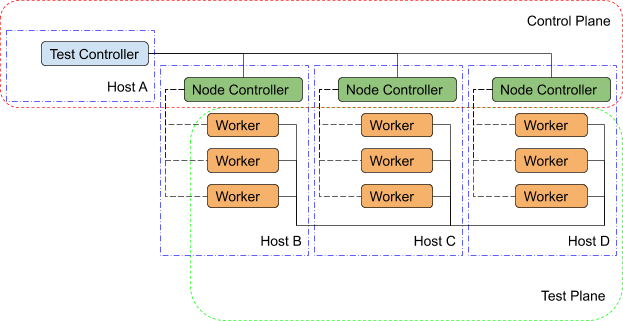

################################################
Bench 2 Performance & Scalability Test Framework
################################################

**********
Motivation
**********

The Bench 2 framework grew out of a desire to be able to test the performance and scalability of OpenDDS in large and heterogeneous deployments, along with the ability to quickly develop and deploy new test scenarios across a potentially-unspecified number of machines.

********
Overview
********

The resulting design of the Bench 2 framework depends on three primary test
applications: worker processes, one or more node controllers, and a test
controller.

  Bench 2 Overview

Worker
======

The ``worker`` application, true to its name, performs most of the work associated with any given test scenario.
It creates and exercises the DDS entities specified in its configuration file and gathers performance statistics related to discovery, data integrity, and performance.
The worker’s configuration file contains regions that may be used to represent OpenDDS’s
configuration sections as well as individual DDS entities and the QoS policies to be for their creation.
In addition, the worker configuration contains test timing values and descriptions of test ``actions`` to be taken (e.g. publishing and forwarding data read from subscriptions).
Upon test completion, the worker can write out a report file containing the performance statistics gathered during its run.

Node Controller
===============

Each machine in the test environment will run (at least) one ``node_controller`` application which acts as a daemon and, upon request from a ``test_controller``, will spawn one or more worker processes.
Each request will contain the configuration to use for the spawned workers and, upon successful exit, the workers’ report files will be read and sent back to the ``test_controller`` which requested it.
Failed workers processes (aborts, crashes) will be noted and have their output logs sent back to the requesting ``test_controller``.
In addition to collecting worker reports, the node controller also gathers general system resource statistics during test execution (CPU and memory utilization) to be returned to the test controller at the end of the test.

Test Controller
===============

Each execution of the test framework will use a ``test_controller`` to read in a scenario configuration file (an annotated collection of worker configuration file names) before listening for available ``node_controller``'s and parceling out the scenario’s worker configurations to the individual ``node_controller``'s.
The ``test_controller`` may also optionally adjust certain worker configuration values for the sake of the test (assigning a unique DDS partition to avoid collisions, coordinating worker test times, etc.).
After sending the allocated scenario to each of the available node controllers, the test controller waits to receive reports from each of the node controllers.
After receiving all the reports, the ``test_controller`` coalesces the performance statistics from each of the workers and presents the final results to the user (both on screen & in a results file).

****************
Building Bench 2
****************

Required Features
=================

The primary requirements for building OpenDDS such that Bench 2 also gets built:

 - C++11 Support (``--std=c++11``)
 - RapidJSON present and enabled (``--rapidjson``)
 - Tests are being built (``--tests``)

Required Targets
================

If these elements are present, you can either build the entire test suite (slow) or use these 3 targets (faster), which also cover all the required libraries:

 - ``Bench_Worker``
 - ``node_controller``
 - ``test_controller``

****************
Running Bench 2
****************

Environment Variables
=====================

To run Bench 2 executables with dynamically linked or shared libraries, you’ll want to make sure the Bench 2 libraries are in your library path.

Linux/Unix
----------

Add ``${DDS_ROOT}/performance-tests/bench/lib`` to your ``LD_LIBRARY_PATH``

Windows
-------

Add ``%DDS_ROOT%\performance-tests\bench\lib`` to your ``PATH``

Assuming :envvar:`DDS_ROOT` is already set on your system (from the ``configure`` script or from sourcing ``setenv.sh``), there are convenience scripts to do this for you in the :ghfile:`performance-tests/bench` directory (``set_bench_env[.sh/.cmd]``)

Running a Bench 2 CI Test
=========================

In the event that you’re debugging a failing Bench 2 CI test, you can use :ghfile:`performance-tests/bench/run_test.pl` to execute the full scenario without first setting the environment as listed above.
This is because the perl script sets it automatically before launching a single ``node_controller`` in the background and executing the test controller with the requested scenario.
The perl script can be inspected in order to determine which scenarios have been made available in this way.
It can be modified to easily run other scenarios against a single node controller with relative ease.

Running Scenarios Manually
==========================

Assuming you already have scenario and worker configuration files defined, the general approach to running a scenario is to start one or more ``node_controller``\s (across one or more hosts) and then execute the test_controller with the desired scenario configuration.

*******************
Configuration Files
*******************

As a rule, Bench 2 uses JSON configuration files that directly map onto the C++ Platform Specific Model (PSM) of the IDL found in :ghfile:`performance-tests/bench/idl` and the IDL used in the `DDS specification <https://www.omg.org/spec/DDS/About-DDS/>`_.
This allows the test applications to easily convert between configuration files and C++ structures useful for the configuration of DDS entities.

Scenario Configuration Files
============================

Scenario configuration files are used by the test controller to determine the number and type (configuration) of worker processes required for a particular test scenario.
In addition, the scenario file may specify certain sets of workers to be run on the same node by placing them together in a node “prototype” (see below).

IDL Definition
--------------

.. code-block:: omg-idl

  struct WorkerPrototype {
    // Filename of the JSON Serialized Bench::WorkerConfig
    string config;
    // Number of workers to spawn using this prototype (Must be >=1)
    unsigned long count;
  };

  typedef sequence<WorkerPrototype> WorkerPrototypes;

  struct NodePrototype {
    // Assign to a node controller with a name that matches this wildcard
    string name_wildcard;
    WorkerPrototypes workers;
    // Number of Nodes to spawn using this prototype (Must be >=1)
    unsigned long count;
    // This NodePrototype must have a Node to itself
    boolean exclusive;
  };

  typedef sequence<NodePrototype> NodePrototypes;

  // This is the root type of the scenario configuration file
  struct ScenarioPrototype {
    string name;
    string desc;
    // Workers that must be deployed in sets
    NodePrototypes nodes;
    // Workers that can be assigned to any node
    WorkerPrototypes any_node;
    /*
     * Number of seconds to wait for the scenario to end.
     * 0 means never timeout.
     */
    unsigned long timeout;
  };

Annotated Example
-----------------

.. code-block:: json

  {
    "name": "An Example",
    "desc": "This shows the structure of the scenario configuration",
    "nodes": [
      {
        "name_wildcard": "example_nc_*",
        "workers": [
          {
            "config": "daemon.json",
            "count": 1
          },
          {
            "config": "spawn.json",
            "count": 1
          }
        ],
        "count": 2,
        "exclusive": false
      }
    ],
    "any_node": [
      {
        "config": "master.json",
        "count": 1
      }
    ],
    "timeout": 120
  }

This scenario configuration will launch 5 worker processes.
It will launch 2 pairs of “daemon” / “spawn” processes, with each member of each pair being kept together on the same node (i.e. same ``node_controller``).
The pairs themselves may be split across nodes, but each “daemon” will be with at least one “spawn” and vice-versa.
They may also wind up all together on the same node, depending on the number of available nodes.
And finally, one “master” process will be started wherever there is room available.

The “name_wildcard” field is used to filter the ``node_controller`` instances that can be used to host the nodes in the current node config - only the ``node_controller`` instances with names matching the wildcard can be used.
If the “name_wildcard” is omitted or its value is empty, any ``node_controller`` can be used.
If node “prototypes” are marked exclusive, the test controller will attempt to allocate them exclusively to their own node controllers.
If not enough node controllers exist to honor all the exclusive nodes, the test controller will
fail with an error message.

Worker Configuration Files
==========================

QoS Masking
-----------

In a typical DDS application, default QoS objects are often supplied by the entity factory so that the application developer can make required changes locally and not impact larger system configuration choices.
As such, the QoS objects found within the JSON configuration file should be treated as a “delta” from the default configuration object of a parent factory class.
So while the JSON “qos” element names will directly match the relevant IDL element names, there will also be an additional “qos_mask” element that lives alongside the “qos” element in order to specify which elements apply.
For each QoS attribute “attribute” within the “qos” object, there will also be a boolean “has_attribute” within the “qos_mask” which informs the builder library that this attribute should indeed be applied against the default QoS object supplied by the parent factory class before the entity is created.

IDL Definition

.. code-block:: omg-idl

  struct TimeStamp {
    long sec;
    unsigned long nsec;
  };

  typedef sequence<string> StringSeq;
  typedef sequence<double> DoubleSeq;

  enum PropertyValueKind { PVK_TIME, PVK_STRING, PVK_STRING_SEQ, PVK_STRING_SEQ_SEQ, PVK_DOUBLE, PVK_DOUBLE_SEQ, PVK_ULL };
  union PropertyValue switch (PropertyValueKind) {
    case PVK_TIME:
      TimeStamp time_prop;
    case PVK_STRING:
      string string_prop;
    case PVK_STRING_SEQ:
      StringSeq string_seq_prop;
    case PVK_STRING_SEQ_SEQ:
      StringSeqSeq string_seq_seq_prop;
    case PVK_DOUBLE:
      double double_prop;
    case PVK_DOUBLE_SEQ:
       DoubleSeq double_seq_prop;
    case PVK_ULL:
      unsigned long long ull_prop;
  };

  struct Property {
    string name;
    PropertyValue value;
  };
  typedef sequence<Property> PropertySeq;

  struct ConfigProperty {
    string name;
    string value;
  };
  typedef sequence<ConfigProperty> ConfigPropertySeq;

  // ConfigSection

  struct ConfigSection {
    string name;
    ConfigPropertySeq properties;
  };
  typedef sequence<ConfigSection> ConfigSectionSeq;

  // Writer

  struct DataWriterConfig {
    string name;
    string topic_name;
    string listener_type_name;
    unsigned long listener_status_mask;
    string transport_config_name;
    DDS::DataWriterQos qos;
    DataWriterQosMask qos_mask;
  };
  typedef sequence<DataWriterConfig> DataWriterConfigSeq;

  // Reader

  struct DataReaderConfig {
    string name;
    string topic_name;
    string listener_type_name;
    unsigned long listener_status_mask;
    PropertySeq listener_properties;
    string transport_config_name;
    DDS::DataReaderQos qos;
    DataReaderQosMask qos_mask;
    StringSeq tags;
  };
  typedef sequence<DataReaderConfig> DataReaderConfigSeq;

  // Publisher

  struct PublisherConfig {
    string name;
    string listener_type_name;
    unsigned long listener_status_mask;
    string transport_config_name;
    DDS::PublisherQos qos;
    PublisherQosMask qos_mask;
    DataWriterConfigSeq datawriters;
  };
  typedef sequence<PublisherConfig> PublisherConfigSeq;

  // Subscription

  struct SubscriberConfig {
    string name;
    string listener_type_name;
    unsigned long listener_status_mask;
    string transport_config_name;
    DDS::SubscriberQos qos;
    SubscriberQosMask qos_mask;
    DataReaderConfigSeq datareaders;
  };
  typedef sequence<SubscriberConfig> SubscriberConfigSeq;

  // Topic

  struct ContentFilteredTopic {
    string cft_name;
    string cft_expression;
    DDS::StringSeq cft_parameters;
  };

  typedef sequence<ContentFilteredTopic> ContentFilteredTopicSeq;

  struct TopicConfig {
    string name;
    string type_name;
    DDS::TopicQos qos;
    TopicQosMask qos_mask;
    string listener_type_name;
    unsigned long listener_status_mask;
    string transport_config_name;
    ContentFilteredTopicSeq content_filtered_topics;
  };
  typedef sequence<TopicConfig> TopicConfigSeq;

  // Participant

  struct ParticipantConfig {
    string name;
    unsigned short domain;
    DDS::DomainParticipantQos qos;
    DomainParticipantQosMask qos_mask;
    string listener_type_name;
    unsigned long listener_status_mask;
    string transport_config_name;
    StringSeq type_names;
    TopicConfigSeq topics;
    PublisherConfigSeq publishers;
    SubscriberConfigSeq subscribers;
  };
  typedef sequence<ParticipantConfig> ParticipantConfigSeq;

  // TransportInstance

  struct TransportInstanceConfig {
    string name;
    string type;
    unsigned short domain;
  };
  typedef sequence<TransportInstanceConfig> TransportInstanceConfigSeq;

  // Discovery

  struct DiscoveryConfig {
    string name;
    string type; // "rtps" or "repo"
    string ior; // "repo" URI (e.g. "file://repo.ior")
    unsigned short domain;
  };
  typedef sequence<DiscoveryConfig> DiscoveryConfigSeq;

  // Process

  struct ProcessConfig {
    ConfigSectionSeq config_sections;
    DiscoveryConfigSeq discoveries;
    TransportInstanceConfigSeq instances;
    ParticipantConfigSeq participants;
  };

  // Worker

  // This is the root structure of the worker configuration
  // For the sake of readability, module names have been omitted
  // All structures other than this one belong to the Builder module
  struct WorkerConfig {
    TimeStamp create_time;
    TimeStamp enable_time;
    TimeStamp start_time;
    TimeStamp stop_time;
    TimeStamp destruction_time;
    PropertySeq properties;
    ProcessConfig process;
    ActionConfigSeq actions;
    ActionReportSeq action_reports;
  };

Annotated Example
-----------------

::

  {
    "create_time": { "sec": -1, "nsec": 0 },

Since the timestamp is negative, this treats the time as relative and waits one second.

::

    "enable_time": { "sec": -1, "nsec": 0 },
    "start_time": { "sec": 0, "nsec": 0 },

Since the time is zero and thus neither absolute nor relative, this treats the time as indefinite and waits for keyboard input from the user.

::

    "stop_time": { "sec": -10, "nsec": 0 },

Again, a relative timestamp.
This time, it waits for 10 seconds for the test actions to run before stopping the test.

::

    "destruction_time": { "sec": -1, "nsec": 0 },

    "process": {

This is the primary section where all the DDS entities are described, along
with configuration of OpenDDS.

::

      "config_sections": [

The elements of this section are functionally identical to the sections of an OpenDDS ``.ini`` file with the same name.
Each config section is created programmatically within the worker process using the name provided and made available to the OpenDDS ``ServiceParticipant`` during entity creation.
The example here sets the value of both the ``DCPSSecurity`` and ``DCPSDebugLevel`` keys to 0 within the ``[common]`` section of the configuration.

::

        { "name": "common",
          "properties": [
            { "name": "DCPSSecurity",
              "value": "0"
            },
            { "name": "DCPSDebugLevel",
              "value": "0"
            }
          ]
        }
      ],
      "discoveries": [

Even if there is no configuration section for it (see above), this allows us to create unique discovery instances per domain.
If both are specified, this will find and use / modify the one specified in the configuration section above.
Valid types are ``"rtps"`` and ``"repo"`` (requires additional ``"ior"`` element with valid URL)

::

        { "name": "bench_test_rtps",
          "type": "rtps",
          "domain": 7
        }
      ],
      "instances": [

Even if there is no configuration section for it (see above), this allows us to create unique transport instances.
If both are specified, this will find and use / modify the one specified in the configuration section above. Valid types are ``rtps_udp``, ``tcp``, ``udp``, ``ip_multicast``, ``shmem``.

::

        { "name": "rtps_instance_01",
          "type": "rtps_udp",
          "domain": 7
        }
      ],
      "participants": [

The list of participants to create.

::

        { "name": "participant_01",
          "domain": 7,
          "transport_config_name": "rtps_instance_01",

The transport config that gets bound to this participant

::

          "qos": { "entity_factory": { "autoenable_created_entities": false } },
          "qos_mask": { "entity_factory": { "has_autoenable_created_entities": false } },

An example of QoS masking.
Note that in this example, the boolean flag is ``false``, so the QoS mask is not actually applied.
In this case, both lines here were added to make switching back and forth between ``autoenable_created_entities`` easier (simply change the value of the bottom element ``"has_autoenable_created_entities"`` to ``"true"``).

::

          "topics": [

List of topics to register for this participant

::

            { "name": "topic_01",
              "type_name": "Bench::Data"

Note the type name.
``"Bench::Data"`` is currently the only topic type supported by the Bench 2 framework.
That said, it contains a variably sized array of octets, allowing a configurable range of data payload sizes (see write_action below).

::

              "content_filtered_topics": [
                {
                  "cft_name": "cft_1",
                  "cft_expression": "filter_class > %0",
                  "cft_parameters": ["2"]
                }
              ]

List of content filtered topics.
Note ``"cft_name"``.
Its value can be used in DataReader ``"topic_name"`` to use the content filter.

::

            }
          ],
         "subscribers": [

List of subscribers

::

            { "name": "subscriber_01",
              "datareaders": [

List of DataReaders

::

                { "name": "datareader_01",
                  "topic_name": "topic_01",
                  "listener_type_name": "bench_drl",
                  "listener_status_mask": 4294967295,

Note the listener type and status mask.
``"bench_drl"`` is a listener type registered by the Bench Worker application that does most of the heavy lifting in terms of stats calculation and reporting.
The mask is a fully-enabled bitmask for all listener events (i.e. ``2^32 - 1``).

::

                  "qos": { "reliability": { "kind": "RELIABLE_RELIABILITY_QOS" } },
                  "qos_mask": { "reliability": { "has_kind": true } },

DataReaders default to best effort QoS, so here we are setting the reader to reliable QoS and flagging the ``qos_mask`` appropriately in order to get a reliable datareader.

::

                  "tags": [ "my_topic", "reliable_transport" ]

The config can specify a list of tags associated with each data reader.
The statistics for each tag is computed in addition to the overall statistics and can be printed out at the end of the run by the ``test_controller``.

::

                }
              ]
            }
          ],
          "publishers": [

List of publishers within this participant

::

            { "name": "publisher_01",
              "datawriters": [

List of DataWriters within this publisher

::

                { "name": "datawriter_01",

Note that each DDS entity is given a process-entity-unique name, which can be used below to locate / identify this entity.

::

                  "topic_name": "topic_01",
                  "listener_type_name": "bench_dwl",
                  "listener_status_mask": 4294967295
                }
              ]
            }
          ]
        }
      ]
    },
    "actions": [

A list of worker 'actions' to start once the test 'start' period begins.

::

      {
        "name": "write_action_01",
        "type": "write",

Current valid types are ``"write"``, ``"forward"``, and ``"set_cft_parameters"``.

::

        "writers": [ "datawriter_01" ],

Note the datawriter name defined above is passed into the action's writer list. This is used to locate the writer within the process.

::

        "params": [
          { "name": "data_buffer_bytes",

The size of the octet array within the ``Bench::Data`` message.
Note, actual messages will be slightly larger than this value.

::

            "value": { "_d": "PVK_ULL", "ull_prop": 512 }
          },
          { "name": "write_frequency",

The frequency with which the write action attempts to write a message.
In this case, twice a second.

::

            "value": { "_d": "PVK_DOUBLE", "double_prop": 2.0 }
          },

::

          { "name": "filter_class_start_value",
            "value": { "_d": "PVK_ULL", "ull_prop": 0 }
          },
          { "name": "filter_class_stop_value",
            "value": { "_d": "PVK_ULL", "ull_prop": 0 }
          },
          { "name": "filter_class_increment",
            "value": { "_d": "PVK_ULL", "ull_prop": 0 }
          }

Value range and increment for ``"filter_class"`` data variable, used when writing data.
This variable is an unsigned integer intended to be used for content filtered topics "set_cft_parameters" actions.

::

        ]
      },

      { "name": "cft_action_01",
        "type": "set_cft_parameters",
        "params": [
          { "name": "content_filtered_topic_name",
            "value": { "_d": "PVK_STRING", "string_prop": "cft_1" }
          },
          { "name": "max_count",
            "value": { "_d": "PVK_ULL", "ull_prop": 3 }
          },

Maximum count of "Set" actions to be taken.

::

          { "name": "param_count",
            "value": { "_d": "PVK_ULL", "ull_prop": 1 }
          },

Number of parameters to be set

::

          { "name": "set_frequency",
            "value": { "_d": "PVK_DOUBLE", "double_prop": 2.0 }
          },

The frequency for set action, per second

::

          { "name": "acceptable_param_values",
            "value": { "_d": "PVK_STRING_SEQ_SEQ", "string_seq_seq_prop": [ ["1", "2", "3"] ] }
          },

Lists of allowed values to set to, for each parameter. Worker will iterate thought the list sequentially unless ``"random_order"`` flag (below) is specified

::

          { "name": "random_order",
            "value": { "_d": "PVK_ULL", "ull_prop": 1 }
          }
        ]
    }

    ]
  }

*********************************
Detailed Application Descriptions
*********************************

test_controller
===============

.. program:: test_controller

As mentioned above, the ``test_controller`` application is the application responsible for running test scenarios and, as such, will probably wind up being the application most frequently run directly by testers.
The ``test_controller`` needs network visibility to at least one ``node_controller`` configured to run on the same domain. It expects, as arguments, the path to a directory containing config files (both scenario & worker) and the name of a scenario configuration file to run (without the ``.json`` extension).
For historical reasons, the config directory is often simply called ``example``. The ``test_controller`` application also supports a number of optional configuration parameters, some of which are described in the section below.

Usage
-----

``test_controller CONFIG_PATH SCENARIO_NAME [OPTIONS]``

``test_controller --help|-h``

This is a subset of the options.
Use ``--help`` option to see all the options.

.. option:: CONFIG_PATH

    Path to the directory of the test configurations and artifacts

.. option:: SCENARIO_NAME

    Name of the scenario file in the test context without the
    `.json` extension.

.. option:: --domain N

    The DDS Domain to use.
    The default is 89.

.. option:: --wait-for-nodes N

    The number of seconds to wait for nodes before broadcasting the scenario to them.
    The default is 10 seconds.

.. option:: --timeout N

    The number of seconds to wait for a scenario to complete.
    Overrides the value defined in the scenario.
    If N is 0, there is no timeout.

.. option:: --override-create-time N

    Overwrite individual worker configs to create their DDS entities N seconds from now (absolute time reference)

.. option:: --override-start-time N

    Overwrite individual worker configs to start their test actions (writes & forwards) N seconds from now (absolute time reference)

.. option:: --tag TAG

    Specify a tag for which the performance statistics will be printed out (and saved to a results file).
    Multiple instances of this option can be specified, each for a single tag.

.. option:: --json-result-id ID

    Specify a name to store the raw JSON report under.
    By default, this not enabled.
    These results will contain the full raw ``Bench::TestController`` report, including all node controller and worker reports (and DDS entity reports)

node_controller
===============

.. program:: node_controller

The node controller application is best thought of as a daemon, though the application can be run both in a long-running ``daemon`` mode and also a ``one-shot`` mode more appropriate for testing.
The ``daemon-exit-on-error`` mode additionally has the ability to exit the process every time an error is encountered, which is useful for restarting the application when errors are detected, if run as a part of an OS system environment (systemd, supervisord, etc).

Usage
-----

``node_controller [OPTIONS] one-shot|daemon|daemon-exit-on-error``

.. option:: one-shot

    Run a single batch of worker requests (configs > processes > reports) and report the results before exiting.
    Useful for one-off and local testing.

.. option:: daemon

    Act as a long-running process that continually runs batches of worker requests, reporting the results.
    Attempts to recover from errors.

.. option:: daemon-exit-on-error

    Act as a long-running process that continually runs batches of worker requests, reporting the results.
    Does not attempt to recover from errors.

.. option:: --domain N

    The DDS Domain to use.
    The default is 89.

.. option:: --name STRING

    Human friendly name for the node.
    Will be used by the test controller for referring to the node.
    During allocation of node controllers, the name is used to match against the “name_wildcard” fields of the node configs.
    Only node controllers whose names match the “name_wildcard” of a given node config can be allocated to that node config.
    Multiple nodes could have the same name.

worker
======

.. program:: worker

The worker application is meant to mimic the behavior of a single arbitrary OpenDDS test application.
It uses the Bench builder library along with its JSON configuration file to first configure OpenDDS (including discovery & transports) and then create all required DDS entities using any desired DDS QoS attributes.
Additionally, it allows the user to configure several test phase timing parameters, using either absolute or relative times:

 - DDS entity creation (``create_time``)
 - DDS entity “enabling” (``enable_time``) (only relevant if ``autoenable_created_entities`` QoS setting is false)
 - test actions start time (``start_time``)
 - test actions stop time (``stop_time``)
 - DDS entity destruction (``destruction_time``)

Finally, it also allows for the configuration and execution of test “actions” which take place between the “start” and “stop” times indicated in configuration.These may make use of the created DDS entities in order to simulate application behavior.
At the time of this writing, the three actions are ``“write”``, which will write to a datawriter using data of a configurable size and frequency (and maximum count), ``“forward”``, which will pass along the data read from one datareader to a datawriter, allowing for more complex test behaviors (including round-trip latency & jitter calculations), and ``"set_cft_parameters"``, which will change the content filtered topic parameter values dynamically.
In addition to reading a JSON configuration file, the worker is capable of writing a JSON report file that contains various test statistics gathered from listeners attached to the created DDS entities.
This report is read by the ``node_controller`` after the worker process ends and is then sent back to the waiting ``test_controller``.

Usage
-----

``worker [OPTIONS] CONFIG_FILE``

.. option:: --log LOG_FILE

    The log file path.
    Will log to ``stdout`` if not passed.

.. option:: --report REPORT_FILE

    The report file path.
