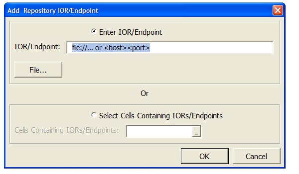
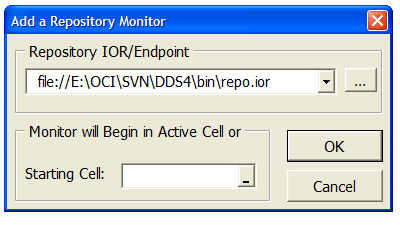

# OpenDDS Excel Real Time Data

Excel Real Time Data (RTD) server and Add-in for viewing OpenDDS
instrumentation. As with the OpenDDS Monitor, ExcelRTD only works
with OpenDDS systems using an InfoRepo.

## Building

The monitor requires the core OpenDDS libraries so make sure you are able to
build them first. It also uses Qt5.
To configure Qt5 applications in OpenDDS, please follow the
[OpenDDS Qt5 documentation (DDS\_ROOT/docs/qt.md)](../../docs/qt.md).
Once configured, the mointor should be able to be built using the
target/project named `MonitorApp` but will also be built by default if
everything is being built.

**NOTE: After OpenDDS 3.13, support for MSVC 9 (Microsoft Visual Studio 2008)
has been dropped for the Montior and ExcelRTD even though OpenDDS supports it
in the core libraries.**

## Installing and Usage

OpenDDS Real-Time Data for Microsoft Excel allows visualization of an operating OpenDDS system. This application can monitor multiple OpenDDS repositories at a time by subscribing to both the DDS specification defined Builtin Topics and the OpenDDS specific Monitor topics. Repository monitors may be simultaneously running in multiple workbooks in the same and/or separate instances of Excel. However, embedding workbooks containing repository monitors in documents, presentations, etc., is not supported due to limitations in the underlying technology. The content of the monitor tree in this application mirrors the content of the monitor tree portion of the stand-alone OpenDDS Monitor application. Additional features of this application include a repository monitor saved on a worksheet will automatically restart when the workbook is opened and a snapshot of a repository monitor can be taken in-place or to another location in the same workbook.

The project is in `%DDS_ROOT%\tools\excelRTD` and consists of an Excel add-in and an Excel Real-Time Data (RTD) server. The OpenDDS Excel Add-in is `%DDS_ROOT%\tools\excelRTD\OpenDDS.xlam` and contains Visual Basic for Applications (VBA) macros. The OpenDDS Excel RTD Server is installed to `%DDS_ROOT%\lib\OpenDDS_RTD(d).dll` and is the interface between Excel and OpenDDS. It is a C++ in-process COM server. To-date, OpenDDS Real-Time Data for Excel has only been used with a 32-bit OpenDDS Excel RTD Server and 32-bit version of Excel.

To use OpenDDS Real-Time Data for Excel, do the following:

  - Make sure that the environment is setup correctly for execution.
  - Make sure that the OpenDDS Excel RTD Server is built.
  - Register the OpenDDS Excel RTD Server:
    - This requires administrator rights and you'll get a cryptic error code if you don't normally have them. If you do a "runas" an administrator remember the environment will have to be set up again as it isn't inherited.
    - `> regsrv32 OpenDDS_RTD(d).dll`
  - Start Excel
  - Load the OpenDDS Excel Add-in:
    - Select the Office button
    - Select the Excel Options button
    - Select Add-Ins
    - Select the Go button next to "Manage: Excel Add-ins"
    - Select the Browse button
    - Browse for OpenDDS.xlam > Select it. It will appear on the list of available add-ins and should be checked.
  - Add the IOR/Endpoint of a repository:
    - On the Ribbon Bar, select the OpenDDS tab
    - In the Repository IORs/Endpoints Group, select the [Add] option, this will open an "Add Repository IOR/Endpoint" dialog
    - From "Add Repository IOR/Endpoint" dialog, select an IOR/Endpoint, either as a string or file selection or cells on the spreadsheet, accept the selection using the [Ok] pushbutton.
  - Add a repository monitor:
    - On the Ribbon Bar, select the OpenDDS tab
    - In the Repository Monitors Group, select the [Add] option, this will open an "Add Repository Monitor" dialog
    - From "Add Repository Monitor" dialog, select an IOR/Endpoint from the drop down list and a starting cell for the monitor tree and accept the selections using the [Ok] pushbutton.
  - Snapshot a repository monitor:
    - On the Ribbon Bar, select the OpenDDS tab
    - In the Repository Monitors Group, select a repository monitor in the drop down list. This is the monitor that will be used.
    - In the Repository Monitors Group, select the [Snapshot] option, this will open a "Snapshot Monitor" dialog
    - From "Snapshot Monitor" dialog, select the "Select Location" radio button (the default) to select the starting cell of the snapshot. This will result in a snapshot of the data in the monitor tree being created in another location in the spreadsheet. Or select the "In-place" radio button and the result will be the selected monitor tree will be removed and replaced with a snapshot of its data. Then accept the selections using the [Ok] pushbutton.

## GUI

The OpenDDS Excel Add-in adds a dedicated tab for OpenDDS to the Excel ribbon bar. However, the tab won't be visible if a workbook isn't open or the active workbook is an add-in. Under the OpenDDS tab are two groups. Repository IORs/Endpoints and Repository Monitors.

### Repository IORs/Endpoints

The Repository IORs/Endpoints Group is for management of IORs and endpoints only. It has a drop down list of IORs/Endpoints and two buttons: Add and Remove. Selecting the Add button displays the dialog below. Selecting the Remove button removes the current selection in the drop down list.

### Repository Monitors

The Repository Monitors Group has a drop down list of repository monitors that are in the workbook and four buttons: Add, Remove, Go To, and Snapshot. Selecting the Add button displays the dialog below which in turn adds the monitor tree below that to the worksheet. Selecting the Remove button removes the current selection in the drop down list from the list and the worksheet. Selecting the Go To button activates the cells of the monitor tree that is currently selected in the drop down list.

Selecting the Snapshot button snapshots the monitor tree that is currently selected in the drop down list either in-place or in another location in the same workbook by replacing the formulas in the cells with the current values.

## Data

The information hierarchy displayed in the repository monitor tree view starts with the host at the top level. Each executing process that publishes monitor information will appear within the host on which they are executing. The data displayed is derived from Monitor Data Topics distributed in the OpenDDS specific `MONITOR_DOMAIN_ID` and the DDS specification defined Builtin Topic data. The information hierarchy is summarized in the following table. The table includes references to the IDL data definitions for the data that will be displayed.

The Monitor Topics include a variable field that allows the application programmer to extend the topics if desired. Arbitrary name/value pairs can be added to the data for distribution and will be displayed by the monitor application. The data is defined in IDL with each topic constructed of portions of the common IDL definitions. These IDL definitions are all within the `OpenDDS::DCPS IDL module`. They are all defined within the file located at `$DDS_ROOT/dds/monitor/monitor.idl`.

The Builtin Topics are defined in the DDS specification. The table below includes links to the specific IDL for the Builtin Topic data for reference. OpenDDS uses the IDL defined in `$DDS_ROOT/dds/DdsDcpsInfrastructure.idl` for the Builtin Topic definitions.

Type | Contains | Multiplicity | Links to | Data | Description
--- | --- | --- | --- | --- | ---
host | process | n | n/a | Monitor Topic Data | Each host with processes publishing OpenDDS monitor topics. The value for the tree node is the hostname as it is published in the monitor topics process
process |  DomainParticipant | n | n/a | Monitor Topic Data | Each process publishing OpenDDS monitor topics. The value for the tree node is the process Id value as it is published in the monitor topics
 ... | transport | n | n/a | ... | ...
transport | type | 1 | n/a | Monitor Topic Data | Each transport active within a process.The value for the tree node is the TransportIndex value for the transport instance in hexadecimal format
DomainParticipant | DomainId | 1 | n/a | Monitor Topic Data, Builtin Topic Data | Each DomainParticipant within a process. The value for the tree node is the 16 byte GUID value for the DomainParticipant in a hexadecimal format
... | Topic | n | n/a | ... | ...
... | Publisher | n | n/a | ... | ...
... | Subscriber | n | n/a | ... | ...
... | QoS | 1 | n/a | ... | ...
Topic | Topic name | 1 | n/a | Monitor Topic Data, Builtin Topic Data | Each Topic within a DomainParticipant. The value for the tree node is the 16 byte GUID value for the Topic in a hexadecimal format
... | Data type | 1 | n/a | ... | ...
... | QoS | 1 | n/a | ... | ...
Publisher | transport | 1 | host.process.transport | Monitor Topic Data, Builtin Topic Data | Each Publisher within a DomainParticipant. The value for the tree node is the 16 byte GUID value for the Publisher in a hexadecimal format
... | writer | n | n/a | ... | ...
... | QoS | 1 | n/a | ... | ...
Subscriber | transport | 1 | host.process.transport | Monitor Topic Data,Builtin Topic Data | Each Subscriber within a DomainParticipant. The value for the tree node is the 16 byte GUID value for the Subscriber in a hexadecimal format
... | reader | n | n/a | ... | ...
... | QoS | 1 | n/a | ... | ...
Writer | Topic name | 1 | DomainParticipant.topic.topicname | Monitor Topic Data, Builtin Topic Data | Each Writer within a Publisher. The readers are the DataReader entities associated with the DataWriter entitiy represented by this tree node. The value for the tree node is the 16 byte GUID value for the DataWriter in a hexadecimal format
... | Reader | n | Subscriber.reader | ... | ...
... | QoS | 1 | n/a | ... | ...
Reader | Topic name | 1 | DomainParticipant.topic.topicname | Monitor Topic Data, Builtin Topic Data | Each Reader within a Subscriber. The writers are the DataWriter entities associated with the DataReader entitiy represented by this tree node. The value for the tree node is the 16 byte GUID value for the DataReader in a hexadecimal format
... | Writer | n | Publisher.writer | ... | ...
... | QoS | 1 | n/a | ... | ...

The links column in the table indicates which, if any, fields contained by the element are references to data contained at a separate location. For example, each Publisher and Subscriber contains a transport, which is a link to the actual transport described separately and contained within the process.

## Notes for Developers

### FILES

  - OpenDDS.xlam
    - Excel XLA Add-in. VBA code and ribbon menus.To modify the VBA code open
  this file in Excel.  Ribbon can be modified using RibbonXVisualDesigner.

  - `*.{h,cpp,inl}`
    - source code for application.
