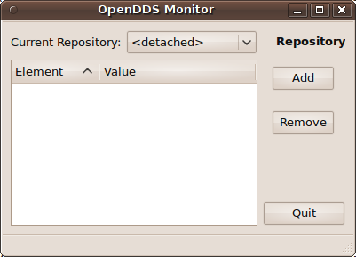
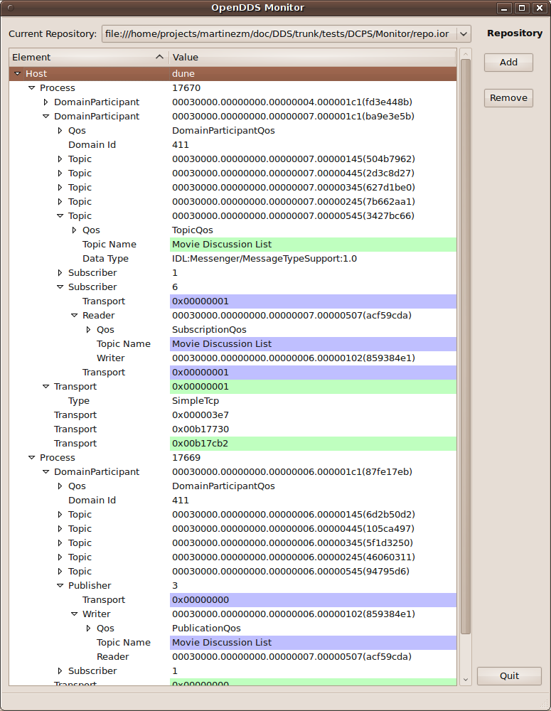

# OpenDDS Monitor

The monitor tool allows one to inspect information available about an
operating OpenDDS system. It only works with an OpenDDS system using an
InfoRepo, it will not work with RTPS. The viewer attaches to a single OpenDDS
repository at a time and subscribes to both the DDS specification defined
Builtin Topics and the OpenDDS specific Monitor topics. It is possible to
switch from viewing the information from one repository to another while the
monitor is running.

## Building

The monitor requires the core OpenDDS libraries so make sure you are able to
build them first. It also uses Qt5.
To configure Qt5 applications in OpenDDS, please follow the
[OpenDDS Qt5 documentation (DDS\_ROOT/docs/qt.md)](../../docs/qt.md).
Once configured, the mointor should be able to be built using the
target/project named `MonitorApp` but will also be built by default if
everything is being built.

**NOTE: After OpenDDS 3.13, support for MSVC 9 (Microsoft Visual Studio 2008)
has been dropped for the Montior and ExcelRTD even though OpenDDS supports it
in the core libraries.**

## Usage

If the application has been built and the environment has been set correctly
(using `setenv.sh` or `setenv.cmd`), the application can be started using the
`monitor` command.

To use:

  - Attach to a running OpenDDS service
  - Add the repository:
    - from main window, select the [Add] pushbutton, this will open a "Select Repository" dialog
    - from "Select Repository" dialog, select an IOR, either as a string or file selection, the accept the selection using the [Ok] pushbutton
  - Select the repository
    - from the main window, select the newly added repository IOR from the "Current Repository:" pulldown

## GUI

The Graphical User Interface (GUI) for the monitor application is a simple window with three pushbuttons, a pulldown combo-box and a tree viewer with two columns:

The elements of the GUI are summarized in the following table:

Element | Type | Description
--- | --- | ---
Quit | pushbutton | This will exit the application.
Add | pushbutton | This is used to add repositories IORs to the list of available repository IORs to which the monitor application can attach. The selection is made by a popup selection dialog. The currently available IOR values are located as the values in the "Current Repository" pulldown list.
Remove | pushbutton | This is used to remove the currently selected repository IOR from the combo-box pulldown list. When this is done, the currently displayed data is discarded and the new selection (the previous in the list, if any) will be attached and its data displayed.
Element | column | This is the column identifying the data being displayed. The elements are the data from the monitor data hierarchy.
Value | column | This is the column with the data values being displayed.
display area | tree view | This is where the data is displayed as tree graph with element names and values.
Current Repository: | combo box | This is the mechanism to attach and detach from specific OpenDDS repositories. There is always a **detached** selection which when selected results in no repository being attached to and no data displayed. When a selection other than **detached** is made, the repository reached at the displayed IOR will have its data examined and displayed.

The repository selection dialog is a simple selection dialog allowing the entry of a string based IOR, either as a corbaloc value or a stringified IOR pasted in, or a file based IOR from a file selection dialog:

The elements of the dialog are summarized in the following table:

Element | Type | Description
--- | --- | ---
IOR | text entry | This allows capture of a string IOR, in either corbaloc format (started by default) or as a stringified IOR pasted directly into the text entry widget.
File | pushbuttom | This starts a standard system file selection dialog to locate and select a file containing an IOR value.
Cancel | pushbutton | Exits the dialog without adding an entry to the repository IOR list.
Ok | pushbutton | Adds the IOR value to the repository list and exits.

An example of the application attached to a repository and displaying data from two processes is shown below. The displayed data is described separately.

## Notes for Developers

The GUI source code files are compiled by the Qt meta-object compiler and
have certain macros and other non-standard language constructs that are
parsed by that system.

This means that it is not recommended to run a style utility on the GUI
files, as the Qt specific elements may no longer be recognizable by the
Qt tools.

Currently the GUI files that should not be reformatted include:

  - all generated files
  - `Monitor_main.cpp`
  - `MonitorDataModel.{h,cpp}`
  - `TreeNode.h`
  - `Viewer.{h,cpp}`

### Files

  - `*.ui`
    - Qt designer files specifying the UI for the application.

  - `Monitor.qrc`
    - Resource specification file, managed by Qt designer.

  - `Monitor.mpc`
    - MPC project file for the application.

  - `*.{h,cpp}`
    - source code for application.
